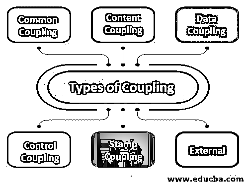

# 软件工程中的耦合

> 原文：<https://www.educba.com/coupling-in-software-engineering/>

## 软件工程中的耦合介绍

软件工程中的耦合是软件需求规范(SRS)文档的一部分，用于定义软件的每个模块与其他模块的依赖和独立因素。它被用作模块间相互依赖的指示器，耦合值越低，软件的质量就越高。这个过程被称为耦合，因为它通常是在两个模块之间同时进行的。耦合过程中采取的第一步是评估两个模块之间的关联，并定义模块中的功能依赖区域。

### 耦合类型

任何两个模块之间的耦合都可以通过模块与其他模块共享的资源的数量和类型来识别。该资源可以是功能行为、公共接口、用户接口中的公共字段、从字段中选取并在两个模块之间共享的数据、在两个模块之间共享的事务等。基于这些可能的依赖，软件工程中的耦合被分为六种不同类型的耦合。而且，他们是

<small>网页开发、编程语言、软件测试&其他</small>

*   公共耦合
*   内容耦合
*   数据耦合
*   控制耦合
*   邮票耦合
*   外部的

每一个软件需求规格文档过程都应该有一个相关模块之间耦合的分类，在对客户提供的需求进行简单评估后，以适用的为准。

#### 1.公共耦合

公共耦合包括在软件系统的任意两个模块之间共享整体约束的模块。这也可能是公共约束中的任何变化将反映在共享公共耦合场景的模块中的迹象。与任何其他过程一样，这种常见的耦合也为描述该过程中涉及的优点和缺点留出了空间。应该避免这种类型的依赖，因为它需要更多的维护活动和对模块更少的控制。这种耦合的一个很好的例子是登录页面，其中登录模块和后端模块是相互依赖的，因为登录验证同时发生在登录页面级和后端数据库级。

#### 2.内容耦合

顾名思义，内容耦合是指两个模块共享它们的内容，当一个模块发生变化时，另一个模块也需要更新。当模块不同步时，会导致更高级别的功能失常。例如，当两个模块共享相同的数据时，两个模块的数据库的主键列应该是相关的，否则模块的内容将由于依赖关系而反映不同步的数据。

#### 3.数据耦合

当软件系统的两个模块之间只有一种类型的交互，并且这种交互是以数据的形式，那么这种类型的耦合被称为数据耦合。除了数据形式之外，模块没有其他公共共享资源，如功能或任何其他系统组件。数据耦合的一个例子是两个用户界面，它们共享数据，如模块 1 将数据传递给模块 2 进行处理，并从模块 2 接收处理后的数据。虽然所有的耦合都需要最小化，但是这种类型的耦合是可以容忍的，因为它不影响软件的任何其他功能行为。

#### 4.控制耦合

控制耦合是软件的功能流，其中两个软件模块通过提供涉及模块功能活动的共享控制来联网。这种类型的耦合对软件应用程序的影响可以是积极的，也可以是消极的，因为它只能根据所述模块共享的控制类型来定义。当功能允许重用时，这被视为一种积极的影响。当参数在代码的功能部分中不止一个地方被重用时，这种类型的耦合通常在代码级别被观察到。

#### 5.邮票耦合

在任何两个共享已经结构化的复杂数据集的编译的模块之间检测到印记耦合。由于数据和元素是预先组织好并放置好的，所以两个耦合模块之间不会共享无用或未使用的数据。这有助于提高软件的总体效率及其性能，同时系统设计者应该知道系统中允许的印记耦合的限度。

#### 6.外部耦合

外部耦合可以描述为模块与共同的外部影响因素相互关联的情况。它可以是“向两个模块发送同一组数据或内容的外部遗留应用程序”，或者“两个模块共有的硬件要求”，或者“两个模块使用公共文件/文件夹”，或者“当两个模块在网络中使用相同的交换机/路由器进行通信”等。

### 耦合在软件工程中的优势

在软件工程过程中，作为软件开发生命周期的一部分，设计阶段已经将“耦合”作为必须完成的基本步骤之一。

以下是执行耦合过程的主要优点，

*   它有助于确定每个模块与
*   它主要用于提高软件应用程序的质量和性能，因为分析有助于保持与
*   耦合支持功能在
*   当模块之间的依赖性较小时，在一个单元中进行的更改不会影响
*   它为更好的维护方法提供了空间

### 结论

软件工程中的耦合是一个至关重要的过程，因为它对于识别和限制软件各种模块之间的联系具有重要意义。除此之外，通过检查软件中所有元素之间的链接，耦合在将软件系统的质量和性能保持在最高水平方面起着重要作用。

### 推荐文章

这是软件工程中耦合的指南。这里我们讨论软件工程中 6 种不同类型的耦合以及各自的优势。您也可以看看以下文章，了解更多信息–

1.  [软件工程面试问题](https://www.educba.com/software-engineering-interview-questions/)
2.  [逆向工程过程](https://www.educba.com/process-of-reverse-engineering/)
3.  [软件设计原理](https://www.educba.com/software-design-principles/)
4.  [逆向工程](https://www.educba.com/reverse-engineering/)

