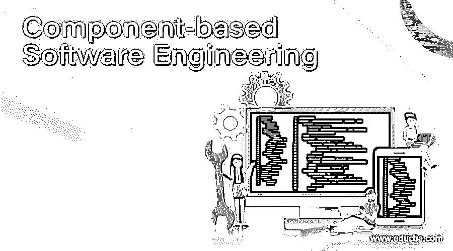

# 基于组件的软件工程

> 原文：<https://www.educba.com/component-based-software-engineering/>

## 基于组件的软件工程导论

基于组件的软件工程是组装组件的过程。这种方法使基于组件的软件工程从面向对象开发的失败中脱颖而出，以支持有效的重用。它是一组预构建的标准化软件组件，可用于适应某些其他应用程序领域的特定架构风格。然后，通过组装这些可用的组件来形成应用程序，而不是组装传统编程语言的离散部分。

例如，当我们购买一个立体声系统时，我们看到每个组件都被设计成适合特定的建筑风格。连接已标准化，通信协议已重新建立。此外，在这个立体声系统中组装组件很容易，因为你不必从头开始构建系统，相反，你已经准备好所有组件，只需将它们正确地相互连接。

<small>网页开发、编程语言、软件测试&其他</small>

### 基于计算机的软件工程过程

基于计算机的软件工程的过程如下:

1.  首先，它概述了所有的系统需求。
2.  识别组件:它包括组件搜索、组件选择和组件验证。
3.  根据组件中可用的功能修改需求。
4.  再次搜索组件，看看是否有更好的组件可以满足修改后的需求。
5.  组合组件以创建系统。

### 基于计算机的软件工程原理

*   基于计算机的软件工程是基于计算机的系统的快速组装和维护，其中组件具有明确定义的属性。
*   软件组件是一个逻辑上内聚的、松散耦合的模块，它表示一个抽象，可以在系统开发中重用。
*   这些组件相互独立，也就是说，它们不会相互干扰，因为每个组件的实现都是相互隐藏的，并且这些组件之间的通信是通过明确定义的接口进行的。
*   只有当软件组件是自包含的，并且在实现组件模型的某个组件平台上作为独立实体运行时，它才是可部署的。
*   软件组件是服务提供者。组件提供的服务通过一个接口可用，所有组件交互都通过该接口进行。
*   组件应该被适当地文档化，以便组件的潜在用户可以决定这些组件是否满足他们的需求。

### 成分组成

组件组合是组装组件以创建系统的过程。它包括组件之间的集成以及与组件基础设施的集成。通常，编写粘合代码是为了集成组件。有三种类型的合成顺序合成、层次合成和加法合成。

*   顺序组合:在这种组合中，组合的组件以顺序的方式执行。这包括组合每个组件提供的接口。
*   分层组合:在这种组合中，一个组件调用另一个组件的服务。这包括将一个组件的接口与另一个组件所需的接口组合在一起。
*   添加组合:在这种组合中，两个组件的界面被放在一起以创建一个新的组件。

**构图问题**

*   在组装组件时，可能会出现功能性和非功能性需求之间的冲突，以及快速交付需求和系统发展之间的冲突。
*   关于什么样的组件组合对于交付功能需求是有效的，需要做出正确的决定？什么样的组件构成可以允许未来的变化？组合系统的最终属性是什么？

### 基于组件的软件工程的优势

*   组件的重用比新组件的开发需要更少的时间。因此，使用基于组件的软件工程过程可以更快地构建系统。
*   通过降低软件开发成本和提高软件生产率来提高竞争力。
*   通过增加软件/人来限制人的才能。有可能通过重用现有的解决方案，而不是发明它们。
*   在实现环境中模拟真实的软件。
*   在进行更改或开发之前，它提供了现有系统的准确描述。
*   它通过依赖关系公开软件配置问题
*   揭示实现中的瓶颈，而不需要我们阅读所有的代码。

### 结论

组件是软件的一个可分发单元。它是系统的一个物理的和可替换的部分，符合并提供接口的实现。它可以形成实现其行为的一组实现分类器的抽象。此外，因为类本身是封装的分类器的一个子类型，一个组件可以有一个可选的内部结构和一组端口来形式化它的交互点。

### 推荐文章

这是一个基于组件的软件工程指南。在这里，我们讨论介绍，基于计算机的软件工程的原则，基于组件的软件工程的优势。您也可以看看以下文章，了解更多信息–

1.  [软件工程中的耦合](https://www.educba.com/coupling-in-software-engineering/)
2.  [软件工程中的凝聚力](https://www.educba.com/cohesion-in-software-engineering/)
3.  [软件工程中的设计建模](https://www.educba.com/design-modeling-in-software-engineering/)
4.  [软件工程面试问题](https://www.educba.com/software-engineering-interview-questions/)

