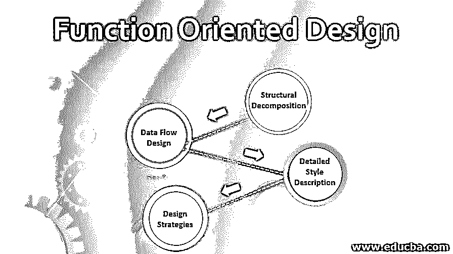

# 面向功能的设计

> 原文：<https://www.educba.com/function-oriented-design/>

## 面向功能的设计导论

函数式风格是一种包装风格的方法，其中模型分解为一组相互作用的单元或模块，每个单元或模块包含一个清晰的轮廓。然而，函数可以另外维护本地状态数据，只是在它们的执行期间。它隐藏了规则的要点，但是没有隐藏系统状态数据。

要执行的修改以及使用系统状态的方法可能会导致相反功能的行为发生意外变化。

<small>网页开发、编程语言、软件测试&其他</small>

一旦系统状态数据的数量减少并且数据共享被表达出来，一种实用的风格化方法就可能获得成功。

### 实用标题设计策略

有面积单位肯定有实用的领导风格。该方法中的活动包括:

*   数据流样式模型
*   结构分解
*   详细的风格描述

#### 1.数据流设计

它涉及规划一系列的实际转换，将系统输入转换为期望的输出。这种风格是图解式的信息流图。数据流程图是描述系统的直观方法。他们展示了端到端的过程。流程是从信息进入的地方开始，到系统产生的地方为止。不同的方式可能使用完全不同的图标来表示信息流程图，但是它们的含义是相似的。

符号面积单位的符号如下:

*   Rounded parallelogramrepresents 表示将输入转换为输出的函数。
*   矩形代表信息。
*   圆圈代表用户与系统的交互，给出输入或接收输出。
*   箭头显示信息的方向。
*   关键字“和”和“或”在《数学家》中有通常的含义。

#### 2.结构分解

它是系统的信息流模型。人们习惯于开发一个结构化的系统模型。然而，Tis 结构模型显示，执行是通过它调用的各种替代功能来完成的。结构图区域单元是一个图形化的感谢来表示这种分解层次。

一个预成形体在结构图上是一个平行四边形。这种层次结构是通过用线条连接矩形来显示的。输入和输出区域单位用带注释的箭头表示。进入盒子的箭头意味着输入，因此离开盒子意味着输出。信息存储区单位显示为圆角矩形，用户输入区单位显示为圆形。从信息流程图到结构图的转换方法，遵循规则的 3 个步骤将是已知的。它们被称为:

*   **识别系统流程转换:**这些区域单元转换期间，图中区域单元负责中心流程
*   **识别输入转换:**这些区域不涉及阅读信息，检查它并去除重复。在结构图中，这些甚至应该被归类在一级表演之下。
*   **识别输出转换:**这些区域单位转换准备并格式化他的输出，或将其写入用户屏幕或其他

#### 3.详细的风格描述

设计实体描述思考和制作各项性能的简要风格说明。它需要描述它的输入和输出。数据流图和结构图应该被重新访问和修改，以包括对规划的更好的理解。管理这些实用描述的最好方法是在一个非常信息化的词典中处理它们。信息词典是在系统模型中记录数据的方法，是作为必要性分析方法的一部分发展起来的。数据词典条目将完全不同，从简短的非正式描述到非常风格的描述语言中的性能规范。

由于以下原因，数据词典在任何包开发方法中都起着重要作用:

*   数据词典为所有相关数据提供了一种常规语言，供项目团队中的工程师使用。
*   数据词典为分析人员提供了一种根据信息结构的组成部分来定义各种信息结构的方法。

#### 4.设计策略

在以绩效为导向的风格中有区域单位确定字段。它们是:

*   操作字段
*   众所周知的索引字段
*   当前索引字段
*   文档名称字段
*   限定符字段
*   当前空间

### 结论——面向功能的设计

在这里我们讨论了面向功能的设计。

*   面向功能的设计
*   面向功能的设计策略
*   数据流图
*   结构分解
*   详细的设计描述

### 推荐文章

这是面向功能设计的指南。在这里，我们还讨论了实用的标题设计的介绍和策略，包括数据流样式模型、结构分解和详细的样式描述。您也可以看看以下文章，了解更多信息–

1.  [Javascript 设计模式](https://www.educba.com/javascript-design-patterns/)
2.  [c#中的设计模式是什么？](https://www.educba.com/what-is-design-pattern-in-c-sharp/)
3.  [Java 中的设计模式是什么？](https://www.educba.com/what-is-design-pattern-in-java/)
4.  [Python 是面向对象的吗](https://www.educba.com/is-python-object-oriented/)

