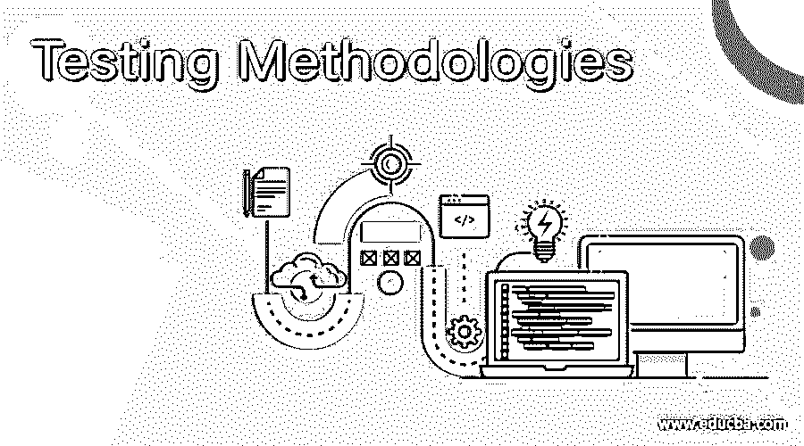

# 测试方法

> 原文：<https://www.educba.com/testing-methodologies/>

## 测试方法简介

软件测试方法被定义为测试应用程序的各种方法、策略和测试类型，以确保应用程序的外观和性能符合预期，并满足用户/客户的期望。

从广义上讲，测试方法包括所有不同类型的功能和非功能测试，以验证应用程序。

<small>网页开发、编程语言、软件测试&其他</small>

### 什么是测试方法？

在您的测试过程中应用各种测试方法的目的是确保应用程序能够在各种环境和跨多个平台中成功地执行和交付。

**功能测试**包括验证应用程序是否正确无误地满足了所有的业务需求。它涉及所有可能的测试类型，以验证应用程序的每个部分是否都按照预期和业务或客户需求运行。

功能测试方法按以下顺序列出:

*   单元测试
*   集成测试
*   系统试验
*   验收测试

**非功能性测试**用于测试应用程序的性能、可用性、可靠性和兼容性。其中包括:

*   性能试验
*   安全测试
*   可用性测试
*   兼容性测试

开发和发布容易被最终用户接受的高质量应用程序的关键是构建一个伟大的测试框架，它可以执行功能性和非功能性测试。

#### 1.单元测试

单元是应用程序中可以测试的最小部分。单元测试的目标是验证每一个单元，看它是否按照要求被开发。单元可以是单独的程序、函数、方法等。

单元测试通常由开发人员执行。开发人员通过在将代码传递给测试团队之前运行代码来执行单元测试。

单元测试是测试过程中非常重要的一部分，因为如果单元测试完美地执行了，那么缺陷就能尽早地被识别出来，修复这些错误的时间也就减少了。

#### 2.集成测试

集成测试是一种对单个单元进行分组和测试的测试。这种类型的测试是为了暴露集成单元或组之间的交互中的任何种类的缺陷

在单元测试阶段之后，所有单元被集成在一起，以创建可以执行一些特定任务的组件。然后，对这些创建的组件执行集成测试，以检查组件的行为是否符合预期，以及单元之间的交互是否无缝。集成测试可以由开发人员和测试人员手动或使用自动化来执行。

#### 3.系统试验

当所有单元被开发和集成以形成执行任务的完整系统时，执行系统测试。系统测试验证系统满足其要求并按预期运行。这个完全集成的系统可以是一个特定的界面，也可以是一个类似登录窗口的屏幕。

系统测试阶段由测试团队执行，在代码应用程序准备好投入生产之前，测试应用程序的端到端功能。

#### 4.验收测试

验收测试阶段是功能测试流程的最后一个测试阶段，在此阶段，将测试应用程序是否准备好交付给客户。这个阶段确保应用程序满足所有的业务需求和标准，并准备交付。应用程序由来自公司和组织外部的测试人员(beta 测试人员)进行测试。

beta 测试阶段是最重要的阶段，在这个阶段，公司让真正的最终用户测试产品，并解决遇到的任何缺陷。

#### 5.性能试验

性能测试是一种测试技术，用于验证应用程序在重负载和不同条件下是否会按预期运行。执行性能测试是为了检查应用程序的速度、可伸缩性和稳定性。性能测试主要有 4 种类型:

*   负载测试
*   压力测试
*   耐久性测试
*   尖峰测试

#### 6.安全测试

安全测试是为了确保应用程序中的数据是否安全和受到良好保护而进行的一种测试。测试团队有意试图找到进入系统的方法或漏洞，以获得未授权的访问，这可能导致信息丢失或安全风险。检查安全性的一些测试方法有:

*   完整
*   机密
*   证明
*   批准
*   有效性
*   不可否认性

#### 7.可用性测试

可用性测试是测试最终用户使用应用程序的难易程度的技术。可用性测试发生在真实的用户身上，看他们在应用程序中执行任务有多容易。

#### 8.兼容性测试

兼容性测试是为了了解应用程序如何在不同的环境下工作，如各种硬件、操作系统、移动设备、平台、浏览器或网络条件。该测试的目标是确保应用程序是独立于平台的，并在各种环境中执行其预期的功能。

### 测试方法的重要性

软件测试方法对于找出在开发应用程序时所产生的程序缺陷和错误是很重要的。

*   应用程序的测试确保了公司的可靠性在用户心中得到维护，并且他们对应用程序感到满意。
*   测试通过消除应用程序中的任何缺陷来提高产品的质量。交付质量更好的产品以增加用户对公司的信心。
*   高质量的测试确保了应用程序的有效和无缺陷的性能。
*   质量测试确保应用程序不会导致任何失败，并尽早发现缺陷。在后期阶段发现的缺陷纠正起来非常昂贵，如果在生产中发现，还会损害公司的声誉。

### 结论

在您的测试过程中需要测试方法，以确保应用程序能够在各种环境和跨多个平台中成功执行和交付。质量测试方法导致更高质量的产品、更高的产品可靠性以及更高的客户满意度。

### 推荐文章

这是测试方法的指南。这里我们讨论基本概念，不同类型的功能和非功能测试方法。您也可以阅读以下文章，了解更多信息——

1.  [静态测试技术](https://www.educba.com/static-testing-techniques/)
2.  [自动化测试](https://www.educba.com/automation-testing/)
3.  [尖峰测试](https://www.educba.com/spike-testing/)
4.  [兼容性测试](https://www.educba.com/compatibility-testing/)

