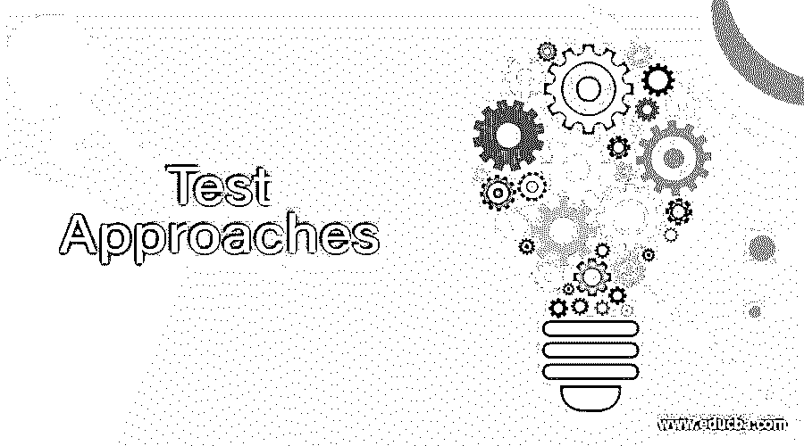

# 测试方法

> 原文：<https://www.educba.com/test-approaches/>

## 测试方法介绍

下面的文章提供了测试方法的概要。测试策略是一种通用的方法，在这种方法中，在测试的每个级别内，独立于项目，在整个组织内进行测试。测试方法是 ISTQB 给特定项目上测试策略的实现起的名字。测试方法是特定于项目的；您应该在测试计划中定义和记录该方法，并细化和记录测试方法，在测试设计中提供进一步的细节。

### 测试方法是如何工作的？

决定正确的测试方法需要仔细考虑测试的目的、项目的目标和整体的风险评估。它为计划测试过程和选择测试设计技术和测试类型提供了一个起点。它还有助于定义测试用例的进入和退出标准。在对方法进行决策时，您应该考虑项目和组织背景、与风险和安全相关的问题、可用资源、涉及的技术、受测系统的性质、与系统是定制还是由商业组件组装相关的考虑因素。

<small>网页开发、编程语言、软件测试&其他</small>

### 测试方法列表

在这一节中，我们将讨论可用于项目的各种测试方法。

#### 1.基于模型

基于模型的测试方法通常用于创建或选择关键系统行为的正式或非正式模型。通常，它在项目的需求和设计阶段使用。例如，我们可以为电子商务服务器的加载和响应建立一个数学模型，并基于该模型测试用例。如果系统给出与模型相同的输出，则可以认为是工作系统。

#### 2.有条不紊的

系统测试方法的共同点是坚持预先计划的、系统化的方法，这种方法是在内部开发的，由内部开发的各种概念组合而成，从外部收集或大量采用外部想法，并且可能有一个或早或晚的测试参与点。例如，假设您有一个用于测试的输入和输出的清单，那么您可以根据您的清单系统地设计和实现模型，并且可以执行测试。

#### 3.分析的

分析测试方法通常使用一些正式和非正式的分析技术。它通常在项目的需求和设计阶段使用。例如，基于风险的方法，其中使用项目文档和涉众输入来执行风险分析，然后基于风险来计划、估计、设计和优先化测试。另一个例子是基于需求的方法，在这种方法中，分析是基于指定的需求进行的。

#### 4.符合流程或标准

符合流程或标准的测试方法通常依赖于外部开发的测试方法，通常很少(如果有的话)进行定制，并且可能有一个早期或晚期的测试参与点。例如，您可以使用 IEEE 829 标准来使用书籍进行测试，或者填补方法上的空白。另外，作为一种替代选择，您可以使用敏捷方法。

#### 5.动态的

动态测试方法通常集中于在测试执行期间发现尽可能多的缺陷，并在交付时适应被测系统的现实，它们通常强调测试的后期阶段。例如，您可以创建一套测试指南，关注软件对已知弱点的快速适应。

#### 6.回归厌恶

厌恶回归的测试方法有一套共同的过程，通常是自动化的，允许检测回归缺陷。它包括在功能发布之前自动化功能测试，在这种情况下，它需要早期测试。但是有时，测试几乎完全集中在测试已经发布的功能上，这是发布后测试环境的一种形式。例如，您可以尝试自动化所有的功能测试用例，以便无论何时需求或任何事情发生变化，您都可以重新运行每个测试用例来确保系统的功能性。

#### 7.咨询或指导

咨询式或指导性测试方法的共同点是依赖一组非测试人员来指导或执行测试工作，并且由于缺乏对早期测试价值的认识，通常强调测试的后期阶段。例如，你可以要求系统的开发者或用户给你关于测试什么的信息，或者甚至依赖他们来做测试部分。

### 结论

在本文中，我们讨论了各种方法。测试方法的选择是测试工作成功以及测试计划和配方估算准确性的一个重要因素。它是由测试人员和测试领导者选择的。有正确的选择可以导致项目的成功，有错误的选择可以导致项目的失败。

### 推荐文章

这是测试方法的指南。在这里，我们讨论可以用于项目的各种测试方法的列表，以及它是如何工作的。您也可以看看以下文章，了解更多信息–

1.  [测试覆盖工具](https://www.educba.com/test-coverage-tools/)
2.  [硒负荷测试](https://www.educba.com/selenium-load-testing/)
3.  [接口测试](https://www.educba.com/interface-testing/)
4.  [软件测试的级别](https://www.educba.com/levels-of-software-testing/)

