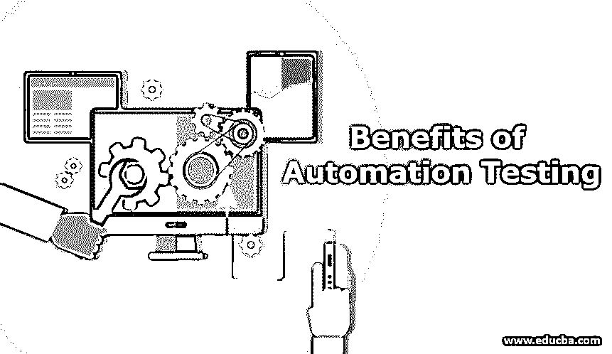

# 自动化测试的好处

> 原文：<https://www.educba.com/benefits-of-automation-testing/>

## 自动化测试简介

与传统的功能测试方法相比，自动化测试有几个好处，传统的功能测试方法通常使用自动化工具来执行，如 UFT、Selenium、TestComplete、Appium、Cucumber 等。，来执行自动化测试执行。自动化测试在实际场景中的各种因素中是有益的，它比手工测试相对更快，产生结果的一致性，节省时间和手工努力，成本更低，效率更高。

### 自动化测试的各种好处

测试自动化为您的移动应用程序开发阶段带来了许多好处，使您能够以更少的努力构建更好的应用程序。

<small>网页开发、编程语言、软件测试&其他</small>

下面给出了自动化测试的好处:

#### 1.快速反馈机制

自动化加速了测试周期，消除了重复单调的测试用例，并通过改善设计者、编码者和客户之间更快的交流，允许更好的测试用例场景。潜在的小故障很容易纠正。因此，自动化提供了更好的最终产品质量。

#### 2.测试效率的提高

测试覆盖了整个应用程序开发生命周期的重要部分。即使在测试阶段效率很低，也能提高产品交付的截止日期。通过消除或最小化测试周期中的人工干预，它消除了任何延迟产品交付的被忽略的错误。

#### 3.降低运营成本，提高人力利用率

虽然自动化测试可能会有大量的初始前期成本和其他额外费用，但公司可以通过减少所需的人力来提高长期盈利能力。自动化测试脚本需要最少的干预，并且需要较少的测试用例执行和脚本错误的故障排除。它通过将人力部署在更重要的业务流程中，远离重复性任务，提高了人力利用率。

#### 4.更好的左移测试

左移测试方法学，将测试阶段纳入软件开发生命周期，从需求评估开始到修正错误，它提高了最终产品的质量。由于自动化测试从产品的开发开始，产品中的任何错误或缺陷都可以在开发阶段的早期被检测到，这有助于更快地向左转移。

#### 5.提供连续性

自动化测试帮助自动化工程师准确地知道其他人做了什么，他们写的脚本，已经执行的任何测试，或者他们以前发现并修复的任何错误。

#### 6.最大化测试覆盖率

对于任何复杂的 web 应用程序的 100%覆盖，手动测试并不总是能够提供高质量的测试用例，这也是一个挑战。然而，[自动化测试工具](https://www.educba.com/automation-testing-tools/)通过确保数据库、 [web 服务](https://www.educba.com/what-is-web-services/)和用户界面都符合业务需求，使得测试过程更加容易。因此，提高了 web 应用程序的整体测试覆盖率，这是无法以有效的方式手动完成的。

#### 7.最大化投资回报

在市场上发布软件产品的重复手动测试会导致产品延迟并影响质量。自动化测试降低了产品开发生命周期的成本，提供了无缺陷的产品，并缩短了产品上市的时间。因此，它降低了运营成本，并确保产品开发的投资回报更高。

#### 8.加速跨浏览器测试

跨浏览器的手动测试导致了许多问题和挑战，因为测试人员需要识别浏览器，他们的应用支持。由于客户使用各种各样的浏览器，手动跨浏览器测试带来了困难的挑战。自动化跨浏览器测试工具，如 Lambda test，在多个浏览器上并行多次执行相同的测试用例，从而消除了这个问题。

#### 9.执行常规烟雾测试

冒烟测试减少了停机，是测试中推荐的最佳实践。许多组织取消了它，理由是这样做减少了测试人员的带宽。自动化测试建立在随机烟雾测试案例的基础上，因此烟雾测试可以定期进行。

#### 10.分布式测试用例

通过手工测试，在多个操作系统、浏览器和机器上分发测试用例是不可能的，因为测试人员一次只能在一个平台或一个设备上执行一个测试。自动化测试工具将测试执行分散到多个设备或平台上同时运行，从而提高了效率。

#### 11.轻松执行冗长复杂的测试用例场景

自动化测试非常容易执行复杂且容易出错的测试用例场景。当手动测试时，具有许多可重复步骤的测试用例可能会导致分心和错误的保证，但是通过自动化测试，可以很容易地制作健壮的测试脚本。

#### 12.提高可扩展性

由于手工测试在每个项目中需要更多的测试人员，这降低了公司伸缩运营的灵活性。通过自动化测试，利用测试工具或平台，可以实现高水平的可伸缩性。

#### 13.改进数据驱动的测试

自动化测试有一个关键的好处，那就是能够执行测试用例并验证涉及非常大的数据集的功能。手动测试不能总是交付相同的结果。

#### 14.提高手动测试人员的性能

自动化测试减少了手工测试人员的紧张活动，这样他们就可以想出更好的测试场景，把手工单调的过程留给测试工具。测试人员可以交叉检查自动化工具的测试结果，这样的结果可以帮助手工测试人员提高他们编写的测试脚本的质量。

#### 15.回归测试变得更加容易

由于手动测试是一个耗时的过程，测试人员必须在同一时期重复类似的测试用例，以确保所有的 bug 都被移除。在回归测试的[案例中，反复执行相同的测试会花费更多的时间，也会降低测试人员的效率。因此，自动化测试是执行回归测试的最佳方式，因为他们可以不间断地运行回归测试套件。](https://www.educba.com/regression-testing/)

#### 16.24/7 测试执行计划

自动化测试可以随时随地进行。自动化工具可以 24/7 不间断运行，不需要像人类测试人员那样需要身体休息，因为人类测试人员受到时间和地理位置的限制。

### 结论

软件业正朝着其过程日益自动化的方向发展。因此，测试是一个关键的领域，自动化过程可以应用于缩短软件开发生命周期的时间线。自动化测试工具通过降低产品开发成本、减少应用程序中的错误和提高产品质量，消除了手工测试的障碍。

### 推荐文章

这是一个自动化测试好处的指南。这里我们分别讨论自动化测试的介绍和各种好处。您也可以浏览我们推荐的文章，了解更多信息——

1.  什么是自动化测试？
2.  [硒自动化测试](https://www.educba.com/selenium-automation-testing/)
3.  [测试方法](https://www.educba.com/testing-methodologies/)
4.  [自动化测试面试问题](https://www.educba.com/automation-testing-interview-questions/)

