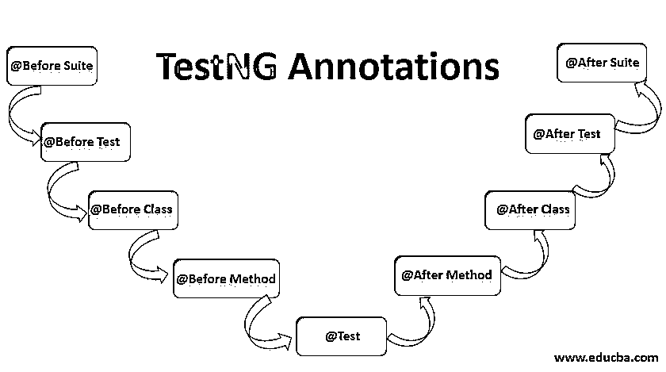

# 测试注释

> 原文：<https://www.educba.com/testng-annotations/>

## TestNG 注释简介

TestNG Annotations 是 TestNG 编码中包含的注释或注解，用于向编译器提供在某个计划好的引导流中执行测试的指令？TestNG 代码中常用的一些注释有@BeforeTest、@AfterTest、@BeforeSuite、@AfterSuite、@Test、@BeforeMethod、@AfterMethod、@BeforeClass、@AfterClass、@Parameters 等。它是一个高效的测试自动化框架，能够在测试用例的编译中执行测试脚本并并行执行。

### 测试注释

有各种各样的 TestNG 注释，每个注释都有不同的用途。注释及其解释如下所述:

<small>网页开发、编程语言、软件测试&其他</small>

**1。** **@BeforeSuite:** 这个带注释的方法在测试套件中的所有测试运行之前运行。

**2。@AfterSuite:** 这个带注释的方法在一个特定测试套件中的所有测试运行之后运行。

**3。@BeforeTest:** 这个带注释的方法在与该类相关的任何测试方法之前运行，该方法在<测试>标记中定义。

**4。@AfterTest:** 这个带注释的方法在每个与类相关的测试方法执行之后运行，这个测试方法在<测试>标签中定义。

**5。@BeforeClass:** 这个带注释的方法只运行一次，并且在提到的类的第一个测试方法之前执行。

**6。@AfterClass:** 这个带注释的方法只运行一次，在所有提到的/当前的类测试方法执行完之后执行。

7 .**。@Test:** 这个带注释的方法将任何类或方法标记为需要测试的测试的一部分。它有各种参数，如下所述:

*   **alwaysRun:** 如果设置为 true，测试方法总是运行，不管它所依赖的测试用例是否失败。
*   **dataProvider:** 这为测试用例定义了数据提供者的名字。
*   **依赖于方法:**这定义了特定方法所依赖的方法列表。
*   **dependsOnGroups** :这定义了特定方法所依赖的组的列表。
*   **描述**:定义了方法的描述
*   **启用**:定义该方法是否启用。如果设置为 false，则不执行该方法，或者认为该方法不存在。
*   **优先级**:定义了应该执行的特定测试方法的优先级。较低的优先级值首先被调度，如果测试用例没有被定义为任何优先级值，那么 TestNG 分配一个默认的优先级值(0)。
*   **successPercentage** :定义该方法预期的成功百分比。
*   **invocationCount** :顾名思义，指定方法被调用的次数。
*   **超时**:它定义了一个特定测试用例执行的最大次数。它以毫秒为单位定义。
*   **InvocationTimeOut** :和 TimeOut 一样，它指定了一个方法完成所有调用计数所需的毫秒数。它的值总是以毫秒为单位。

**8。@BeforeMethod:** 这个带注释的方法在每个测试方法之前运行。

**9。@AfterMethod:** 这个带注释的方法将在每个测试方法之后运行。

10。@BeforeGroups: 这个带注释的方法将在相应组的第一个测试方法之前运行，这是执行的一部分。

**11。@AfterGroups:** 这个带注释的方法将在所有测试方法之后运行，或者在调用相应组的最后一个方法之后运行，这是执行的一部分。

**12。@DataProvider:** 这个带注释的方法用于向测试方法提供数据。它可以与任何@test 方法一起使用，以便提供输入。它用于为@test 方法提供复杂的参数，这些参数在 XML 文件中无法提供。每个@DataProvider 必须返回 Object[ ] [ ]，其中每个 Object[ ]都被分配了测试方法的参数列表。它有一个需要提供的属性“name”；如果程序员没有提到它，它的值被设置为方法的名称。它有一个名为“parallel”的属性，默认情况下为“false”。如果设置为真，那么所有测试用例

13。@Listeners: 该注释用于[在测试方法中定义监听器](https://www.educba.com/listeners-in-testng/)。

**14。@Parameters:** 该注释用于定义测试方法中的参数。“Value”属性包含用作参数的所有变量名。

15。@Factory: 该注释用于将任何测试方法标记为工厂，并返回 TestNG 文件用作 TestNG 类的对象(Object[ ])。

### TestNG 注释的优点

下面给出了 TestNG 注释的一些优点:

*   TestNG 是一个与 Selenium 一起使用的框架，它带有注释，提供了一种简单易用的方法来控制自动化测试用例的执行流程。
*   TestNG 有助于以并行方式运行/执行测试用例。
*   TestNG 根据程序员的需求提供了测试用例优先化的工具。
*   TestNG 有助于测试用例的分组，并相应地执行它们。
*   TestNG 提供了一种根据测试结果生成报告的优秀方法。
*   TestNG 是强类型的，它定义了强错误检查的能力。
*   它提供了一种简单的方法来传递参数并向测试用例提供输入。
*   TestNG 也可以连接到外部数据源。
*   测试用例的执行不需要遵循某种模式或格式。注释提供了根据特定需求调用方法的工具。
*   TestNG 生成基于 HTML 的报告，以易于理解的图形格式表示数据。

### 结论

上面的描述清楚地解释了 TestNG 的各种注释以及每个注释在控制流中的用途。虽然 TestNG 的注释非常容易使用，我们可以根据需要使用它们，但是在测试自动化中使用它们之前，应该对每个注释有深入的理解。

### 推荐文章

这是一个测试注释的指南。这里我们讨论各种 TestNG 注释的优点。您也可以浏览我们的其他相关文章，了解更多信息-

1.  [Java 注释](https://www.educba.com/java-annotations/)
2.  [安装 TestNG](https://www.educba.com/install-testng/)
3.  [兼容性测试](https://www.educba.com/compatibility-testing/)
4.  [冬眠注解](https://www.educba.com/hibernate-annotations/)

