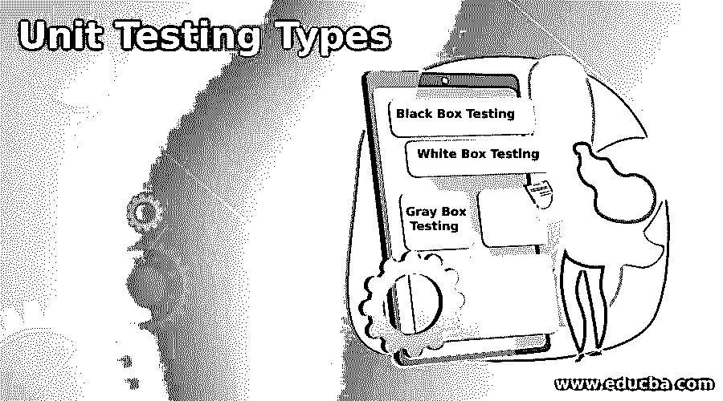

# 单元测试类型

> 原文：<https://www.educba.com/unit-testing-types/>

## 单元测试简介

下面的文章提供了单元测试类型的概要。单元测试是指测试软件应用程序的单个“单元”/模块，以便在进行高级测试之前验证单元组件是否按预期工作。“单元”基本上是在软件产品开发阶段测试的应用程序的一个小的可测试部分。因此，在单元测试的早期阶段检测缺陷是非常容易和时间友好的。单元测试的主要目的是隔离应用程序的每个模块、功能和方法，分析、测试和重构它，以最大限度地减少后期出现问题的机会。

### 各种单元测试类型

单元测试基本上分为三种类型，它们将在较小的单元中测试整个应用程序:

<small>网页开发、编程语言、软件测试&其他</small>

#### 1.黑箱测试

黑盒测试基本上是软件测试，包括内部功能、代码知识、实现细节等。测试人员不知道。通过只关注软件应用程序的输入/输出来执行测试。这种测试也被称为行为测试。该测试的主要来源是客户提到的需求和给定输入的预期输出。

在[黑盒测试](https://www.educba.com/black-box-testing/)中，黑盒可以是任何软件应用程序，可以是网站、oracle 等数据库或任何定制软件。在该测试中，通过传递输入来测试软件的功能/单元，并且检查它是否产生预期的结果。如果实际输出符合预期结果，则认为通过，否则认为失败。在单元测试失败的情况下，它被交给开发人员并采取相应的行动。

让我们看看在执行应用程序的黑盒测试时所遵循的一般步骤:

*   因为黑盒测试是基于特定单元的要求，所以检查单元/模块的要求和规格。
*   测试人员和测试数据创建测试场景(正面的和负面的)来完整地测试模块。
*   对于测试场景，测试用例由测试人员创建，显示基于各种输入的预期输出。
*   测试人员现在执行测试用例。
*   在执行之后，预期的和测试者的实际输出进行比较。
*   “失败的”测试用例被再次报告给开发人员，他们被再次纠正和重新测试。

在软件应用的黑盒测试中涉及的一些重要的测试技术是决策表、边界值分析、等价类、状态模型、域测试等。

#### 2.白盒测试

[白盒测试](https://www.educba.com/white-box-testing/)基本上是一种软件测试，其中测试软件应用的内部功能、实现、设计和编码，并根据提供的输入检查适当的流程和输出。与只关注功能的黑盒测试不同，它分析软件应用程序的内部结构。它也被称为透明盒测试、开放盒测试、基于代码的测试和基于玻璃的测试。由于这种测试侧重于通过测试输入输出流来加强软件的安全性，因此需要一个具有良好编程技能的人来为其开发测试用例。

术语“白盒”、“玻璃盒”、“透明盒”用于此测试，因为它提供了从外壳到内部工作的应用程序透视能力。它是由开发人员执行的，他们会彻底测试每一行代码。这种测试对于揭示代码中的“隐藏”错误、破损或结构不良的代码、内部安全漏洞、条件循环检查等非常有帮助。

让我们看看在执行应用程序的黑盒测试时所遵循的一般步骤:

*   由于白盒测试是基于对代码的直接操作，所以首先理解应用程序的代码是很重要的，这样才能对其内部工作有完整的了解。
*   白盒测试的第二步是编写测试用例来检查流程和应用程序结构。
*   测试用例，现在由测试人员执行。
*   基于实际和预期的结果，测试用例被标记为通过或失败。
*   开发人员(开发相应的模块)再次报告失败的测试用例，这些用例被纠正并再次重新测试。

应用程序白盒测试中涉及的一些重要技术有语句覆盖、分支覆盖、决策覆盖、控制流覆盖、数据流覆盖、路径覆盖、条件覆盖等。

#### 3.灰盒测试

灰盒测试是一种软件测试技术，在这种技术中，利用软件应用程序的内部结构和实现的部分知识来测试应用程序。它是应用程序的黑盒和白盒测试的组合。[灰箱测试](https://www.educba.com/gray-box-testing/)是为了识别由于不正确的代码结构或软件使用不当而可能出现的问题。它增加了应用程序的测试覆盖率，因为它既关注表现(黑盒)也关注内部代码(白盒)。

灰盒测试基于 UML 图、数据库图、功能规范等。它提高了软件应用程序的整体质量，并涉及到开发人员和测试人员。对于执行灰盒测试的测试人员来说，不需要太高的编码技能。它主要关注于识别属于 web 系统的特定于上下文的错误。为了执行灰盒测试，测试人员不一定要直接从代码中编写测试用例，因为测试用例可以基于架构知识、高级描述、代码知识和软件产品的基本工作来设计。

灰盒测试中涉及的一些重要技术有矩阵测试、回归测试、模式测试、正交阵列测试。

### 结论

上面的描述清楚地解释了什么是单元测试及其各种类型。对于任何软件应用程序，对其执行严格的单元测试以确保应用程序的每个单元模块都按预期工作是很重要的。此外，它还降低了测试的成本，因为缺陷只在早期阶段被识别出来。

### 推荐文章

这是单元测试类型的指南。为了更好地理解，我们在这里讨论介绍和各种单元测试类型。您也可以看看以下文章，了解更多信息–

1.  [控制流测试](https://www.educba.com/control-flow-testing/)
2.  [无障碍测试](https://www.educba.com/accessibility-testing/)
3.  [白盒测试的类型](https://www.educba.com/types-of-white-box-testing/)
4.  什么是自动化测试？

