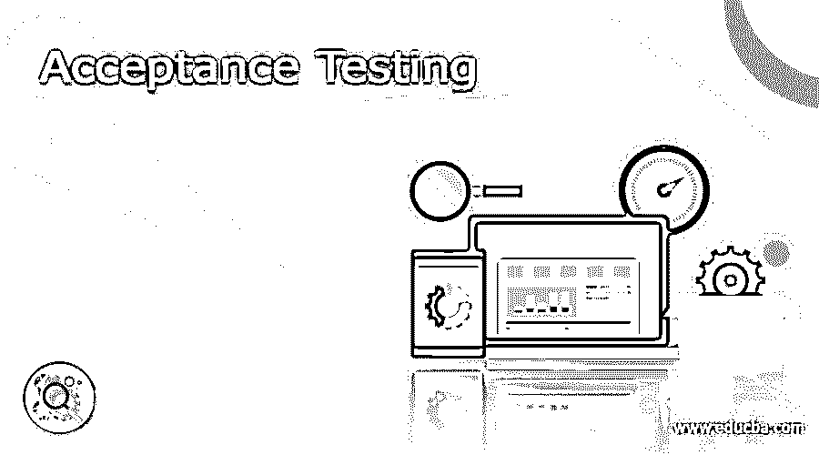

# 验收测试

> 原文：<https://www.educba.com/acceptance-testing/>

## 什么是验收测试

验收测试是基于用户需求和功能处理进行的正式测试。首先，它用于验证软件是否满足指定的需求和用户需求。它是基于黑盒测试执行的，在黑盒测试中，测试过程中涉及到所需的用户数量。最后，它用于检查软件的可接受性。

### 为什么我们需要验收测试？

由于以下原因，需要进行验收测试

<small>网页开发、编程语言、软件测试&其他</small>

*   在软件开发过程中，如果需求发生变化，可能无法有效地传达给开发团队。
*   基于指定的需求和他们的理解，开发人员开发软件中的功能。开发人员可能很少了解最终用户的需求
*   只有当最终用户在实时场景中使用系统时，才可能发现一些小错误。为了找到这些错误，需要对软件进行验收测试。

### 验收测试的先决条件

*   用户需求必须可用。
*   应用程序的编码必须充分开发。
*   单元测试，集成测试，系统测试都要做。
*   回归测试必须在没有重大缺陷的情况下完成。
*   必须完成所有品酒的可追溯性矩阵。
*   测试环境必须准备好。

### 如何进行验收测试？

这个过程包括五个阶段，即需求分析、测试计划创建、测试用例设计、测试用例执行和目标确认。让我们详细讨论这些阶段。

1.  需求分析:在这个阶段，测试团队首先分析需求文档，并根据这些需求，找出所开发软件的目标。使用需求文档、流程图和业务用例。完成业务需求文档、系统需求规范、项目章程和测试计划。
2.  测试计划创建:它概述了测试过程的整个策略。该策略用于确保和验证软件是否确认指定的需求。
3.  测试用例设计:在这个阶段，基于测试计划文档，测试用例以这样一种方式设计，即用例可以覆盖大部分场景。
4.  测试用例执行:在这个阶段，所有的测试用例都使用适当的输入值来执行。测试人员收集所有的用户输入值并执行它们，以确保软件在适当的场景下正常工作。
5.  目标的确认:在执行了上面提到的所有步骤之后，测试团队确认软件是没有缺陷的，并且已经准备好交付给客户了。

### 验收测试的类型

它分为以下几类。

*   内部验收测试:这也称为 alpha 测试。它由开发软件但不直接参与项目的组织成员执行。换句话说，我们可以说它涉及产品管理、客户支持和销售部门成员。
*   外部验收测试:这是由开发软件的组织以外的人员执行的。
*   用户验收测试；这是众所周知的测试最终用户的软件执行。最终用户可以是顾客本身、公众或顾客。
*   客户验收测试:这是由开发软件的组织的客户执行的。是他们要求组织开发软件的。

### 验收测试的测试计划

测试计划具有以下属性:

*   介绍
*   验收测试类别
*   操追境
*   测试用例 ID
*   测试标题
*   测试目标
*   检查法
*   试验进度表

### 验收测试的测试报告

测试报告具有以下属性

*   报告标识符
*   结果摘要
*   变化
*   推荐
*   待办事项列表摘要
*   批准决定

### 优势

*   当客户根据需要测试需求定义时，它改进了需求定义。
*   给出测试策略的清晰视图。
*   提高客户在测试应用程序本身时的满意度。
*   增进对目标受众需求的理解。
*   帮助交付无 bug 软件。

### 验收测试工具

为了测试，使用了各种工具。其中一些如下

Watir :这是一个开源的 Ruby 库，用于自动化 web 浏览器。它驱动 Chrome、internet explorer、Firefox、opera 和 safari。它可作为红宝石宝石。Watir 由几个项目组成，如 watir classic、watir web Driver 和 watir spec。

**适应工具**:用于自动输入输入值，生成测试用例。用户需要输入值，这些输入的值随后被 fitness 工具用来执行测试用例并生成适当的输出。对于进程间通信，fitness 工具使用 java 语言。有了这个工具，团队可以轻松地创建和测试案例。他们也可以用表格的形式记录测试用例。

### 结论

在本文中，我们已经讨论了验收测试的基本概念及其工作过程。我们还用工具讨论了它的优缺点。最后，我们已经讨论了测试计划和测试报告..

### 推荐文章

这是验收测试指南。在这里，我们还将讨论简介、如何执行验收测试，以及优点和类型。您也可以看看以下文章，了解更多信息–

1.  [用于测试的温度弹出窗口](https://www.educba.com/?post_type=popup&p=476363)
2.  [静态测试与动态测试](https://www.educba.com/static-testing-vs-dynamic-testing/)
3.  [渗透检测的类型](https://www.educba.com/types-of-penetration-testing/)
4.  [JavaScript 测试框架](https://www.educba.com/javascript-testing-frameworks/)

