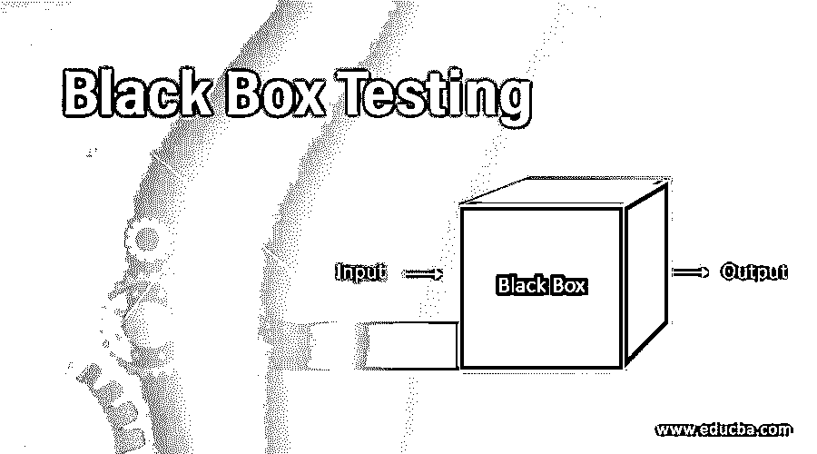
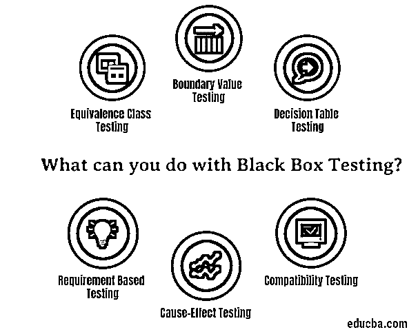

# 黑箱测试

> 原文：<https://www.educba.com/black-box-testing/>

## 黑盒测试简介

黑盒测试是一种软件测试方法，其中测试人员不知道需要测试的项目的内部结构或设计或实现。黑盒测试是一种软件测试技术，它专注于分析软件功能和内部系统机制。黑盒测试是作为一种分析客户需求、规格和高级设计策略的方法而开发的。黑盒软件测试器将选择有效和无效的输入集和代码执行条件，并检查有效的输出响应。黑盒测试也被称为功能测试或封闭盒测试。

软件测试是评估一个系统的过程，目的是为了发现错误。执行该测试是为了检查系统是否满足其规定的要求。测试根据系统的正确性、完整性、可用性、性能以及其他功能和非功能属性来度量系统的整体质量。

<small>网页开发、编程语言、软件测试&其他</small>

例如，一个应用程序的搜索引擎。在搜索引擎中，用户会在浏览器的搜索栏中输入文本。搜索引擎随后将定位并检索相关的用户数据输出。用户不知道幕后发生了什么。因此，内部实现对他没有任何了解。

黑盒测试的优势包括:

*   **简单:**便于测试高级设计和复杂的应用程序。
*   节约资源:测试人员关注软件功能。
*   **测试用例:**关注软件功能，以促进快速测试用例开发。
*   **提供灵活性:**不需要特定的编程知识。

**举例:**

测试人员将测试网页，即通过点击和击键，在不知道内部结构的情况下使用浏览器提供输入，从而对照预期结果验证输出。

### 用于黑盒测试的工具

黑盒测试工具基本上取决于你正在实现的黑盒测试的类型。

*   功能/回归测试可以通过 QTP 或硒来完成。
*   非功能性测试可以通过 LoadRunner 或者 Jmeter 来完成。

**等级:**

在黑盒测试中，以下级别适用于软件测试:

*   集成测试
*   系统试验
*   验收测试

随着级别的提高，盒子会变得更大、更复杂，同时，更多的黑盒测试也会出现。

### 理解黑盒测试

黑盒测试可以被定义为一种测试技术，其中被测应用程序(AUT)的功能被测试，但是忽略了内部代码的结构、实现的细节以及软件内部路径的任何知识。

黑盒测试是关于所有的软件规格和需求。黑盒测试只关注软件系统的输入和输出，而不关心软件的内部知识。

### 黑盒测试是如何让工作变得如此简单的？

还有[软件测试生命周期](https://www.educba.com/software-testing-life-cycle/)，即 STLC，属于黑盒测试，相对于[软件开发生命周期的各个阶段。](https://www.educba.com/what-is-sdlc/)

*   在 STLC 的初始或第一阶段，收集产品的需求。这就是所谓的需求收集阶段。
*   接下来的阶段是测试计划和测试分析阶段。此阶段的可交付成果通常是根据项目完成的测试类型，以及确定风险和减轻这些风险的测试计划。
*   第三阶段是设计阶段，在这个阶段，测试用例、测试脚本是在软件需求文档或业务需求文档的帮助下准备的。
*   最后一个阶段被称为测试执行阶段。顾名思义，在这个阶段，所有的测试用例或脚本都被执行。所有发现的错误都被报告、修复和重新测试。

### 你能用黑盒测试做什么？

黑盒测试中使用的一些主要测试策略如下:

*   等价类测试
*   边界值测试
*   决策表测试
*   因果测试
*   基于需求的测试
*   兼容性测试

#### 1.等价类测试

这种类型的测试是首选的，因为它有助于将测试用例减少到需求覆盖机会达到最佳水平的水平。

这通过以下两个步骤完成:

*   **识别并划分为等价类:**首先，输入数据被划分为至少两个集合——第一个集合包含有效输入值的列表，第二个集合包含无效输入值的列表。例如，如果有一个年龄框可以包含 20-40 范围内的年龄，则有效的输入值可以是 21、25、30、39 等。无效输入值可以是小于 20 或大于 40 的任何值，如 10、15、45、55 等。
*   **创建测试用例**–为每个有效的输入类和无效的输入类分配一个唯一的标识号，然后编写测试用例以覆盖两组输入类。

#### 2.边界值测试

边界值测试主要关注边界值。它评估系统是否可以接受某个范围的值。边界值测试有助于减少/最小化测试用例的数量。边界值测试最适合于输入位于特定范围内的系统。

#### 3.决策表测试

决策表以矩阵的形式展示了原因及其同时产生的影响。在决策[表测试](https://www.educba.com/decision-table-testing/)中，每一列都存在唯一的组合。

#### 4.因果图

因果图在原因(逻辑输入)和相应的结果(行动)之间建立了一种关系。它们借助于布尔图来表示。

要遵循的步骤如下:

*   输入和输出的识别。
*   因果图的开发。
*   图到决策表的转换。
*   决策表规则到测试用例的转换。

#### 5.基于需求的测试

这种类型的测试包括检查 SRS 或软件需求规范中提到的需求是否有效。

#### 6.兼容性测试

为了交付功能，产品和基础设施都依赖于测试用例执行的结果。不管基础结构参数发生了什么变化，产品仍然可以正常工作。

下面列出了一些通常会影响软件兼容性的参数:

*   奔腾 3 或奔腾 4 处理器以及使用的处理器数量。
*   32 位或 64 位架构。
*   数据库服务器或任何其他后端组件。
*   操作系统的类型(Windows、Linux 等。)

### 使用黑盒测试

以下是执行黑盒测试所需的基本步骤。

*   首先，讨论了系统的规格和需求。
*   其次，测试人员会选择逻辑输入，也就是肯定的测试场景，以检验 SUT 是否正确地处理了它们。此外，还选择了无效输入，即否定测试场景，以检查 SUT 是否能够检测到它们。
*   第三，测试人员将确定所有有效输入的预期输出。
*   第四，软件测试人员用那些选择的和有效的输入创建测试用例。
*   第五，执行创建的测试用例。
*   第六，软件测试人员区分实际输出和预期输出，并检查它们是否相同。
*   最后，如果发现任何问题，它们将被修复并重新测试。

### 优点和缺点

下面是提到的优点和缺点:

#### 优势:

*   黑盒测试总是从用户的角度来执行，因为它们有助于显著暴露差异。
*   黑盒测试人员也不需要知道任何编程语言。
*   黑盒测试人员不需要知道软件是如何实现的。
*   一旦规范处于完成阶段，测试人员就设计与黑盒相关的测试用例。

#### 缺点:

*   因为不需要任何技术或编程知识，所以可能会有忽略必须测试的场景的所有有效和可能的条件的情况。
*   由于时间限制(规定的时间)，存在较少测试和忽略每一个可能的输入及其输出测试的可能性。
*   对于复杂的大型项目来说，完整的测试覆盖通常是不可能的。

### 为什么要用黑盒测试？

黑盒测试工具基本上是记录和回放工具。这些工具以脚本的形式记录测试用例，如 TSL、JavaScript、VB script 等。所有这些工具基本上都用于回归测试，以便检查所提供的新版本是否在已经很好工作的应用程序功能中产生了任何缺陷。

### 范围

最突出和最重要的黑盒测试类型如下:

*   **功能测试:**这类黑盒测试都是关于系统的功能需求，由软件测试人员执行。
*   **非功能性测试:**这种黑盒测试不是关于特定功能的测试，而是关于非功能性需求，比如性能、可用性、可伸缩性等等。
*   **回归测试:**回归测试在代码固定后执行；进行系统的任何代码升级或任何其他维护，以验证新代码是否没有影响现有功能。

### 差异

黑盒测试是一种软件测试技术，其中被测试产品的内部结构或设计或实现对测试人员来说是未知的。白盒测试是一种软件测试技术，其中测试人员知道被测试产品的内部结构或设计或实现。

| **黑盒测试** | **白盒测试** |
| --- | --- |
| 黑盒测试是指内部结构、程序或代码未知的测试。 | 白盒测试是指测试人员了解软件的内部结构。 |
| 这通常由软件测试人员来完成。 | 通常由软件开发人员来完成。 |
| 这里，绝对不需要任何实现知识。 | 在这里，实现的知识是必需的。 |
| 它也可以被称为外部/外部软件测试。 | 它也可以被称为内部/内部软件测试。 |
| 黑盒测试是软件的功能测试。 | 白盒测试是软件的结构测试。 |
| 这个测试可以在需求规格文档的基础上开始。 | 这种类型的软件测试是在详细的设计文档之后开始的。 |
| 这里不需要编程语言知识。 | 在这里，必须掌握至少一门编程语言的知识。 |
| 基本上就是软件的行为测试。 | 这是软件的基本逻辑测试。 |
| 它主要适用于更高层次的测试。 | 它主要适用于较低层次的测试。 |
| 它也被称为行为测试。 | 它也被称为透明或玻璃盒测试。 |
| 黑盒测试比白盒测试耗时少。 | 白盒测试比黑盒测试更耗时。 |
| 它不适合算法测试。 | 白盒测试适用于算法测试。 |
| 这可以通过试错法来完成。 | 数据的内部或内部边界，以及它的域，可以被彻底地测试。 |
| 例如:借助关键词在谷歌上搜索一些东西。 | 例如:使用输入来检查和验证循环。 |
| **类型**

*   functional test
*   Non-functional test
*   regression testing

 | **Ty****PE****s**

*   Path test
*   loop test
*   Conditional test

 |

### **结论**

所有讨论的主题都是与黑盒测试及其所有技术和方法的要点相关的基础和高级主题。由于几乎不可能在人工参与的情况下测试所有的东西，而且也不可能达到 100%的准确性，但是如果已经指定的方法被非常有效地使用，毫无疑问，它将提高系统的质量。因此，为了结束，这是一个非常有效的方法来识别缺陷以及验证系统的功能。

### 推荐文章

这是黑盒测试的指南。在这里，我们将借助例子和不同的工具技术来讨论黑盒测试是如何执行的。您也可以浏览我们推荐的其他文章，了解更多信息——

1.  [白盒测试](https://www.educba.com/White-Box-Testing/)
2.  [测试面试问题](https://www.educba.com/testing-interview-questions/)
3.  [什么是虚拟机管理程序](https://www.educba.com/What-is-Hypervisor/)
4.  [游戏测试面试问题](https://www.educba.com/game-testing-interview-questions/)

