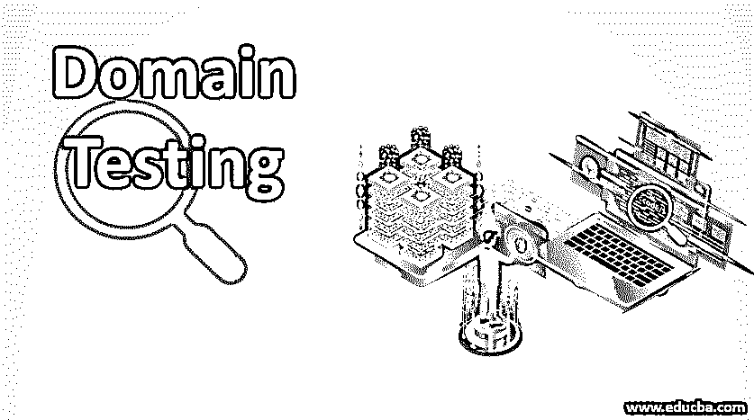

# 领域测试

> 原文：<https://www.educba.com/domain-testing/>

## 领域测试简介

领域测试是一种软件测试技术，通过提供输入数据和验证相关输出来测试应用程序。领域测试也称为等价测试或边界分析测试。在领域测试中，测试使用最少数量的输入数据进行，这样应用程序就不允许无效和超出范围的数据，并评估输出的预期范围。域测试确保应用程序没有超出上述有效范围的输入数据。该测试过程用于验证应用程序对不同输入值的反应或操作能力。

### 领域测试的 4 大策略

现在让我们讨论一下领域测试策略:

<small>网页开发、编程语言、软件测试&其他</small>

它分为多个子域。之后，应用程序考虑域测试和子域，即通过子域测试单个或组合的输入数据。它简化了复杂的场景，因为域被划分为子域。在子域边界进行的测试称为边界值分析(BVA)。当测试条件被分成测试集或组时，那么它就被命名为[等价类测试](https://www.educba.com/equivalence-class-testing/)。领域测试人员需要详细了解领域。

#### 1.领域选择

功能不太复杂的领域可以被认为是领域测试。在应用程序中，需要分配输入变量，并且必须验证正确的结果。

#### 2.将输入数据分组

相似类型的输入数据被划分成子集。有两种类型的划分，等价类划分和边界值分析(BVA)。等价类划分将输入划分为等价的数据分区，以确定测试用例。这里，测试用例是以这样的方式设计的，每个分区只被覆盖一次。在边界值分析(BVA)测试中，考虑到边界值的无效范围，设计了[个测试用例。](https://www.educba.com/test-cases-vs-test-scenario/)

#### 3.用于测试的类的输入数据

边界值应被视为测试数据。边界表示等价类比其他类成员更容易发现错误。在该范围之间的数据是等价类的最佳代表。

#### 4.输出数据的验证

当输入数据被分配给与验证输出数据有关的应用程序时。输出数据应该无效并在指定范围内。

### 领域测试的例子

让我们考虑两种情况作为例子:

#### 1.单输入的测试数据

考虑 x & y 是任何表达式的输入变量，变量 z 是输出变量。这里，表达式是包含变量 x & y 的单输入场景，因此没有组合输入变量。

**表达式示例:** (z =x + y)或(z= x-y)或(z= x*y)或(z=x/y)等。

#### 2.多输入变量检验

在这个例子中，测试了关于适当输出的多个输入变量或输入变量的组合。让我们考虑一个学校管理应用程序的儿童评分系统，关于他们的评分系统班级被分配给他们。

根据上述测试条件，可以确定以下场景:

*   **Scenario1:** 学生成绩> 80 & < =100，理科科目应该在 a 类
*   **Scenario2:** 学生成绩> 80 & < =100，有户口科目应该在 b 类
*   **场景 3:** 学生成绩< =80 & > 65、理科科目应该在 c 类
*   **Scenario4:** 学生成绩< =80 & > 65，户口科目应该在 d 类
*   **Scenario5:** 学生成绩< =65 & > 50，理科应该在 e 班
*   **Scenario6:** 学生成绩< =65 & > 50，账户科目应该在 f 类
*   **场景 7:** 学生成绩< =50，理科应该在 g 班
*   **Scenario8:** 学生成绩< =50，会计科目应该在 h 班

这里，在上面的例子中，输入将是 Marks & Subject，关于那些将被分配的类。这种情况是输入的划分或输入值的分组。得分范围分为以下几类:

*   **一班:**成绩>80&100<的学生。
*   **二班:**得分< =80 & > 65 的学生。
*   **三班:**得分< =65 & > 50 的学生。
*   第四班:得分< =50 的学生。

边界值应该被认为是用于测试的数据，边界代表了等价类，其目的是找到比其他类成员更大的错误或缺陷。在该范围之间的数据是等价类的最佳代表。对于上面提到的每一类，都需要进行测试。

对于 1 班，得分在 80 分以上的学生(分数> 80 分&分数< =100 分)。

**边界值:**

*   本课程不应考虑 80 分，因为数值应大于 80。
*   本课程应考虑分数 81，因为数值应大于 80。
*   本课程应考虑 100 分，因为数值应小于或等于 100。
*   分数 101 不应该在这个类中考虑，因为值应该小于 100 或等于 100。

等价分区值:从 81 到 100 的输入值是有效的，因此必须包括 81、82、83 到 100 之间的一个值。因此，所选标记“90”是该类别的有效标记。

**输出数据的验证**

在这里，每个分区只执行一个测试条件。如果一个测试条件在一个分区中工作正常，那么所有剩余的测试条件都应该工作正常。并且，如果分区中的一个测试条件不能正确运行，那么就可以认为没有其他条件能够正确运行。

### 领域测试的结构

该结构解释如下:

*   分析与领域相关的应用程序。
*   找出有效的输入变量。
*   关于输出查找，分析输入变量并对它们进行排序。
*   关于 BVA 和等价分配分析创建/查找输入变量。
*   找到并分析与输入变量相关的输出变量。
*   查找未分析的输入变量。收集信息以供进一步评估。
*   总结与风险表相关的整个测试分析。

### 结论

它是一种软件测试技术，需要该领域的基础知识，用正确的输入进行测试，以实现必要的输出。需要将域划分为子域来有效地执行。它也被称为等价测试或边界分析测试，其中输入变量被分析和识别为边界值和等价类值，以实现预期的结果。

### 推荐文章

这是一个领域测试指南。这里我们讨论领域测试的介绍和它的测试策略，以及结构和例子。您也可以浏览我们推荐的其他文章，了解更多信息——

1.  [软件测试的级别](https://www.educba.com/levels-of-software-testing/)
2.  [手动测试](https://www.educba.com/manual-testing/)
3.  [什么是测试用例？](https://www.educba.com/what-is-test-case/)
4.  [手工测试 vs 自动化测试](https://www.educba.com/manual-testing-vs-automation-testing/)

