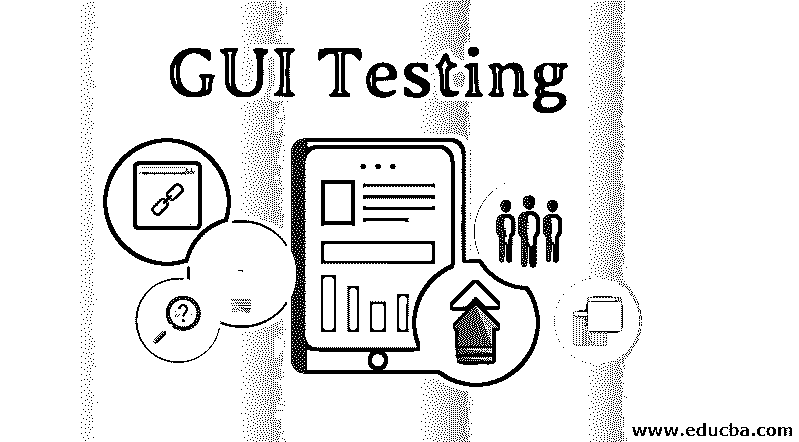

# GUI 测试

> 原文：<https://www.educba.com/gui-testing/>

## 什么是 GUI 测试？

GUI 测试被描述为在测试系统图形用户界面下对应用程序的测试。图形测试包括屏幕检查，使用图标、按钮和菜单等控件，以及所有类型的栏，如对话框、菜单栏、工具栏、窗口等。基本上，我们可以说我们看到的是 GUI。对于计算机应用程序，有两种接口。命令行界面是响应命令文本和计算机的界面。另一方面， [GUI](https://www.educba.com/what-is-gui/) 是一个图形用户界面，在其中你使用图片而不是文本来与计算机交流。

我们举个例子。如果你或你的朋友访问一个名为 Educba 的网站。首先，他会看到主页，搜索按钮，课程栏，以及许多其他 GUI(图形用户界面)。用户看不到源代码。用户可以看到界面。重点是特别是在设计的结构，以及图像的工作是否正确。连接也是可访问的，如果您单击，按钮应该可以操作。此外，如果用户重新设计屏幕，图像和内容都不能缩小或重叠。这是关于 GUI(图形用户界面)测试的一点介绍。

<small>网页开发、编程语言、软件测试&其他</small>

### 图形用户界面的特点

通过理解其不同的特征，可以进一步清楚地了解 GUI 测试。

因此，一些关键的 GUI 测试和其他相关元素描述如下:

*   这种测试方法比线路接口测试命令更难。
*   大多数用于 GUI 测试的测试工具主要集中在[回归测试](https://www.educba.com/regression-testing/)上。
*   它还确认了像字体和图片这样的组件符合它们的设计规范。
*   由于用户界面经常变化，GUI 会面临自动化测试的更多挑战。
*   它是从用户的角度进行的，而不是从开发人员或测试人员的角度。
*   它帮助团队收集决定应用程序是否可以部署所需的数据。

### 不同方式的 GUI 测试

软件专家使用全球三大 GUI 测试工具来验证图形用户界面元素的精度和质量。

*   基于人工的测试
*   记录和重放
*   基于模型的测试

#### 1.基于人工的测试

测试人员手动验证公司文档的所有图形是否满足先决条件。例如，乘法运算(33X5)可以通过[手动测试](https://www.educba.com/manual-testing/)来检查。

#### 2.记录和重放

记录和重放是一个自动化的图形用户界面工具，包含测试时的所有测试记录。

#### 3.基于模型的测试

基于模型的测试就像一个图形描述。这些测试预测系统的行为，这种技术有效地生成测试用例。决策表和图表是一些建模技术。

### GUI 测试的检查表

*   检查 GUI 元素，如长度、宽度、大小、字体等。
*   检查错误信息显示是否正确。
*   字体大小和字体可读性。
*   图片应该正确对齐。
*   所有 GUI 元素的各种分辨率的定位。

### 优势

通过在 [SDLC](https://www.educba.com/what-is-sdlc/) 的早期阶段应用 GUI 测试方法，团队将能够利用各种好处，例如加速增长、性能增强以及在周期结束时降低风险。

此外，这种测试还有其他好处，例如:

*   从客户的角度测试界面。
*   有效地降低了开发周期结束的风险。
*   有助于验证各种图标和元素是否符合设计规范。
*   提高产品可靠性和产品质量。

### 不足之处

虽然 GUI 测试有很多好处，但是测试仍然需要确认。此外，还有几个缺点。因此，以下是缺点/劣势。

*   需要更多的内存资源，这会降低系统速度。
*   测试方法需要时间，并且可能涉及额外的 GUI 软件。
*   考虑到实现接口的频繁变化，团队可能需要重构测试脚本来提高其精确度。
*   由于对源代码的访问有限或无法访问，测试方法很困难。

### 例子

*   测试元素的高度、位置和宽度。
*   测试显示的错误信息。
*   测试屏幕的各个部分。
*   测试字体是否可读。
*   我们也可以测试拼写。
*   通过放大和缩小来测试各种尺寸的屏幕，如 600×800、640×480 等。
*   文本和其他组件(如按钮、图标等)是否位于正确的位置，以测试是否对齐。
*   我们也可以测试前面的颜色。
*   测试错误信息颜色和警告信息。
*   我们还可以测试图像的清晰度
*   我们还可以测试图像的对齐情况。
*   超链接颜色测试。

### 如何做 GUI 测试？

*   确保文本框与标签“源文件夹”正确对齐
*   确保文本框与标签“Package”正确对齐
*   检查“浏览”标签是否是文本框末尾以“源文件夹”标签命名的按钮。
*   确保标签文本框“名称”正确对齐。
*   验证“Editors”标签是否由 4 个单选按钮的公共、默认、私有和受保护名称组成。
*   验证“修改者”标签下的“超类”标签是否正确对齐。
*   确保在任何需要的地方，错误都应该以红色显示。
*   确保在更新任何字段后显示正确的确认消息。

### 推荐文章

这是 GUI 测试的指南。这里我们详细讨论了 GUI 测试的类型、优点、缺点和应用。您也可以浏览我们推荐的其他文章，了解更多信息——

1.  [安全测试工具](https://www.educba.com/security-testing-tools/)
2.  [性能测试工具](https://www.educba.com/performance-testing-tools/)
3.  [SOA 测试工具](https://www.educba.com/soa-testing-tools/)
4.  [系统集成测试](https://www.educba.com/system-integration-testing/)

