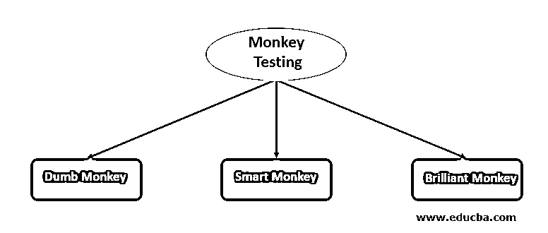

# 猴子测试

> 原文：<https://www.educba.com/monkey-testing/>

## 猴子测试简介

猴子测试是一种测试类型，其中用户通过提供随机输入来测试系统或应用程序，并在应用程序或系统崩溃时检查行为或测试。通常这种类型的测试是作为自动化单元测试随机实现的。这个猴子测试在 1983 年首次用于测试 Mac OS 上的 MacWrite 和 MacPaint。“猴子”这个名字指的是臭名昭著的，这是不确定的，说明一只猴子在键盘上随意敲击键盘无限长的时间肯定会导致一些输入。这个猴子测试作为压力测试工具的一部分包含在 Android Studio 中。这个猴子测试的目的是找出 bug 或错误。

软件中的猴子测试是一种由开发人员和测试人员使用的测试技术，或者我们可以说任何对应用程序有想法或没有想法的人，通过提供随机输入和检查应用程序的行为或试图使应用程序崩溃来测试应用程序。当用户输入任何无效输入来检查应用程序的行为时，这种技术会自动完成。

<small>网页开发、编程语言、软件测试&其他</small>

这种技术不遵循任何规则或任何预定义的测试用例及策略。

*   在猴子测试中，测试人员被认为是一只猴子，开发人员也被认为是执行测试的人
*   Monkey 随机执行任务或向系统提供输入，而不了解应用程序的知识。
*   这就像一个普通的测试人员应用他/她的测试用例，而没有预先定义任何策略来发现 bug 或错误。
*   猴子测试可以用作单元测试或 GUI 测试。
*   根据业务需求，进行测试的场景可能正确，也可能不正确。
*   由于这是随机测试，测试人员将无法重现错误
*   这是一种黑盒测试，目的是确保客户给出的规范得到正确处理。
*   这种类型的测试通常在测试人员没有时间创建和执行测试用例的时候进行。
*   也称为随机测试，模糊测试，技术上称为随机测试。

### 猴子测试的类型

根据其实现方式，它可以进一步分为 3 类。

*   哑巴猴子
*   聪明的猴子
*   聪明的猴子

#### 1.哑巴猴子

*   对系统或功能没有概念，对测试用例的有效性没有保证的猴子测试员被认为是哑巴猴子。
*   他们也不知道他们的输入数据是否有效。
*   他们也被称为“无知的猴子”
*   与智能猴子测试相比，定义更少的错误。
*   可以捕捉难以识别但也很关键的错误。

#### 2.聪明的猴子

*   这些类型的猴子测试人员对系统或功能有重要的想法。
*   这些测试人员在系统中导航，并为测试提供有效的输入。
*   他们知道产品的功能。
*   负载测试的一个很好的例子，给出快速的结果。
*   测试人员仅仅专注于在发现错误时破坏应用程序。

#### 3.聪明的猴子

*   这些类型的猴子测试人员根据客户的行为进行测试。
*   可以指定错误发生的概率。
*   他们从客户的角度进行测试。
*   它是智能猴子测试的高级版本。
*   例如，在保险领域有足够知识的测试人员将被要求输入保险领域的输入。
*   也有助于确定将来可能出现的其他错误。

### 猴子测试的优点和缺点

下面给出了优点和缺点:

#### 优势

以下是优点:

*   这是发现现成错误的有效方法。
*   执行负载和压力测试非常有用。
*   猴子测试的随机性有助于发现可能破坏系统的主要错误。
*   设置和执行它既简单又划算，因为需要一些随机输入数据来运行一些随机测试用例。
*   易于测试软件应用程序的可靠性。
*   由于测试用例是临时的，应用程序可能会有压力，因此测试人员也可以检查服务器响应。
*   它的过程可以使用工具自动化。
*   它可以用于桌面应用程序、web 应用程序以及移动应用程序。
*   聪明的猴子将有助于发现独特的错误。
*   任何人都可以访问，无论是完全了解应用程序的人还是对应用程序一无所知的人。
*   在时间紧迫的情况下，如果所有其他测试都完成了，测试人员可以选择猴子测试，这样可以快速修复错误。

#### 不足之处

以下是缺点:

*   因为猴子测试是随机的，所以测试通常不可能重现 bug。
*   意外发现的 bug 需要花费时间进行分析，并且可能具有挑战性。
*   对于聪明的猴子来说，找出错误的能力取决于状态模型，开发一个好的状态模型是昂贵的。
*   由于没有预定义的测试用例，而 bug 的数量较少，找出一个 bug 可能需要几天时间。
*   测试人员无法定义准确的测试场景，也无法保证准确性。
*   需要良好的技术经验才能使其更加准确。

尽管我们已经看到猴子测试是混乱的，但还是建议为它的执行计划和分配一些时间。在测试的初始阶段，测试人员可能找不到错误，但它可以帮助发现正常测试中难以发现的内存泄漏、硬件崩溃和故障线路。因此，通过这种测试，测试人员可以确保最终用户的需求，降低软件崩溃的概率。在这里，我们已经了解了它的主要特征、类型和优缺点。

### 推荐文章

这是猴子测试指南。在这里，我们讨论猴子测试的介绍以及类型、优点和缺点。您也可以看看以下文章，了解更多信息–

1.  [临时测试](https://www.educba.com/adhoc-testing/)
2.  [基于风险的测试](https://www.educba.com/risk-based-testing/)
3.  [手动测试](https://www.educba.com/manual-testing/)
4.  [蝗虫负载测试](https://www.educba.com/locust-load-testing/)

