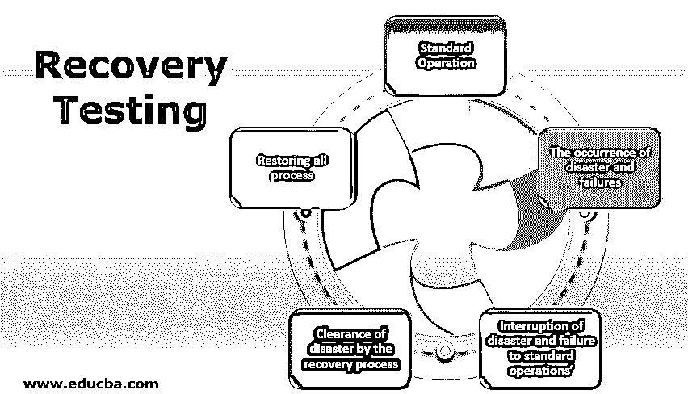

# 恢复测试

> 原文：<https://www.educba.com/recovery-testing/>

## 恢复测试简介

恢复测试可以被描述为一种软件测试，其中非功能测试过程被应用于软件应用。执行该过程是为了验证软件的响应或系统及其在崩溃或硬件故障或其他相关问题后的恢复能力。它是对软件进行强制失败的过程，以检查恢复过程是否成功。恢复测试不是一种可靠性测试，其目的是确定故障启动的准确点。恢复测试是在受控条件下通过模拟故障孔并确定故障的真正原因来完成的。该测试旨在确保在服务级别协议下，任何数据都不会受到影响、丢失或损坏。它还验证应用程序是否能够如估计的那样支持其动作，而不会对软件应用程序的组成部分造成任何破坏。

### 恢复测试是如何工作的？

回收试验应在受控条件下进行。应创建测试基础并将其部署到工作环境中，对互联网协议、接口设备、防火墙地址、连接和安装的硬件和软件进行轻微更改，使其接近原始值。这种测试应该从头到尾完整地进行，以得到一个完美的结果，即使它是耗时且昂贵的。

<small>网页开发、编程语言、软件测试&其他</small>

测试应该在将要安装到系统中的硬件系统上进行。这是一个有意义的过程，因为它用于检查和恢复备份过程，如果它将被安装在不同的机器上。备份光盘和硬件光盘的大小应该相同。但是这个问题可以通过创建虚拟机来解决。VMware 等虚拟化供应商是可用的。

应该在在线备份系统中进行测试，因为备份服务提供商通过使用容错存储系统避免了直接暴露于介质问题。备份系统非常可靠；必须检查系统的恢复端，以确保安全、加密和检索功能没有中断或缺陷。

恢复后，进行以下步骤:大型企业有单独的工程师定期进行恢复测试。这种测试和维护的费用是必不可少的，有时对于小规模工业可能不考虑。

预计在数据备份和异地存储设计上风险较小，以防止企业发生灾难。文件和数据恢复后，应进行以下检查，以确保没有数据丢失或损坏。找到并重命名损坏的文件夹，检查恢复的文件夹中的文件数量，并与现有文件夹进行交叉检查，检查文件是否可以访问。确保用户可以登录到应用程序，并且可以浏览数据、更新数据、获取数据。

打开许多包含不同数据类型的文件很好，比如 mp3、文档、图片和视频。签入大文件和小文件。只需将它们与现有的库和目录进行比较。确定恢复过程的可能性，并验证备份设施。确保纠正措施已存档，并检查对备份设施的了解。然后向相关团队提供强制性培训。向团队展示公司从严重故障中恢复的能力。定期执行恢复计划

### 恢复测试示例

回收测试的几个例子如下进行，

当应用程序从网络获取数据时，拔掉连接电缆，过一段时间后，插回电缆，检查应用程序是否从连接断开时的同一点获取数据。

当互联网浏览器打开多个标签时，重新启动系统，并确保浏览器是否能够恢复所有标签

如果一个流程中有多个故障，恢复测试应该按照优先级和服务级别协议以结构化的方式从一个单元到另一个单元进行。

在恢复测试之前，应检索备份数据并将其保存在安全的文件夹中，这样做是为了确保即使在灾难发生后也能执行常规操作。

### 回收过程的生命周期

回收过程的主要生命周期分为五个步骤，

*   标准操作
*   灾难和失败的发生
*   “灾难中断和标准操作失败”
*   通过恢复过程清除灾难
*   恢复所有进程和数据以恢复系统

#### 1.标准操作

系统或服务器包括集成到系统中的软件、硬件、防火墙和其他组件，它们一起工作以实现公共目标。该系统执行其常规操作，这是预先定义的，在提到的时间段内没有任何中断。

#### 2.灾难和失败的发生

由于不正确的输入、软件崩溃、硬件故障或由于火灾、突然袭击、威胁或打击造成的数据损坏导致的软件故障，可能会对本系统造成干扰。这是一个致命的阶段，会导致连接中断、业务损失、机会和人力资源损失。

#### 3.“灾难中断和标准操作失败”

组织应该对这种类型的灾难有一个备用计划，它不能防止公司遭受灾难，但它有助于将灾难造成的影响和损失降到最低。

#### 4.通过恢复过程清除灾难

假设风险过程和备份计划的效果应该保持在适当的位置，以在任何灾难发生之前暗示它。恢复测试可以在最短的时间内完成，而不会损失太多的能量、时间和数据。相关团队应负责尽快恢复系统。

#### 5.恢复所有进程和数据以恢复系统

恢复和重建包括重建所有文件夹以及安装和配置文件的多个过程，这些文件具有正确恢复所需的适当文档。

恢复测试是非功能性测试，指的是与特定功能或用户操作无关的软件功能，如安全性或可伸缩性。恢复点所需的时间取决于起点的数量、有限的应用程序数量、执行恢复测试的人员的技能以及可用于恢复的工具。

### 推荐文章

这是一个恢复测试指南。在这里，我们通过例子和恢复过程的生命周期来讨论恢复测试是如何工作的。您也可以阅读以下文章，了解更多信息——

1.  [稳定性测试](https://www.educba.com/stability-testing/)
2.  [静态测试技术](https://www.educba.com/static-testing-techniques/)
3.  [兼容性测试](https://www.educba.com/compatibility-testing/)
4.  [阴性测试](https://www.educba.com/negative-testing/)

