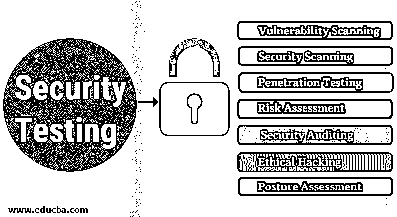

# 安全测试

> 原文：<https://www.educba.com/security-testing/>

## 安全测试简介

应用程序的安全性测试是软件测试生命周期中的一个重要步骤。它用于控制应用程序各个层次的未授权入侵，如服务器、前端应用层、中间件模块，甚至网络安全。该测试用于验证只有正确身份验证的系统或用户是否被允许访问应用程序，而身份验证失败的用户则被限制使用应用程序。

以下是一些安全缺陷列表:

<small>网页开发、编程语言、软件测试&其他</small>

*   如果“入口”分支可以编辑考试信息，则学生管理系统是不安全的。
*   如果 DEO(数据输入操作员)可以产生“报告”，ERP 系统是不安全的。
*   如果客户的信用卡资料没有加密，那么在线网站就没有安全性。
*   当 SQL 查询找到真实的用户密码时，个性化软件的安全性不足。

### 安全测试的类型

开源安全测试方法手册有七种主要的安全测试。

*   **漏洞扫描:**这是通过自动软件扫描系统中已知的漏洞特征来执行的。
*   安全扫描:它包括识别网络和系统中的弱点，并提供减少此类危险的替代方案。对于手动和自动扫描，可以进行这种扫描。
*   **渗透测试:**该测试模拟恶意黑客攻击。这种检查包括分析特定系统，以检测内部黑客攻击的潜在漏洞。
*   **风险评估:**该测试包括分析在公司观察到的安全隐患。风险分为低、中、高三个等级。该测试提出了降低风险的控制措施和行动。
*   **安全审计:**审计也可以通过线路、代码检查、操作系统对安全故障进行在线审计。
*   **道德黑客:**道德黑客并不等同于恶性黑客。相反，道德黑客旨在识别组织结构中的安全缺陷。
*   **态势评估:**这结合了安全扫描、风险评估和[道德黑客，以显示](https://www.educba.com/ethical-hacking-software/)一个组织的整体安全状况。

### 安全测试方法

安全性测试有不同的方法:

*   老虎盒子
*   黑匣子
*   灰色方框

#### 1.老虎盒子

这种黑客行为通常在装有操作系统和黑客工具集的笔记本电脑上进行。该测试[允许渗透测试](https://www.educba.com/penetration-testing-services/)操作员和安全测试操作员评估和攻击漏洞。

#### 2.黑匣子

[黑盒测试](https://www.educba.com/black-box-testing/)是一种被测试人员称为行为测试的软件测试方法。这样，测试产品的内部设计就不知道了。因此，这些检查可以是功能性的，也可以是非功能性的。

#### 3.灰色方框

灰盒测试是一种结合了黑盒和白盒测试的软件测试技术。[灰箱测试](https://www.educba.com/grey-box-testing/)是一种测试应用程序或软件产品的方法，该应用程序或软件产品具有实现的部分内部工作。

### 我们如何进行安全测试？

人们一直认为，如果我们在软件实现或部署之后推迟安全性测试，成本会增加。在早期阶段，安全性测试必须在 SDLC 生命周期中进行。让我们来看一下[每个 SDLC 阶段](https://www.educba.com/what-is-sdlc/)的适当安全程序。对于输入区域，测试仪可以检查最大长度。这种限制不允许黑客包含这样的恶意脚本。

*   需求安全评估和滥用/误用检查。
*   设计的安全隐患分析。[测试计划开发](https://www.educba.com/test-plan-template/)，包括安全测试。

### 十大开源安全测试工具

下面是顶级安全测试工具及其特性的列表。当然，你可以根据自己的需求选择任何工具。

#### 1.麋鹿

Wapiti 是一个强大的 web 应用程序安全测试工具，用于评估您的 web 应用程序的安全性。它执行“[黑盒测试](https://www.educba.com/black-box-testing-techniques/)，以检查 web 应用程序中的潜在漏洞。它扫描网页并注入测试信息，以在测试阶段监控安全缺陷。Wapiti 为支持 GET 和 POST HTTP 攻击定义了多个漏洞。Wapiti 是一个对新手来说很难，但对专业人士来说很简单的命令应用。因此，软件需要全面的命令理解。

**马鹿的特征:**

*   XSS 注射液
*   数据库注入
*   命令执行的检测。
*   注射 CRLF

#### 2.Zed 攻击代理

Zed 攻击代理，通常被称为 ZAP，ZAP 是由 OWASP 创建的，因此 ZAP 是开源的。Zed 攻击代理受 Unix / Linux、Windows 和 Mac OS 支持，Zed 攻击代理允许您在 web 应用程序的开发和测试阶段识别一系列漏洞。这个测试工具很容易使用，即使你是一个渗透测试初学者。

**Zed 攻击的特征:**

*   Zed 攻击代理有一个自动化扫描器和认证支持。
*   Zed 攻击代理还具有动态 SSL 证书和 Web 套接字支持。

#### 3.低湿平原

用 JAVA 写的，Vega 有一个 GUI。它可以在 Linux、Mac OS 和 Windows 上访问，这可以帮助你。Vega 是一个免费的 web 应用测试工具和开源平台。Vega 可以帮助发现和验证 SQL 注入、跨站点脚本(XSS)和其他漏洞。它还可以用来设置首选项，比如路径后代的数量、每秒的节点数量、每秒的最大和最小请求。

**织女星的特点:**

*   Vega 有跨站点脚本。
*   SQL 注入验证。

#### 4.W3af 的

W3af 是一个著名的 web 应用安全测试框架。它提供了一个使用 Python 开发的有效的 web 应用渗透测试平台[。该工具可用于识别 200 多种互联网应用安全问题，如跨站脚本和 SQL 注入。此外，它还监控以下 web 应用程序漏洞。W3af 在 GUI 和控制台界面中都很容易理解。认证模块还允许您对网站进行认证。](https://www.educba.com/what-is-python/)

**W3af 的特点:**

*   多个 CORS 设置有缺陷。
*   CSRF 和更多的弱点。

#### 5.鲣鱼

Skipfish 是一个互联网应用程序监督测试工具，它修复网站并检查每个页面上的任何弱点，最后准备审计报告。Skipfish 是用 c 语言编写的，并被优化来处理 HTTP 和留下最小的 CPU 足迹。在不显示 CPU 占用的情况下，该软件声称每秒处理 2 K 个请求。该工具还声称提供了高质量的好处，因为它在 web 应用程序中使用了启发式方法。Linux、FreeBSD、Mac-OS X 和 Windows 都提供了针对互联网应用程序的 Skipfish 安全评估工具。

#### 6.sqlcmap

SQLMap 是一种常见的基于 web 的安全测试工具，用于在网站数据库上自动执行 [SQL 注入漏洞](https://www.educba.com/what-is-sql-injection/)检测过程。测试引擎打包了许多不同的特性，功能强大，允许在 Web 应用程序上进行简单的渗透和 SQL 注入测试。SQLMap 支持很多数据库，包括 MySQL、Oracle、PostgreSQL、Microsoft SQL 等。此外，测试工具支持六种不同的 SQL 注入方法。

#### 7.Wfuzz

Wfuzz 是另一个开源工具，可以在市场上免费获得，是一个基于 web 的安全测试工具。这个测试工具是用 Python 开发的，用于暴力的 web 应用程序。使用 Wfuzz 时需要在命令行界面上操作，因为没有 GUI 界面。

**Wfuzz 的特点:**

*   Wifuzz 支持多个注入点。
*   Wfuzz 输出是 HTML 格式的。
*   它还具有多线程功能。
*   它还支持多个代理。

#### 8.Metasploit

渗透测试最常用的框架之一。Metasploit 是一个开源测试平台，它允许进行远远超出风险评估的安全测试。

**Metasploit 的特性:**

*   这个结构比竞争对手的要好得多。
*   渗透模拟函数的许多场景

#### 9.Acunetix

一个完整的自动化渗透评估工具，扫描您的网站的 4500 多个漏洞。Acunetix 最显著的特点就是可以不间断的冲几千页。

**acune tix 的特性:**

*   它可以很容易地产生许多技术和合规补救措施。
*   扫描开源和个性化应用
*   高效扫描的深度扫描。

#### 10.强夺者

Grabber 是一款开源扫描仪，用于检测互联网应用程序的安全漏洞。论坛和私人互联网站点等小型 web 应用程序是移动的，可以被扫描。然而，Grabber 是一个小的测试工具，扫描大型应用程序需要更长的时间。此外，该扫描仪没有 GUI 界面，也没有 PDF 报告生成功能，因为它是为个人使用而设计的。

**抓取器特征:**

*   文件验证备份
*   Ajax 验证

### 结论

本文介绍了什么是安全性测试，我们为什么需要它，不同类型的安全性测试，以及用于执行测试的工具和特性。本文将帮助您根据您的需求和上面给出的特性选择测试工具。

### 推荐文章

这是安全测试指南。在这里，我们讨论介绍、类型、方法和 10 大开源安全测试工具。您也可以浏览我们推荐的其他文章，了解更多信息——

1.  [阿尔法测试 vs 贝塔测试](https://www.educba.com/alpha-testing-vs-beta-testing/)
2.  [静态测试](https://www.educba.com/static-testing/)
3.  什么是可用性测试？
4.  [性能测试工具](https://www.educba.com/performance-testing-tools/)

