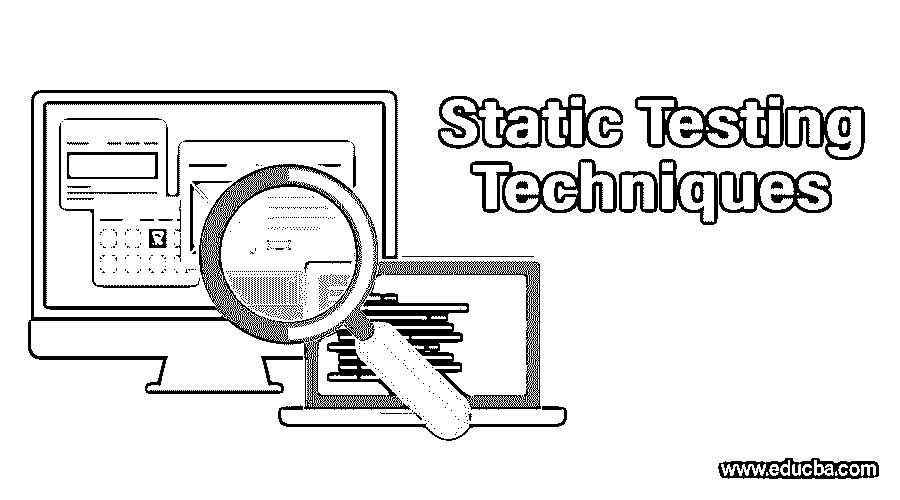

# 静态测试技术

> 原文：<https://www.educba.com/static-testing-techniques/>

## 什么是静态测试？

静态测试是一种在软件应用程序上执行的测试技术，其中测试元素并没有实际执行或投入使用。顾名思义，它与动态测试相反，因此应用程序在运行时不会被测试。它涉及手动功能测试过程，基于视觉/物理评估代码的功能覆盖、分析代码中的错误、代码中未使用的片段或变量、编码标准等活动。

静态测试有两种方式:

<small>网页开发、编程语言、软件测试&其他</small>

*   **评审:**评审是为了发现文档中的缺陷、问题和歧义，比如需求、设计等。评审在静态测试中起着重要的作用，因为在开始时找到失败的原因比在结束时找到失败的原因更好。由于大多数问题是在软件开发之后出现的，涉及到需求、设计在开始时没有固定下来或在文档中发现的任何模糊之处。评审可以是正式的/非正式的，这取决于软件测试的特定[阶段](https://www.educba.com/what-is-software-testing/)。软件测试中的评审包括非正式的、走查的、检查的和技术的评审。
*   **静态分析:**在静态分析中，对软件或应用程序进行测试，以发现开发人员编写的代码中的结构缺陷，而不实际执行它。静态分析通常由工具完成，用于发现缺陷，如未使用/未引用的变量、编程标准违规、语法违规、未遵循的编码标准、死代码(代码已编写但未在任何地方使用)等。市场上有一些工具可以帮助静态分析代码，分析结构和依赖性，计算圈复杂度或嵌套级别等指标，并迫使开发人员遵循特定的编码标准，并帮助进行静态分析。

### 静态测试技术

如上所述，静态测试要么在评审中手工完成，要么通过静态分析中的测试工具来完成。

**评审过程:**在静态测试中，评审可以通过两种方式进行:

#### 1.非正式审查

*   非正式评审在开发生命周期的早期阶段完成。
*   非正式评审中不使用正式文件或程序。
*   非正式评审有各种各样的形式，唯一的特点是没有正式的文档记录。
*   非正式评审的主要目的是在作者的帮助下提高软件质量。
*   它遵循一个简单的程序，就像两个人坐在一起，一个是作者，审查其他同事的工作，如任何文档、设计、代码等。根据测试的级别，它可能会进一步增加更多的成员或者整个团队。

#### 2.正式审查

*   正式审查的结构和记录非常完善。
*   正式评审是受管理的，遵循不同的评审阶段，如计划、启动、准备、评审会议、返工和跟进。
*   正式审查涵盖了广泛而严肃的软件场景，如法律要求、软件开发的成熟度等。

### 评论的类型

下面提到的是各种类型的点评:

#### 1.游戏攻略

*   在演练中，作者领导评审过程以达成共识，其他团队成员提出可能的问题并提交他们收集的反馈。
*   演练可以是正式或非正式的审查。
*   会议记录和报告的缺陷/发现由记录员(不是作者)记录下来，以便以后跟踪。
*   团队成员不需要对内容有详细的了解，因为作者对此有充分的准备，这是一种知识转移会议。

**演练的主要目标**

*   主要目标是让其他团队成员能够学习和了解相关内容。
*   向软件领域内外的所有涉众展示文档，并收集更多关于所考虑文档的信息。
*   他们的目标是让其他成员清楚地检查内容，以便他们可以为提议的文档提供建议和备选方案。

#### 2.检查

*   检查是最正式的审查之一。
*   它由一个训练有素的主持人领导，而不是会议的作者。
*   审阅者在会前对文档或需要讨论的内容做了充分的准备。
*   在这个会议中使用规则和清单，在此期间产品被检查，缺陷被记录。
*   会议中发现的缺陷记录在问题日志或记录列表中。
*   会议有适当的进入和退出标准。
*   会议期间创建的报告与作者共享，以便采取适当的措施。
*   主持人执行正式的跟进流程，以解决改进问题并从发现的缺陷中学习。

**检查的主要目的**

*   提高被检查文件的质量。
*   快速发现并修复会议中发现的缺陷。
*   通过小组讨论和信息交流建立更详细的理解。
*   从以前引入的缺陷中学习，并且在将来不重复它们。

#### 3.技术评论

*   它被很好地记录并遵循缺陷检测技术，该技术涉及同行和技术专家。
*   它通常由训练有素的版主而不是作者领导。
*   在技术评审中，对产品进行检查并发现缺陷，这些缺陷主要是技术缺陷。
*   技术评审中没有管理层的参与。
*   完整的报告将列出一系列需要解决的问题。

**技术评审的主要目标**

*   让参与者了解文档的技术概念。
*   要确保从一开始，就需要正确理解技术概念。
*   从参与者那里收集关于技术概念的备选方案和解决方案。
*   保持软件技术和概念设计的一致性。
*   关注软件的技术方面和技术可行性，这和概念上的一样重要。

### 结论

静态测试不仅有助于在早期发现缺陷，还提供了文档的封闭外观，并有助于理解缺失的需求、模糊性、设计缺陷、维护问题等。一份文件要经过多次审查，每次审查都有自己的目标和程序。每个评审都有一个特定的目的，就像非正式评审在任何技术或正式评审之前完成，以便可以非正式地发现的缺陷可以首先被修复。在开发之前和开发期间，对任何文档进行的审查越多，最终出现缺陷的可能性就越小。

### 推荐文章

这是静态测试技术的指南。在这里，我们详细讨论各种类型的审查和静态技术。您还可以浏览我们推荐的其他文章——

1.  [静态测试](https://www.educba.com/static-testing/)
2.  什么是非功能测试？
3.  [白盒测试](https://www.educba.com/white-box-testing/)
4.  [动态测试](https://www.educba.com/dynamic-testing/)

