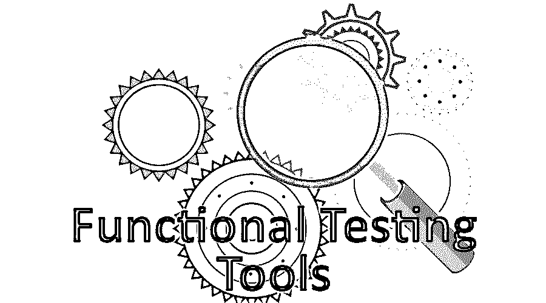

# 功能测试工具

> 原文：<https://www.educba.com/functional-testing-tools/>

## 功能测试工具概述

功能测试通常是为了验证应用程序的功能是否符合指定的需求。它通常在[黑盒测试](https://www.educba.com/black-box-testing/)环境中进行测试，因为它不受应用程序源代码的影响。这种测试通常检查应用程序组件的行为是否符合预期。在本文中，我们将讨论不同类型的功能测试工具。

通常，功能测试工具以如下方式工作。我们将输入输入到应用程序中来模拟用户行为。我们输入的结果被存储并记录为输出，然后与我们的预期输出进行比较。我们通常将这些结果分为“通过”或“失败”两种状态，以帮助我们获得测试结果。

<small>网页开发、编程语言、软件测试&其他</small>

[功能测试](https://www.educba.com/what-is-functional-testing/)包括检查 UI、数据库、API 等等。我们可以手动测试，也可以在自动化的帮助下测试。

### 不同的功能测试工具

让我们看看当今行业中的一些顶级功能测试工具。

#### 1.测试 IO

Test IO 在真实环境中运行功能测试，如真实的浏览器和真实的设备，从而确保我们的应用程序和网站正常工作。

有了 Test IO，我们可以利用许多测试天才的能力和洞察力，提高我们的 web 应用程序质量。许多关心客户评论的组织依赖于测试 IO 来快速交付和高质量的应用程序。

**特性:**

*   测试 IO 允许我们从实际的功能测试人员那里获得意见。他们通过给我们额外的、中立的判断来帮助我们。因为他们是审视我们项目的新鲜眼睛，他们可能会发现我们团队发现不了的错误。
*   我们可以选择在各种真实条件下，在各种真实设备和平台上进行测试。通过这样做，我们可以检查我们的应用程序在所有平台上的工作情况。
*   测试 IO 有助于我们更快地发布新版本。

#### 2.硒

Selenium 是一个功能测试工具，它是一个开源工具，可以免费下载和使用。它可以用来测试用多种语言编写的 web 应用程序，如 Java、C#、Perl、Python 和 Ruby。它可以很容易地部署在 Windows、Linux 和 MAC 系统上。

Selenium 有两个片段，即 Selenium IDE 和 Selenium Web Driver。使用 Selenium IDE，我们可以录制工作并播放它来测试应用程序。使用 Selenium Web driver，我们可以执行更复杂的测试，并提供更多的测试命令，这些在 [Selenium IDE](https://www.educba.com/install-selenium-ide/) 中是不可能的。

**特性:**

*   硒是容易和简单的使用。
*   它是一个开源工具。
*   它采用几种语言的测试脚本。

#### 3.编码的 UI 测试

编码的 UI 测试是微软的产品，因此我们需要微软的 Visual Studio 和机器来使用它。在这个工具的帮助下，我们可以完全自动化我们的应用程序测试，并确认它们的行为和功能。由于这不是一个开源工具，我们必须看看测试工具的价格和附带的许可证。

**特性:**

*   代码 UI 测试是一个简单的工具，易于配置。
*   它非常明智地理解其数据，包括表格。
*   它不需要太多的脚本。
*   它使用基于 XML 的数据库管理器。
*   它提供了方便的支持和文档。

#### 4.索普伊

近来，SoapUI 作为一种优秀的开源功能测试工具越来越受欢迎。它还可以用于负载、安全性和合规性测试。SoapUI 与面向服务的架构和 REST 服务一起工作。它是一个跨平台的工具，可以与 NetBeans 和 Eclipse IDE 一起使用。除了测试，SoapUI 还可以用于检查、开发和代码模拟。

**特性:**

*   SoapUI 是一个开源工具，使用起来很简单。
*   它由简单的数据驱动测试等功能组成。
*   它可以用于技术目的，也可以用于非技术目的。
*   它为我们提供了简单的报告工具，也可以导入到 excel 中。

#### 5.IBM Rational 功能测试器

IBM Rational Functional Tester 是最受欢迎的自动化测试工具之一。这个工具为我们提供了一个[缺陷管理](https://www.educba.com/defect-management-process/)框架，它将每个测试与其所需的文档联系起来。测试脚本的语言可以是 Java 或 Dotnet。我们也可以用 Rational Functional Tester 进行功能和[回归测试](https://www.educba.com/regression-testing/)。

**特性:**

*   它支持多种应用程序，包括 PDF 文档、Ajax 和 SAP 应用程序。
*   它为我们提供了 30 天的试用期和使用该工具的大量文档。

#### 6.瓦特尔

Watir 是另一个开源的自动化工具，代表 Ruby 中的 web 应用程序测试。它由另外三个部分组成，即 Watir Classic、Watir Spec 和 Watir WebDriver。Watir Classic 只能在 Windows 上使用 Internet Explorer web 浏览器，而 Watir WebDriver 可以使用所有浏览器。Watir WebDriver 基于 Selenium，是一种现代的 Watir。

**特性:**

*   Watir 是开源的，开发者可以免费使用
*   测试脚本易于理解和维护。
*   Watir WebDriver 可以用于任何技术的任何类型的应用程序。
*   WebDriver 支持多种浏览器。

#### 7.托斯卡纳三叉戟试验套装

这是端到端测试的有效功能工具。它使用敏捷方法，这是一种基于模型的最新方法。

它构建用通用商业语言而不是任何特定软件语言编写的测试用例，使任何人都容易理解它们。因此，测试用例可以在更短的时间内生成，并且可以被用作自动化测试脚本或者手动测试。它的方法在处理 sprint 周期过程中频繁变化的测试方面非常有效。

**特性:**

*   Tricentis Tosca Testsuite 是一个基于敏捷方法的高效模型。
*   它可以承担业务中的大部分风险。
*   它非常轻松地使用了 DB 专家模块。
*   非技术用户可以毫无困难地照看它。
*   它有令人钦佩的用户界面和图形插图。
*   它可以在各种平台上使用。

### 结论

功能测试的主要目标是确保我们的系统按照需求规范正确运行。我们可以使用这里提到的许多工具中的任何一种来实现这个目标。工具的选择取决于我们的要求和需要。

### 推荐文章

这是功能测试工具的指南。这里我们已经讨论了功能测试工具以及详细的解释。您也可以浏览我们推荐的其他文章，了解更多信息——

1.  [自动化测试工具](https://www.educba.com/automation-testing-tools/)
2.  [质量改进工具](https://www.educba.com/quality-improvement-tools/)
3.  [大数据分析工具](https://www.educba.com/big-data-analytics-tools/)
4.  [吉拉测试工具](https://www.educba.com/jira-testing-tool/)

