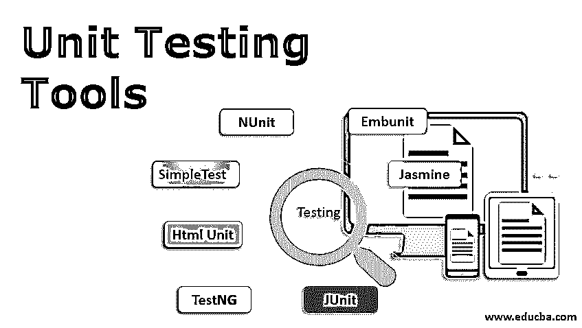

# 单元测试工具

> 原文：<https://www.educba.com/unit-testing-tools/>

## 单元测试工具简介

单元测试工具是 JUnit、TestNG、NUnit、PHPUnit 等测试工具。，用于对应用程序开发人员开发的特定代码模块执行单元测试。单元测试过程可以描述为一种测试过程，用于验证和确认代码的特定模块或单元的正确性，以涵盖编码标准、功能、集成、安全特性、兼容性、性能等。

### 单元测试工具

以前单元测试是由测试人员手工完成的，但是现在大多数公司已经使用测试工具自动化了这个过程。诸如存根、框架、模拟对象、测试工具等替代品用于应用程序的单元测试，因为每个测试用例都是相互独立的。在选择正确的测试工具时，根据灵活性、最小实现时间等因素选择正确的工具非常重要。下面给出了一些最常用的单元测试工具:

<small>网页开发、编程语言、软件测试&其他</small>

#### 1.朱尼特

*   JUnit 是一个开源工具，用于 Java 编程语言中单元测试的自动化。
*   它被认为是单元测试自动化可用的最简单工具之一。
*   它通常用于编写可重复的测试。
*   它支持测试驱动的方法，这意味着先测试后开发。
*   它有一些特殊的特性，比如用于测试数据标识和断言的[注释，这很可能用于测试结果与预期结果之间的映射。](https://www.educba.com/hibernate-annotations/)
*   它支持这样一个特性，即测试数据首先被测试，然后被插入到编写的代码中。

#### 2\. NUnit

*   中程序员常用的单元测试框架之一。网络语言。
*   它的作用几乎与 Java 语言中的 JUnit 相同。
*   它是一个免费的开源框架，用于编写和执行单元测试的自动化测试脚本。
*   它支持自动化测试脚本开发的数据驱动方法。
*   它允许并行运行/执行测试用例。
*   它拥有大量的社区支持，其新版本(版本 3)在市场上提供了高级和特殊的功能。
*   单元测试的一个特殊特性是它支持控制台运行程序，以便更快地执行测试用例。

#### 3.测试

*   TestNG 是最著名的单元测试工具之一，其灵感来自 JUnit 和 NUnit 框架。
*   它是测试人员用 Java 编程语言编写自动化脚本的框架。
*   TestNG 支持测试脚本执行的数据驱动和参数化测试。
*   它适用于为应用程序的单元、集成和系统测试创建测试脚本。
*   它被认为是灵活测试执行和创建的最强大和最有效的工具之一。
*   它允许同一类的顺序和多实例执行。

#### 4.Html 单元

*   顾名思义，类似于用于创建任何 web 应用程序的 UI 的 HTML，HTML 单元提供了 GUI 特性，如表单、表格、链接、按钮等。
*   它是市场上免费提供的开源软件。
*   它支持 Javascript，并支持一个名为 Mozilla Rhino 的 Javascript 引擎。
*   Html 单元支持请求的基本协议，如 HTTP 和 https。
*   它支持 GET、POST、代理服务器等方法来提交请求。
*   它用于 Java 应用程序的单元测试，在著名的框架如 JUnit 和 NUnit 中使用。
*   它包含 Java 库，也使用了 cookies。

#### 5.Embunit

*   它是市场上免费提供的单元测试框架。
*   Embunit 代表嵌入式单元，是应用程序单元测试最常用的框架之一。
*   它被认为是测试人员和开发人员创建测试脚本的好工具。
*   用 C 和 C++语言编写，它的设计有点类似于 JUnit 框架。
*   在 Embunit 中工作非常容易，因为相关的测试用例有一个单独的套件，最终结果以 XML 格式生成。
*   Embunit 的基本版(桌面版)是免费的，而具有高级功能的企业版/商业版是基于云的，定价为 1。
*   它允许源代码生成的结构化格式。

#### 6.简单测试

*   SimpleTest 是一个开源框架，通常用于应用程序的单元测试。
*   测试人员和开发人员使用它来创建 PHP 编程语言的测试脚本。
*   比起应用程序的单元测试，它更关注功能测试。
*   它也支持基本认证和 SSL。
*   它有一个特殊的特性，允许使用 autorun.php 将测试用例文件转换成可执行的测试脚本。
*   一旦熟悉了框架，就很容易在其中创建测试脚本并在应用程序中实现它。

#### 7.茉莉

*   Jasmine 框架通常用于市场上的单元测试，允许用 Javascript 编程。
*   它允许行为驱动的测试，并在 Javascript 平台上运行。
*   用 Jasmine 理解和编写代码非常简单，因为它使用了创建测试脚本的基本语法。
*   它是允许异步规范的框架之一。
*   它不需要任何 DOM 结构，并且受 JSSpec、JSpec 等最著名的单元测试框架的影响很大。

### 结论

在任何应用程序的整个软件测试过程中，单元测试都是测试的基础。它是应用程序中最小的可测试部分，因此应该非常小心地进行测试。以前，只有开发人员在编写代码后执行组件的基本单元测试，但随着软件开发和测试过程的变化，首先创建测试用例，并相应地编写应用程序，这被称为“测试驱动开发”。虽然市场上有很多可用的工具，但应根据公司政策、所选技术、项目预算选择合适的工具。

### 推荐文章

这是单元测试工具指南。在这里，我们讨论一些最常用的工具，如 JUnit、NUnit、TestNG、Html Unit、Embunit，并提供相应的详细信息。您也可以浏览我们推荐的其他文章，了解更多信息——

1.  [Beta 测试](https://www.educba.com/beta-testing/)
2.  [代码覆盖工具](https://www.educba.com/code-coverage-tools/)
3.  [云测试工具](https://www.educba.com/cloud-testing-tools/)
4.  [吉拉测试工具](https://www.educba.com/jira-testing-tool/)

