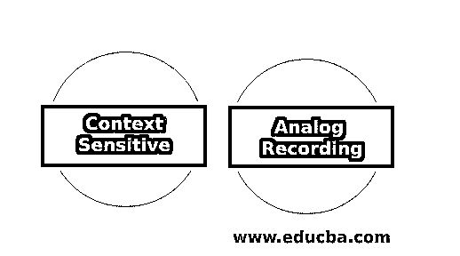

# WinRunner(游戏名)

> 原文：<https://www.educba.com/winrunner/>

## WinRunner 的定义

WinRunner 是一款自动化软件测试工具，归惠普所有，由 Mercury Interactive 开发。众所周知，它能够支持大多数编程语言和 web 开发技术，如 C、 [C++](https://www.educba.com/c-plus-plus-reference/) 、C#、Visual Basic、VC++、D2K、Java、HTML、Power Builder、Delphe、Cibell 等，并被广泛使用。它用于执行各种测试技术，包括功能测试、用户界面测试、集成测试、回归测试等。，利用它的选项来记录创建测试步骤的功能，并利用回放 UI 交互选项来生成测试脚本。

### WinRunner 工具是如何工作的？

WinRunner 是一款功能测试工具，用于编译测试，用于与 HP QuickTest Professional 协作，并作为质量保证流程的支持元素，作为软件开发生命周期测试阶段的一部分。该测试软件是产品卓越进步的一部分。

<small>网页开发、编程语言、软件测试&其他</small>

这里的测试过程通过捕获功能需求/测试需求，通过对照预期结果验证实际结果，以及通过重放在软件产品上执行的用户操作/功能活动来进行。在这个过程中，该工具可以不由自主地执行完整的测试过程，同时识别由企业/客户人员提供的关于产品设计的缺陷。WinRunner Automation tool 使用测试脚本语言(TSL ),该语言在接收用户活动作为流程输入方面与 C 编程语言相同，并且允许非常灵活地进行修改并对其应用约束。

记录过程是一种有洞察力的方法，它有助于生成有力的功能测试项目。为了创建相同的功能，该工具通常通过在整个记录过程中模仿用户动作来记录软件应用的功能流程。它还允许测试专业人员直接修改和更新生成的脚本，以满足功能需求规范文档中描述的大部分功能。

该过程通过允许测试人员添加检查点来进行，以便能够在被分配为预期结果的功能与被分配为实际结果的功能之间进行测试的比较过程。这些检查点可以包括测试标准、用户界面特征、图像/徽标和 URL 形式的导航流。

这个测试过程可以包含一系列验证，如应用程序的外观、web 通信接口、中间件通信方面、评估功能的数据库验证。众所周知，它是一种数据驱动类型的自动化测试工具。另一个名为虚拟对象向导的特性允许测试专业人员学习识别功能、记录过程和重放应用程序功能下分配的项目的运行方式。在执行过程中，WinRunner 通过在功能流程上执行一步一步的流程来模仿用户，从而独立控制软件，并且内置的恢复管理器和异常处理功能在出现不可预测的动作、错误、不当行为、崩溃等情况下，根据自动故障排除特性工作。，使测试流程能够通过一个没有问题的功能流程。

在测试执行过程中，WinRunner 可以利用报告工具来帮助测试专业人员收集测试结果，这些测试结果包含测试结果以及缺陷计数和这些错误发生的原因/根本原因。因此，这些测试可以被选择并应用于回归测试过程，作为可重用功能的一部分。如果将来对软件进行修改，就不需要创建一个全新的测试集。相反，修改现有的测试集来匹配新承认的需求规格就足够了。这也是一种有效的方法，可以将验证点包含到由 WinRunner 生成的现有测试脚本中，借助于所选择的检查点来匹配应用程序的功能。

### WinRunner 测试模式

WinRunner 测试模式如下所示:

#### 1.上下文敏感记录

当用户在经受测试过程的软件上执行各种活动时，应用上下文敏感模式来记录软件应用的功能方面。它选择嵌入在应用程序中的几个对象，如图形用户界面，包括窗口、导航流、列表、按钮、位图/图像、页面分段、页面内容等。但是，它与前面提到的对象在应用程序界面上的位置无关。在这种模式下，每当出于测试目的在应用中启动任何活动时，将创建 TSL 语句作为用于测试执行过程的测试脚本的一部分，以便描述对象选择和执行的相应动作。

#### 2.模拟录音

WinRunner 应用程序中的模拟记录模式用于记录每一次鼠标点击、从键盘接收的输入以及以二维(X，Y)输入形式从鼠标获得的精确坐标。在测试执行期间，这个测试工具跟踪鼠标的移动来收集提到的信息。因此，每当需要精确的鼠标坐标作为测试执行的输入时，就会应用 WinRunner 中的这种模拟记录模式。

### 优点和缺点

一些优点和缺点是:

#### 优势

*   支持快速测试
*   提供一致性
*   测试的可重用性
*   可定制以适应未来的变化

#### 不足之处

*   不适用于压力或负载或可扩展性测试。
*   不支持。网络编程
*   测试人员应具备编程知识/经验
*   它不支持多媒体系统。

### 结论

WinRunner 中的测试流程包括功能识别、应用活动记录、测试脚本管理、测试执行，以及最终收集的测试结果的分析和报告。它可以应用在各种软件开发方法上，如瀑布、敏捷，甚至是 V–V 模型，以便根据功能规范将测试阶段自动化。

### 推荐文章

这是 WinRunner 的指南。在这里，我们还将讨论 WinRunner 工具的定义、工作原理以及优缺点。您也可以看看以下文章，了解更多信息–

1.  [测试覆盖工具](https://www.educba.com/test-coverage-tools/)
2.  [吉拉测试工具](https://www.educba.com/jira-testing-tool/)
3.  [猴子测试](https://www.educba.com/monkey-testing/)
4.  [玻璃箱测试](https://www.educba.com/glass-box-testing/)

