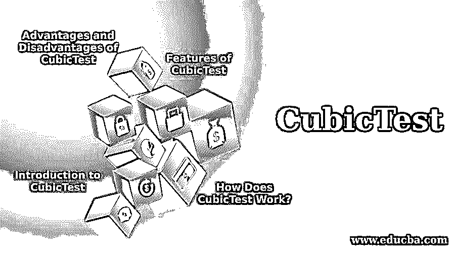

# 立方体测试

> 原文：<https://www.educba.com/cubictest/>

## 立方体测试简介

CubicTest 可以定义为 Eclipse 工具中的一个可自由访问的插件，通常用于验证和确认基于 web 的应用程序或网站。CubicTest 工具的用户界面有助于创建要执行的测试，以确保应用程序的质量，而不需要用户自己构建测试脚本。当 eclipse 与 CubicTest 插件一起使用时，这里的软件开发过程可以解释为一种基于 web 的应用程序的“测试驱动开发”,也是软件开发生命周期中所涉及的文档的替代。

### CubicTest 是如何工作的？

这个 Eclipse 插件通常用于在 Eclipse 应用程序的帮助下开发的代码，用于应用验证过程和测试代码，同时使用 Selenium 和 Watir 工具作为软件开发过程中质量保证过程的一部分。Eclipse 工具中的一些 CubicTest 插件可以方便地使用的库元素有:CubicRecorder、CubicShop、CubicShopTest、CubicSite、CubicTestFeature、cubic test 插件、CubicTestSeleniumExporter、CubicTestSeleniumRC、CubicTestUpdateSite、CubicTestWatirExporter 等。该工具具有灵活的图形用户界面(GUI ),供测试人员使用，它包含测试编辑器窗口，该窗口集中处理 web 应用程序保存的所有网页。

<small>网页开发、编程语言、软件测试&其他</small>

cubitest plug-in 的功能结构可以处理构建基于 web 的应用程序的传统方法以及最新的技术成果，如涵盖大多数 UI 功能的 Ajax。CubicTest 工具的结构风格有助于收集测试、放置测试、执行测试、导出测试、记录测试流程，以及在测试执行完成后记录测试结果。这个插件允许 Selenium RC 测试运行程序、Selenium 核心导出程序、Watir 导出程序等。在应用中需要的功能区域使用，以确保质量卓越。CubicTest 还使用 Selenium RC 记录器来直接获取 Eclipse 工具中记录的功能流，在 Eclipse 工具中，HTML make-believe exporter 用于将基于测试的开发过程强加到软件开发生命周期中。

为了在这个插件工具上工作，测试人员不需要拥有与用于手动测试、功能测试或自动化测试的任何其他测试工具相似的技术知识。该插件附带了元信息文件，用于跟踪所使用的 selenium 版本，这些库元素用于与。sh 或 shell 脚本文件，用于构建支持的 build.properties 文件，用于与 selenium 测试流一起工作的 cubictest.jar 和 cubictest.pom，splash。BMP 用于 RCP 或富客户端平台配置等。打算在 Eclipse 应用程序中使用 cubitestplug-in 的测试专业人员可以简单地使用预定义的选项将插件添加到 Eclipse 工具上，然后可以使用添加的特性来实现网站或基于 web 的应用程序的测试驱动开发过程。

### 立方体测试的特点

cubitestplug-in 作为 Eclipse 应用程序的一个附加工具，让它负责测试执行过程，

**1。**这个插件是一个详细的插件，用于创建使用各种测试工具运行的测试，比如 Selenium 自动化测试工具和 Watirtesting 工具。

**2。**众所周知，它可以生成基于 web 的测试，以便更快、更简单地执行测试。

**3。**cubitest plug-in 的另一个广为人知的特性是，该工具可以进行更加健壮、可靠、一致和可重用的测试，这些测试可用于成功的测试执行。

**4。**该工具的图形用户界面包括用于检查网页进度和状态转换的专用区域。

**5。**它支持所有领先的 web 应用程序开发平台，从传统方法到最新技术，如 Ajax 方法。

**6。**Selenium RC 工具中的记录选项可以很容易地用作 CubicTest 工具的一个包含项，类似地，测试运行程序也是如此。

7 .**。**借助于 cubitest 插件运行的测试是独立的，不会受到 eclipse 应用程序中其他工具的影响。

**8。**cubitest 是一个图形化的 Eclipse 插件，用于编写 Selenium 和 Watir 测试。这里的测试过程基于网站或基于 web 的应用程序的外观，而不是 web 应用程序测试过程中其他工具通常使用的编码方面。

**9。**cubic test 工具提供了访问网页中 HTML 元素的功能，这有助于支持基于框架的测试流程，而不是基于程序的方法。

10。网络应用中使用的识别因素可定义为收集多个分类的过程，例如用于构建基于网络的应用或网站的元素的 id 或名称。它还使用 XPath 表达式来帮助这个插件按预期运行。

**11。**该插件使得测试形成、测试定义和测试执行变得非常直接，并且毫不费力地处理完整的测试流程。

### 优点和缺点

以下是 CubicTest 的优点和缺点:

**优点:**

*   在 Eclipse 工具中使用 CubicTest 插件不需要额外的费用。
*   构建是健壮的、无冗余的、一致的，这使得工具更加可靠。
*   基于用户界面的 web 应用程序的质量保证。
*   它是一个带有支持库元素的包。

**缺点:**

*   这个工具在测试阶段适应功能变化的效率不高。
*   对于使用软件开发过程的敏捷方法构建的基于 web 的应用程序来说，这是不可信的。

### 结论

cubitest plug-in tool 是 Eclipse 应用程序中众多可用插件中的一个，它是一个包含所有支持元素的包。它可以与 Eclipse 本身支持的各种测试工具一起使用，以确保 web 应用程序的质量符合客户的期望。

### 推荐文章

这是一个立方测试指南。在这里，我们讨论了 CubicTest 的简要概述及其特性和优缺点。您也可以浏览我们推荐的其他文章，了解更多信息——

1.  [SDLC 与 STLC–最大差异&对比](https://www.educba.com/sdlc-vs-stlc/)
2.  什么是敏捷测试？| 7 大原则&的好处
3.  [SDLC 与敏捷|主要差异](https://www.educba.com/sdlc-vs-agile/)
4.  [十大 DLC 面试问题&答案](https://www.educba.com/sdlc-interview-questions/)

