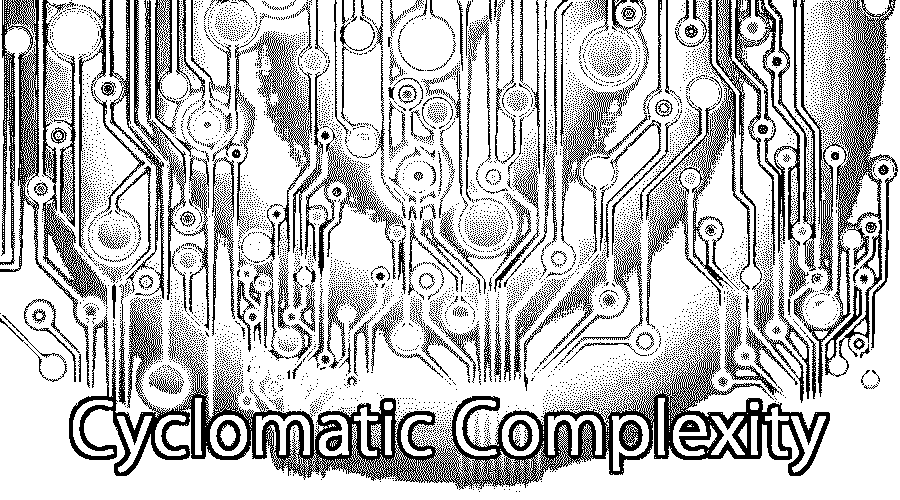
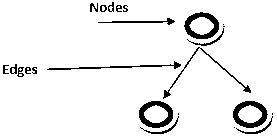
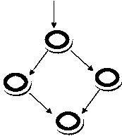
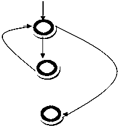
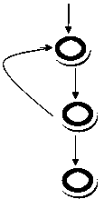
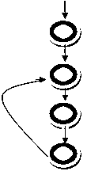
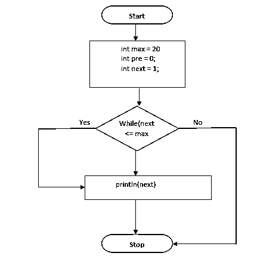

# 圈复杂度

> 原文：<https://www.educba.com/cyclomatic-complexity/>

## 圈复杂度简介

代码段中线性独立路径数量的定量计算是圈复杂度。这是软件中的一种度量，用于显示系统的复杂程度，用系统控制流图来度量。这种计算使用程序图的定义，通过程序的路径数被计算和调节。一个图的结构和拓扑复杂性可以比作一个计算机程序。圈图有两种类型，即偶然复杂性和本质复杂性。

### 如何计算圈复杂度？

通过下面的公式计算程序的圈复杂度是非常容易的。

<small>网页开发、编程语言、软件测试&其他</small>

**圈复杂度= E–N+2P**

*   E = >图的边数
*   **N = >图的节点数**
*   **P = >连通分量的个数**

如果我们考虑出口点，有另一个公式，它回到你的入口点。你会像循环一样创造它。

**圈复杂度= E–N+P**

**圈复杂度= E–N+1**

我们还有一种计算方法。这是一个更简单的方法。

1.  绘制图表
2.  然后将出口点连接到入口点
3.  然后计算图表中的漏洞

看下图

以下是一些流程图符号:

**如果-那么-否则:**

**

** 

**而:**

**Do-While:**

**为:**

**

** 

如果程序没有任何循环，它的复杂性就较低。当程序遇到任何一个循环，复杂度都会增加。

假设我们有一个条件，那么我们得到的复杂度是 2。因为这个条件有两个条件，真和假。

这种技术主要用于对[白盒](https://www.educba.com/white-box-testing/)的基本测试。它表示执行代码中每个路径所需的最小测试数量。

不同的语言有不同的工具来衡量程序的圈复杂度。

### 计算圈复杂度的步骤

计算圈复杂度的步骤如下。

1.  从代码中画出流程图或图表。
2.  现在，在第二步中，检查并确定它有多少条独立路径。
3.  然后用下面的公式计算圈复杂度:

**M = E–N+2P**

4.  根据测量设计，测试用例。

现在，你可能会问，它是如何被计算出来的。让我们继续，并了解我们实际上是如何计算它的。

考虑下面的 Java 代码示例:

这个程序计算斐波纳契数列，就像:

0+1=1

1+1=2

2+1=3

3+2=5

5+3=8

8+5=13

//下面的程序只是打印斐波那契数列

`class Printno {
Public static void main(String[] args){
int max = 20 ;
int pre = 0;
int next = 1;
System.out.println(“The Fibonacii series is : ” +prev);
While(next<= max){
System.out.println(next);
Sum = prev + next;
Prev = next;
Next =sum;
}
}
}`

>javac Printno.java

>java Printno

O/p:

斐波那契数列是:0

One

One

Two

Three

Five

Eight

Thirteen

仔细看看上面的程序。你会发现一个 while 循环。这个程序只包含一个 while 循环。

现在是时候为它画一张图了。

**控制流程图如下:**

**流程图**

现在，为了计算上述程序的复杂性，首先，我们需要计算边的总数:

总边数:6

现在，计算节点总数。

节点总数:5

**公式:M = E-N +2p**

**M = 6 -5 + 2**

**M = 1+2**

**M=3**

所以，这个程序的圈复杂度是 3。

复杂代码很难维护和更新或修改，因为我们都知道圈复杂度不应超过 10。

### 复杂性的类型

给出了复杂性的两种主要类型。

#### 本质复杂度 **:**

这种复杂性是我们不能忽视的一种代码。

《出埃及记》飞行管理系统是一个更复杂的系统。

#### 意外复杂性:

顾名思义，这是因为发生了一些事情，如修复错误，打补丁，修改等。，在系统中。大多数情况下，我们只研究偶然的复杂性。

### 利益

以下是解释的优点。

*   作为简单的逻辑，如果复杂度降低，我们更方便理解。
*   如果有更复杂的程序，那么程序员需要检查增加的可能性。
*   计算复杂度的路径表明一个程序写的程序是复杂的，或者我们可以继续降低复杂度。
*   它减少了代码的耦合。
*   假设一个程序的圈复杂度为 5，这意味着在这个方法中有 5 条不同的独立路径。
*   这意味着需要 5 个测试用例来实现这个测试代码。
*   因此，圈复杂度越小越好。
*   这个过程是必需的，因为高度耦合的代码很难修改。
*   代码的复杂度越高，意味着代码也越复杂。

### 用于计算圈复杂度的工具

以下是用于计算的工具。

*   三轮摩托车
*   CCCC
*   麦凯布智商
*   GCov
*   靶心覆盖
*   PMD
*   LC2
*   查找 bugs
*   建筑师

### 结论

它是程序复杂性的度量。这个度量帮助我们理解需要完成的工作以及软件的复杂程度。这是白盒测试的一部分。

### 推荐文章

这是圈复杂度的指南。这里我们讨论如何计算圈复杂度以及使用的工具？以及好处和复杂的类型。您也可以阅读以下文章，了解更多信息——

1.  [Linux 简介](https://www.educba.com/introduction-to-linux/)
2.  [c++简介](https://www.educba.com/introduction-to-c-plus-plus/)
3.  [html 5 是什么？](https://www.educba.com/what-is-html5/)
4.  [什么是冬眠？](https://www.educba.com/what-is-hibernate/)

