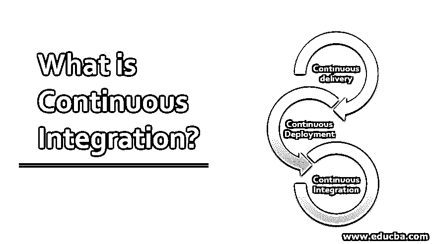

# 什么是持续集成？

> 原文：<https://www.educba.com/what-is-continuous-integration/>

## 持续集成简介

持续集成是 DevOps 应用程序的一种开发方法，开发人员定期将代码更改合并到一个中央存储库中，在那里执行自动化编译和测试。在软件发布的构建或安装阶段，一致的集成通常涉及工程组件和文化组件。正在进行的集成的主要目标是更快的错误，更好的软件质量，以及更少的测试和升级应用的时间。CI 流程的核心是源代码版本控制系统。版本控制框架中还包括其他控制，如自动化代码验证、语法风格审查工具等。

### 持续集成有什么作用？

为了使您的应用程序保持部署状态，甚至在引入进一步的变更时自动推进您的主要代码库，持续交付和持续部署也被开发为最佳实践。这将有助于我们让我们的项目保持标准的质量，可以自动检查。

<small>网页开发、编程语言、软件测试&其他</small>

CI 有助于增加工程团队的人数和交付绩效。将 CI 呈现给上面的场景使软件开发人员能够在功能上独立地并行工作。当您准备好将这些特性结合到最终产品中时，您可以独立快速地完成这项工作。在现代和高绩效的工程组织中，CI 是一种有价值的和完善的实践。

在这里，我们看到了一些词汇，如持续交付、持续部署和持续集成。

*   连续交货
*   持续部署
*   连续累计

让我们一个一个地看看:

#### 1.连续交货

持续集成确保您可以始终保持代码库的可部署性。除了确保对您的请求进行自动化测试之外，还需要所有适当的配置来将其投入生产。大多数团队通过测试或生产环境中的自动化测试来推动变更，以立即确保快速的设计循环。

#### 2.持续部署

它与持续集成密切相关。这确保了软件总是可部署的，甚至在开发和生产区域发布，如果所有的自动化检查都在最新版本中进行的话。

#### 3.连续累计

在最好的情况下，一天中尽可能早地集成来自不同团队开发人员的变更是一种实践。意味着每个开发者的代码都不会受到太大的干扰。一旦系统与自动化测试相结合，软件就可以通过持续集成保持一致。

### 如何保持持续的整合？

在应用程序开发和部署中，CI 侧重于速度。传统上，安全不会。挑战是在不损害软件交付的情况下保护 CI。DevSecOps 要进来了。DevSecOps 基于“所有人都有责任保护”的理念，以确保安全选项在不影响安全性的情况下快速安全地交付。DevSecOps 从那边过来。DevSECOps 基于“每个人都对安全负责”的前提，以便安全、快速地发布安全决策，而不损害必要的安全性。

### 持续集成的优势

下面是提到的优点:

*   在整合其他程序员的过程中，这些部门与主线的差异越来越大。
*   与传统设计工作流程相比，另一个显著优势是它专注于自动化集成。在非 CI 环境中，程序员经常在应用程序中长时间地使用这个主干的分支。
*   整合功能的分支可能是一个费力的过程，以使所有的变化兼容。不幸的是，开发行业非常害怕“集成天堂”这个术语。
*   CI 工作流帮助您进行简单的日常集成，以避免问题的出现。除了节省开发人员的时间之外，持续集成避免了手动集成更改，并增强了软件的可靠性。

### 如何使用持续集成？

*   持续集成通常与敏捷工作流结合使用来开发软件。一个公司编制了一个包括服务路线图的任务列表。这些活动然后被分配给软件工程团队的成员。
*   对于 CI 来说，开发软件任务可以在分配的开发人员之间独立和并行地开发。在完成这些项目中的一个后，程序员必须将新的工作引入到与剩余设计合并的 CI 框架中。
*   持续集成部署工具。持续集成的第二个条件是一个构建工具:这样的工具能够处理应用程序源和所需代码的自动化开发。计算机的构造和构建工具取决于为该技术选择的堆栈。

例如，以下是 Java 应用程序的步骤列表:

*   测试代码将编译成字节码。
*   执行集成测试(如果有)
*   如果需要，将 JAR 存储在存储库管理器中。
*   在控制版本系统标签中，代码(如果需要)

### 结论–持续集成

对于许多传统的软件组织来说，从传统的手工步骤到 CI 过程的转变需要软件团队如何一起工作的深刻变化。然而，如果把软件公司放在一起看，持续集成过程的优势是显而易见的。这现在是工程领域的新标准，CI 实践的采用只会越来越多。

### 推荐文章

这是一个什么是持续集成的指南？这里我们讨论简介，如何保持持续集成，持续集成的优点。您也可以浏览我们推荐的其他文章，了解更多信息——

1.  [持续集成工具](https://www.educba.com/continuous-integration-tools/)
2.  [devo PS 的优势](https://www.educba.com/advantages-of-devops/)
3.  [Java 部署工具](https://www.educba.com/java-deployment-tools/)
4.  [DevOps 服务](https://www.educba.com/devops-services/)

