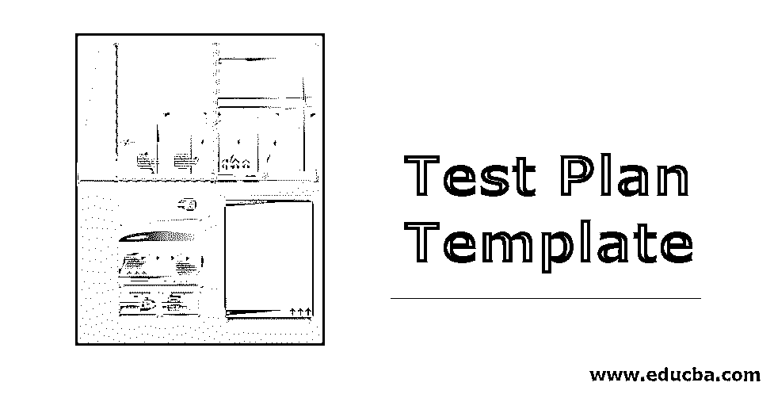
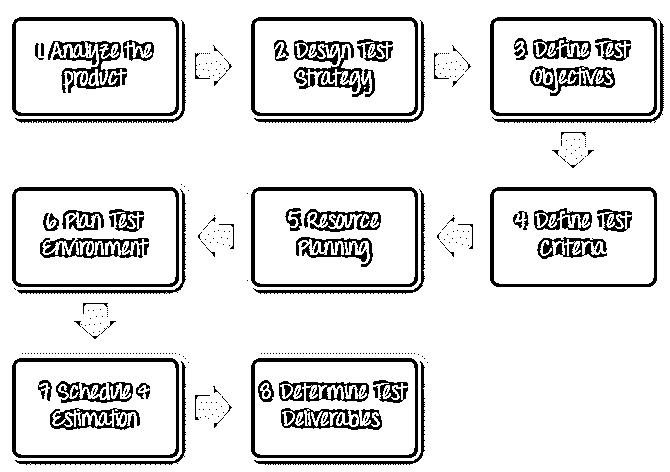

# 测试计划模板

> 原文：<https://www.educba.com/test-plan-template/>

## 测试计划模板介绍

下面的文章提供了一个测试计划模板的概要。测试计划是一个文档，它给出了测试方法、策略、[硬件/软件](https://www.educba.com/hardware-vs-software/)的选择、进度计划以及可交付成果的评估的蓝图。它管理我的测试管理器。

让我们看一个例子，一个会议测试经理要求一个团队为这个项目做测试计划，而团队不感兴趣，在这种情况下，测试经理想要如何处理这种情况。

<small>网页开发、编程语言、软件测试&其他</small>

思考您的测试经理，选择您的答案如下:

*   我是经理，所以你必须照我说的做。
*   好的，让我解释一下为什么这个项目需要一个测试计划。

如果我是经理，我会选择第二个选项，希望你也是。

**测试计划需求:**

*   它将测试应用程序/软件的质量。
*   测试人员需要遵循文档中给出的指导方针。
*   范围、估计、策略都有文档记录，也可以在其他项目中重复使用。

### 如何编写测试计划模板？

编写测试计划模板需要遵循八项重要任务:

这是关于我们如何写一个测试计划模板，下面详细给出:

#### 1.分析

没有数据，就不可能分析任何东西。所以我们需要确定需要分析的项目。假设我们开发了一个网站，需要使用测试技术进行分析。在进入[测试策略](https://www.educba.com/test-strategy/)之前，我们需要回顾包含项目细节的产品文档，首先我们需要了解功能，然后进行分析。

下面是这个网站的样本分析。

*   这个网站有什么用？
*   谁是最终用户？
*   它将如何工作？
*   使用的是什么版本的软件？
*   硬件是什么？

#### 2.设计

开发测试设计是测试计划模板中的一个重要步骤，它将由测试经理来定义。

**a .确定测试范围**

在编写测试设计之前，我们必须确定测试的“范围内”和“范围外”,团队中的每个人都必须清楚地了解项目，并需要提供准确的数据信息。你将如何确定测试的范围？

*   客户需求
*   预算
*   软件规格

**b .定义测试类型**

通过定义测试类型来识别软件中的任何错误，最终目标是将软件交付给客户而没有任何错误。

一些主要的测试技术是:

*   **单元测试:**测试最小的软件或应用程序。
*   **API 测试:**测试为应用程序创建的 API。
*   **集成测试:**测试应用中组合的模块。
*   **系统测试:**测试系统对特定要求的符合性。
*   **安装/卸载测试:**在客户环境中安装/卸载特定软件。
*   敏捷测试:测试敏捷方法。

**c .记录风险和问题**

识别风险，它将对测试计划模板造成潜在的影响，以及哪些度量是一个问题。

请参见下面的一些风险因素。

*   人们缺乏测试这个网站的技能。
*   测试经理缺乏定义测试技术的技能。
*   团队内部缺乏合作。
*   预算估计不佳。

**d .创建测试物流**

在这一步，测试经理必须决定谁来测试？测试什么时候进行？为特定的任务选择合适的人对理解方法非常重要。测试可以在任何时候进行，也可以从开发阶段开始。

当以下来源可用时，就可以进行测试了。

*   测试规格和需求文档。
*   人力资源。
*   测试环境。

#### 3.测试目标

测试的主要目的是识别缺陷，并发布无缺陷的软件。

测试目标需要遵循以下步骤:

*   测试软件或应用功能。
*   基于目标集和目的测试特性。

以这个网站为例，使用最常见的技术自顶向下的测试方法来遵循上述步骤。

*   检查网站是否在真实环境中运行，没有任何问题。
*   需要检查客户的需求，它符合他们的期望。
*   它应该是用户友好的。

#### 4.试验标准

标准可以作为进行测试判断的规则或程序。

有两种类型的测试标准:

**a .暂停标准**

测试经理必须被设置为暂停的目标。当它达到目标时，测试将暂停，直到标准解决。假设项目中有 30%的测试用例失败，它必须返回到开发团队。在问题解决之前，无法进行测试。

**b .退出标准**

退出标准可以被设置为最大百分比(例如，96%)。当测试结果达到该百分比时，该项目可视为通过。强制性的是运行 100%的测试用例，但是通过可以定义为 96%。

**公式:**

Number of test cases passed / total test cases executed

#### 5.资源规划

资源规划可以是人力和设备，这需要该测试计划来完成任务。

**a .人力资源**

*   测试经理
*   测试员
*   测试中的开发人员
*   质量保证工程师

**b .系统资源**

*   计算机网络服务器
*   测试工具
*   网络
*   计算机

#### 6.计划测试环境

测试环境是设置硬件和软件来执行测试。它必须部署在实时业务环境中。环境设置可以遵循开发服务器->测试/ QA 服务器->生产服务器。一旦开发阶段完成，它将转移到测试团队，一旦测试完成，它将在生产环境中投入使用。

#### 7.进度和评估

它需要制定一个时间表和评估来完成测试计划模板中的任务。

| **任务** | **成员** | **预计持续时间** |
| 创建测试计划 | 测试经理 | 80 工时 |
| 实验报告 | 测试员 | 200 工时 |
| 测试交付 | 质量保证 | 30 工时 |

#### 8.测试可交付成果

测试可交付成果可以列出所有的文档和支持这项工作的其他工作。

有三种类型的可交付成果。

**a .测试前**

*   计划文件
*   测试设计文件

**b .测试期间**

*   捕获错误日志
*   [数]矩阵
*   执行错误

**c .测试后**

*   实验报告
*   发布说明

### 推荐文章

这是一个测试计划模板指南。在这里我们已经分别学习了什么是测试计划，需要一个测试计划模板，如何编写一个测试计划。您也可以阅读以下文章，了解更多信息——

1.  [静态测试技术](https://www.educba.com/static-testing-techniques/)
2.  [云测试工具](https://www.educba.com/cloud-testing-tools/)
3.  [协议测试](https://www.educba.com/protocol-testing/)
4.  [什么是测试用例？](https://www.educba.com/what-is-test-case/)

