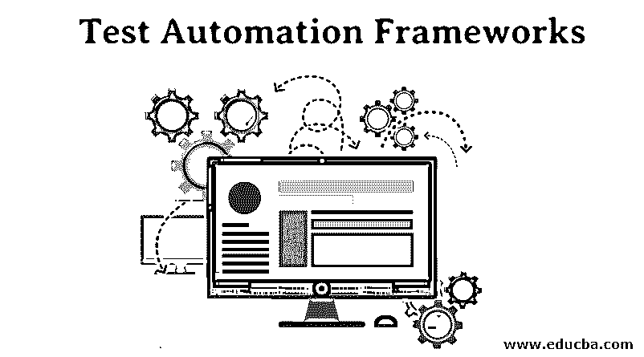

# 什么是测试自动化框架？

> 原文：<https://www.educba.com/what-is-test-automation-frameworks/>

## 测试自动化框架简介

测试自动化框架是一个习惯性的标准，用于创建和实现自动化脚本，以提供自动化测试相对于手动测试的各种优势。在选择某种类型的自动化框架之前，最常考虑的因素是“脚本的高重用率”、“较低的构建成本”、“较低的脚本维护成本”、“易于转移”、“适合较少的编程知识”等。一些测试自动化框架通常用于自动化测试:数据驱动测试框架、关键字驱动测试框架、线性脚本框架和模块化测试框架。

应用程序在部署到实际工作环境之前必须通过的测试包括几项必须通过的检查。检查实际上由测试用例组成，由于测试用例的数量非常多，无法对应用程序进行有效的检查，因此在进行手动检查时会花费大量的时间。这就是为什么需要一个测试自动化框架的原因。一旦给系统下达了正确的命令，自动化测试就会自动进行。简单来说，自动化测试挑选出开发者给出的每一个[测试用例](https://www.educba.com/how-to-write-test-case/)，并尝试使用它来检查应用程序，以确保系统在不常见的情况下也能正常工作。

<small>网页开发、编程语言、软件测试&其他</small>

### 测试自动化框架

*   市场上有许多框架可以用来促进自动化。Selenium 、Watir、RobotFramework、Cucumber、Carina 是一些经常用于测试目的的测试自动化框架。
*   基于应用和测试需求，可以选择上述测试框架中的任何一个。他们通过用自动化测试代替手工测试的机制，使测试工作变得非常容易。
*   测试自动化框架具有预定义的内置功能，在开发解决方案以将手动测试过程转换为自动化过程时，可以利用这些功能。
*   它什么也不做，只是自动完成了一个人或测试人员必须手动完成的所有工作。举例来说，假设必须在输入框中输入一些字符串，然后必须按提交按钮。
*   在这种情况下，将有两种情况，一种是手动将数据放入输入框，然后点击 enter，或者他们可以使用测试自动化框架，该框架将自动填充数据，并点击提交按钮，这是自动化框架帮助我们的方式。

### 测试自动化框架的类型

有四种常见的测试自动化框架。

#### 1.线性脚本框架

它是一种适用于小型应用程序的测试自动化框架。它的功能包括记录和播放动作，以便自动化测试。因此，当涉及到自动化框架时，它是非常基本的，并且可以完美地与小型应用程序一起工作。

#### 2.模块化测试框架

这是一种自动化框架，在这种框架中，事情是在模块中开发的，然后这些模块可以被集成，最终完成测试。每个模块都提供了一些特定的功能，这些功能在每个模块中都是不同的。它们只执行自己的任务，其余的交给其他模块。所有模块产生的结果被集中观察，以便根据测试做出任何决定。

#### 3.数据驱动的测试框架

这是另一种重要的[类型的测试自动化](https://www.educba.com/automation-testing-interview-questions/)框架，它主要关注脚本背后的数据和逻辑。在这个框架中，测试是通过将脚本逻辑从数据中分离出来完成的。使用这个框架完成的测试非常有效，并且可以满足特定的需求。在这个框架下，将会有很多事情使得测试越来越有效。

#### 4.混合测试框架

混合测试框架可以被定义为可以被认为是其他框架的果汁的框架。它结合了其他框架的优点，以提高自动化测试的效率。它集成了如何使用最少的框架进行测试，这就是为什么它被称为混合测试框架。这是自动化测试的最佳方法，因为使用该框架执行测试后的输出非常准确。

### 结论

我们之前谈到的测试自动化框架是在测试中引入自动化的唯一方式。他们在很大程度上帮助我们将手工测试过程转移到自动化测试。当有重要的测试用例可用来检查应用程序的质量时，这是减少完成测试所需时间的最佳方式。此外，除了质量之外，它还确保应用程序能够在不常见的情况下正常工作。为了学习使用自动化框架，你应该理解 Java 或其他编程语言，因为它们完全依赖于它。

### 推荐文章

这是测试自动化框架的指南。这里我们分别讨论测试自动化框架类型的简要概述。您还可以浏览我们推荐的其他文章——

1.  [自动化测试的好处](https://www.educba.com/benefits-of-automation-testing/)
2.  [测试 Java 框架](https://www.educba.com/testing-frameworks-for-java/)
3.  什么是功能测试？
4.  什么是压力测试？

