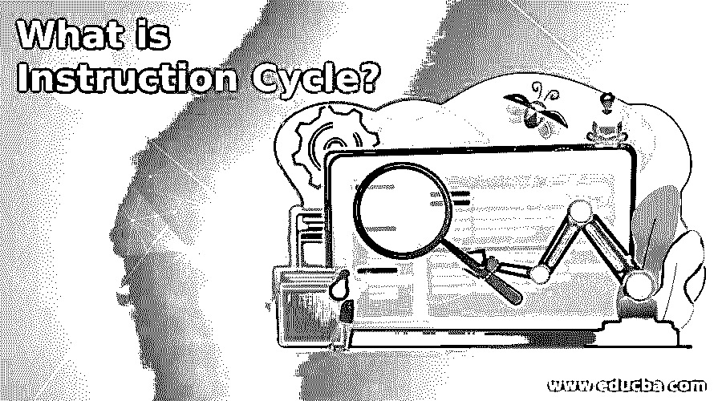

# 什么是指令周期？

> 原文：<https://www.educba.com/what-is-instruction-cycle/>

## 指令周期介绍

指令周期与 CPU(中央处理器)相关，CPU 是计算机系统启动直到计算机系统关闭所遵循的一系列步骤。指令周期的另一个名称是提取-解码-执行周期。在指令周期中基本上有四个阶段:从存储器中取出指令，对取出的指令进行解码，从存储器中读取地址，最后一个阶段包括指令执行。计算机处理器执行它。

### 指令周期是什么？

它被定义为在计算机系统中执行的基本循环，在该循环中，计算机系统从存储器中取出指令，解码该指令，然后执行该指令。它也被称为获取-执行-循环。在计算机系统中，所有指令都在计算机系统的 RAM 中执行。CPU 负责执行指令。CPU 系统首先从主存储器中取出数据和指令，并存储在被称为寄存器的临时存储器中。这个阶段被称为提取周期。从内存中取出指令后，CPU 采取的下一步是解码取出的指令。这个阶段被称为解码阶段。

<small>网页开发、编程语言、软件测试&其他</small>

CPU 包含一个指令集，该指令集包含所有预定义的指令列表。在指令周期的最后阶段，进行数据处理。指令在这个阶段执行，结果存储在另一个寄存器中。在获取-解码-执行周期之后，CPU 为另一个指令周期重置自身。CPU 系统被认为是基本的操作循环，它在中央处理器的 RAM 中执行并执行指令。当计算机系统启动然后关机时，它会在 CPU 中重复不断地出现。它是按顺序执行的，这意味着当一个指令周期完成时，下一个指令周期才开始。但是在现代中央处理器中，指令可以以并行方式执行。

指令周期基本上有五个阶段，描述如下:

#### 1.启动周期

在这个阶段，计算机系统启动，操作系统加载到中央处理器的主存储器(只读存储器)中。当计算机系统启动时，它立即开始。

#### 2.指令提取

取指令是第一阶段。提取指令对于在中央处理单元中执行的每个指令是公共的。在此阶段，中央处理器将 PC 发送到 MAR，然后将读取命令发送到控制总线。在数据总线上发送读命令之后，存储器返回存储在存储器中特定地址的指令。然后，CPU 将数据从数据总线复制到 MBR，然后将数据从 MBR 复制到寄存器。所有这些之后，指针递增到下一个内存位置，以便可以从内存中取出下一条指令。

#### 3.**指令**的解码

指令的解码是第二阶段。在这个阶段，CPU 确定从指令中取出哪个指令，以及需要对该指令执行什么动作。该指令的操作码也从存储器中取出，并对需要为相关指令执行的相关操作进行解码。

#### 4.读取有效地址

有效地址的读取是第三阶段。这个阶段处理操作的决定。该操作可以是任何类型的存储型非存储型操作。存储指令可以分为两类:直接存储指令和间接存储指令。

#### 5.指令的执行

指令的执行是最后一个阶段。在这个阶段，指令最终被执行。执行指令，指令的结果存储在寄存器中。执行完一条指令后，CPU 准备执行下一条指令。对于每一条指令，都要计算执行时间，用来告诉处理器的处理速度。

### 为什么我们需要一个指令周期？

*   需要一种用于计算机系统的指令周期，以便能够正确理解计算机处理器中的指令流和指令执行。
*   它处理从计算机系统启动到计算机系统关闭的整个指令流。通过指令周期，可以更好地了解中央处理单元的内部流程，以便在出现问题时可以轻松解决。
*   它处理计算机处理器的基本操作，需要正确理解它所涉及的各个阶段。
*   提取-解码-执行循环对于计算机处理器系统的所有类型的指令都是通用的。

### 指令周期的重要性

*   因为指令是在中央处理器的主存储器中执行的基本操作，所以对于中央处理器的处理器系统来说是重要的。
*   这是一组有助于理解指令流程的步骤。通过指令周期，可以在计算机处理器中可视化端到端的指令流。
*   它对所有的指令集都是通用的，需要正确理解，以便所有的操作都可以很容易地执行。
*   通过指令周期，可以很容易地计算出程序的处理时间，这有助于确定处理器的速度。
*   因为处理器的速度决定了在中央处理器中可以同时执行多少条指令。

### 结论

指令周期是与计算机系统相关的基本操作周期，它处理中央处理器中的基本操作。指令周期的另一个名字是提取解码执行周期。它不断重复，直到系统进入关机阶段。对于为计算机处理器系统定义的所有类型的指令来说，这是常见的。

### 推荐文章

这是一个什么是指令循环的指南？这里我们讨论引言；为什么我们需要一个指令周期？和重要性。您也可以看看以下文章，了解更多信息–

1.  [缓存类型](https://www.educba.com/cache-memory-types/)
2.  [主存储器的类型](https://www.educba.com/thread-life-cycle-in-java/)
3.  [什么是 CPU 寄存器](https://www.educba.com/what-is-cpu-register/)
4.  [JSP 生命周期](https://www.educba.com/jsp-life-cycle/)

