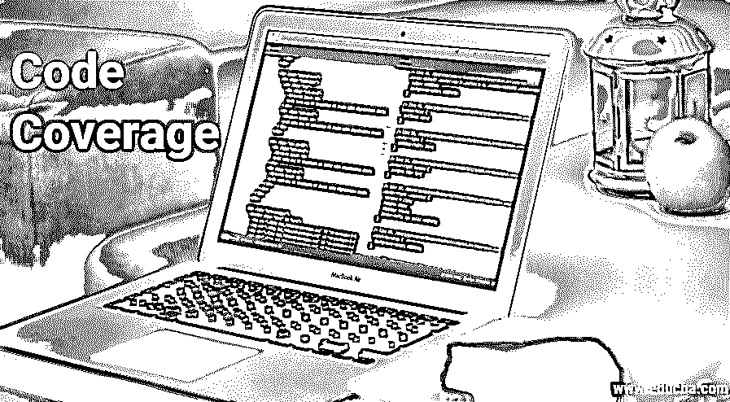
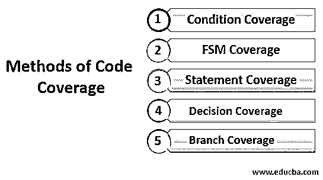

# 代码覆盖率

> 原文：<https://www.educba.com/code-coverage/>

## 什么是代码覆盖率？

代码覆盖率是由开发人员完成的，用来衡量应用程序或组件的编码已经过测试的程度，显示正在运行的程序的信息，帮助衡量测试效率。语句覆盖、切换覆盖、分支覆盖、决策覆盖和 FSM 覆盖是代码覆盖使用的方法。它还允许开发人员创建额外的测试用例来增加代码覆盖率。

### 代码覆盖率是如何工作的？

实际上有各种各样的方法来度量代码覆盖率。然而，如果我们以一种宽泛的方式来考虑，存在以下三种方法:

<small>网页开发、编程语言、软件测试&其他</small>

*   **源代码插装:**源代码插装会将插装语句添加到源代码中。然后，它会用普通的编译工具编译代码，得到一个经过检测的程序集。
*   **中间代码插装:**在中间代码插装中，通过添加新的字节码来插装编译后的文件，然后生成新的类。
*   **运行时信息收集:**在运行时信息收集中，我们从代码执行后的运行时环境中收集信息，以确定覆盖率信息。

由于代码在测试中被执行，[代码覆盖系统](https://www.educba.com/code-coverage-vs-test-coverage/)将收集关于哪些语句被执行的信息。现在，这些信息将被用作报告的一些基础。此外，代码覆盖率方法会因所收集的覆盖率信息的不同形式而有所不同。如果我们超越基本的语句覆盖方法，还有各种各样的代码覆盖方法。

### 代码覆盖的方法

存在许多代码覆盖的方法。其中一些列举如下:

*   条件覆盖
*   FSM 覆盖范围
*   报表覆盖范围
*   决策覆盖
*   分支覆盖

#### 1.报表覆盖范围

*   这是白盒测试设计技术，其中我们至少处理一次源代码中存在的所有可执行语句的执行。因此，在计算和度量源代码中存在的许多语句以及那些在给定需求的情况下可以执行的语句时，需要代码覆盖。
*   根据测试中存在的代码结构，在导出场景时需要此方法。

#### 2.决策覆盖

*   这种方法在报告布尔型的每个[表达式的真或假结果时非常有用。但是，不幸的是，这种报道中的表达往往变得复杂。这就是为什么很难获得 100%的覆盖率。](https://www.educba.com/boolean-operators-in-java/)
*   这正是存在各种方法来报告这种度量的原因。这些完整的方法基本上处理最重要组合的覆盖。决策覆盖提供了很大的敏感性，以便控制流程。

#### 3.分支覆盖

*   当我们谈论这种类型时，我们的意思是来自代码模块的每个输出都要经过测试。因此，作为一个例子，我们可以考虑，如果输出是二进制的，那么我们将测试真和假输出。
*   分支覆盖有助于我们确保来自每个决策的所有可能的分支，条件至少执行一次。
*   通过分支覆盖方法，我们可以计算独立代码段的比例。此外，这个方法使我们能够找出代码的哪些部分没有分支。

存在计算分行覆盖率的公式:

**分行覆盖率=已执行分行数/已执行分行总数**

#### 4.条件覆盖

*   条件覆盖，也称为表达式覆盖，告诉我们如何计算条件语句中的变量或子表达式。
*   让我们考虑一个例子，其中一个表达式包括布尔运算，如 AND、OR 或 XOR，它包括所有的可能性。
*   与决策覆盖相比，这种方法实际上为我们提供了更好的控制流的灵敏度。这种方法不能保证我们得到完整的决策覆盖范围。

存在计算分行覆盖率的公式:

**条件覆盖=已执行操作数数量/已执行操作数总数**

#### 5.有限状态机覆盖

*   这种方法被认为是最复杂的代码覆盖方法。背后的原因是，这种方法实际上对设计的行为起作用。
*   同样，在这个方法中，我们要找出有多少特定时间的状态被访问和经过。此外，该方法也验证了有限状态机中考虑了多少序列。

### 代码覆盖率的优势

下面给出了一些优点:

*   这对于代码覆盖率的量化评估是非常有用的。
*   它还允许我们创建额外的测试用例来增加覆盖率。
*   它还允许我们定位测试用例没有执行[的程序部分。](https://www.educba.com/test-cases-vs-test-scenario/)

### 代码覆盖率的缺点

下面列出了一些缺点:

*   每当一个特定的特性没有在设计中很好地实现，代码覆盖率仍然会报告覆盖率是 100%。
*   如果你通过这个测试特性所有可能的值，这是不可能理解的。
*   它也没有说明我们覆盖了我们的逻辑有多少以及有多好。

### 结论

代码覆盖率被认为是一种度量，其中我们描述了一个程序的源代码被测试的程度。它还帮助我们计算测试实现的效率。同样，语句覆盖意味着至少执行一次所有的可执行语句。

### 推荐文章

这是代码覆盖率的指南。这里我们讨论的方法和它是如何工作的？有优点也有缺点。您也可以阅读以下文章，了解更多信息——

1.  [测试覆盖率](https://www.educba.com/test-coverage/)
2.  [突变测试](https://www.educba.com/mutation-testing/)
3.  [代码覆盖工具](https://www.educba.com/code-coverage-tools/)
4.  [什么是测试用例？](https://www.educba.com/what-is-test-case/)

