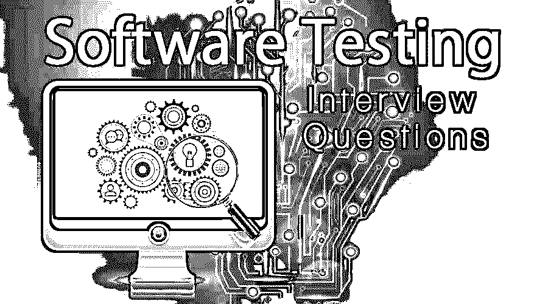

# 软件测试面试问题

> 原文：<https://www.educba.com/software-testing-interview-questions/>

## 软件测试面试问题介绍

以下文章提供了软件测试面试问题的大纲。软件测试是根据最终用户的要求对系统及其组件进行测试的过程，无论系统是否按照要求运行。在这个整个过程中，测试人员根据最终用户的需求对系统进行测试；如果软件不能按照最终用户的要求工作，测试人员会提出错误，开发人员会修复错误以满足最终用户的要求。因此，它被称为分析软件项目以找出实际需求和开发需求之间差异的过程。在这个过程中，我们发现了缺陷并修复了它们。

如果是找软件测试相关的工作，需要准备 2022 年软件测试面试题。的确，每个面试都因不同的职位而不同。在这里，我们准备了重要的测试面试问题和答案，这将有助于你在面试中取得成功。

<small>网页开发、编程语言、软件测试&其他</small>

以下是 10 个重要的软件测试面试问题和答案。这些问题分为如下两部分:

### 第 1 部分-软件测试问题(基础)

这第一部分包括基本的面试问题和答案。

#### Q1。在软件测试中，解释质量保证和质量控制？

**答案:**

质量保证来自面向过程的活动。它用于确保防止在用于制作软件应用程序的过程或方法中出现缺陷。此外，它用于在整个应用程序开发之后防止缺陷。质量控制来自面向产品的活动。它执行脚本逻辑来识别软件应用程序中的缺陷和错误。

#### Q2。解释下列术语审计、检查和调试？

**答案:**

*   **审核:**确定测试过程在组织内进行是一个精心策划的系统过程。它独立于公司软件测试期间所涉及的过程。这是对公司使用的记录流程的审查。审核的类型包括内部审核、法律合规性审核和系统审核。
*   **检查:**是一种形式化的评估技术，其中软件需求编码；由软件开发人员以外的个人或团体对设计进行更详细的检查，以检测缺陷、违反开发标准或任何其他问题。它是一种通过识别任何缺陷或差距，从技术上正式或非正式地评审任何开发的工件的方法。
*   **调试:**进行处理，找出 bug 的根本原因。软件开发人员执行它。IDE 用于执行调试，开发人员在调试模式下运行软件，并逐行检查代码，找出错误的确切根源。

#### Q3。解释一下白盒测试，白盒测试有几种类型，白盒测试的步骤？

**答案:**

在基于对系统内部结构及其子组件的分析而选择的白盒测试用例中，它包括代码覆盖、路径覆盖、条件覆盖、分支覆盖等。

*   决策覆盖
*   报表覆盖范围

**白盒测试步骤如下:**

*   根据文档规范验证系统及其组件结构的流程。
*   验证代码中损坏的路径。
*   验证代码中的安全漏洞。
*   验证预期输出。
*   测试代码中的条件循环，以确保软件应用程序的完整工作功能。
*   软件逐行测试，以确保 100%的测试覆盖率。

#### Q4。解释黑盒测试？软件行业中存在的不同类型的黑盒测试是什么？

**答案:**

这是面试中最常见的软件测试问题。软件应用程序的功能在黑盒测试中进行测试。黑盒测试是一种软件测试方法，在这种方法中，在不知道软件是如何实现的、代码是如何流动的、内部结构是怎样的、为特定功能编写了什么代码的情况下，对软件进行测试。

不同类型的黑盒测试技术如下所示:

*   等价划分
*   因果图
*   边界值分析

#### Q5。解释静态测试和动态测试的区别？

**答案:**

*   **静态测试:**静态测试中，代码执行不执行；这是通过测试文档来完成的。
*   **动态测试:**在动态测试中，执行代码来执行测试。

### 第 2 部分——软件测试面试问题(高级)

这部分包括高级面试问题和答案

#### Q6。测试计划中有哪些表格？

**答案:**

测试计划文档包含以下内容:范围、测试设计、测试策略以及许多其他细节。

*   测试策略和测试方法
*   测试用例标识符
*   要测试的特性
*   测试可交付成果
*   范围
*   风险和意外事件
*   人员配备和培训
*   不需要测试的特性
*   责任

#### Q7。系统测试和用户验收测试有什么区别？

**答案:**

*   **系统测试**:在这种类型的测试中，软件应用从开始阶段一直进行到结束。它是一种在系统经历测试时发现缺陷的方法，同时包括所有的组件；这就是为什么它被称为端到端测试。
*   **用户验收测试**:它包括通过一系列特定的测试用例来运行一个应用软件，这些测试用例决定软件是否满足用户的需求。

#### Q8。解释测试用例、测试场景和测试脚本的区别？

**答案:**

*   **测试用例**:是要执行的测试用例的文档；它是在软件开发的早期创建的。
*   **测试场景**:测试场景是在软件测试的前期准备的；它包括许多事情，如测试产品的计划、环境条件和许多团队成员，制定测试计划，制定测试用例以及应用程序要测试的所有功能。
*   **测试脚本**:根据需求用编程语言编写，简单来说，就是要测试软件系统或子系统部分功能的程序。

#### Q9。测试类型是什么？

**答案:**

遵循一个标准的程序和步骤来获得期望的测试结果，这被称为测试类型。

常用的测试类型有:

*   敏捷测试:这是一种用敏捷技术进行测试的方法。
*   **API 测试:**为应用创建不同的测试 API。
*   **单元测试:**对一个应用程序的一小块代码进行测试。
*   **安装/卸载测试:**从最终用户需求的角度进行测试。
*   **集成测试:**将所有独立的小模块组合起来，然后进行测试。
*   **系统测试:**是对系统的整体测试。

#### Q10。解释追溯矩阵和测试矩阵的区别？

**答案:**

*   **追溯矩阵**:是客户需求和测试用例之间的映射。
*   测试矩阵(Test Matrix):它用于捕获软件应用测试的所有阶段所需的葡萄努力、实际质量、资源、计划和时间。

### 推荐文章

这是一个软件测试面试问题和答案列表的指南，以便候选人可以轻松地解决这些软件测试面试问题。在本帖中，我们研究了在面试中经常被问到的最常见的面试问题。您也可以阅读以下文章，了解更多信息——

1.  [数据库测试面试问题](https://www.educba.com/database-testing-interview-questions/)
2.  [云计算面试问题](https://www.educba.com/cloud-computing-interview-questions/)
3.  [手机测试面试问题](https://www.educba.com/mobile-testing-interview-questions/)
4.  [Bitbucket 面试问题](https://www.educba.com/bitbucket-interview-questions/)

