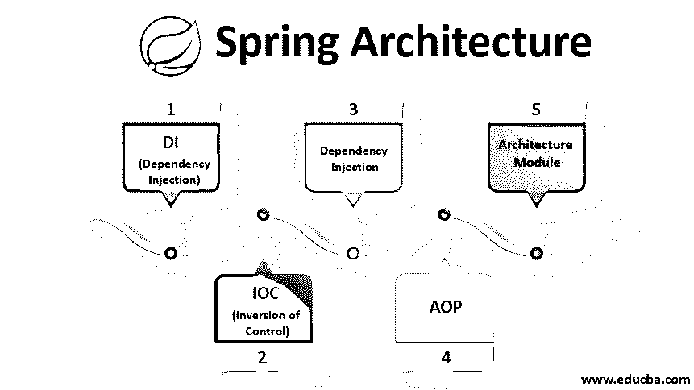
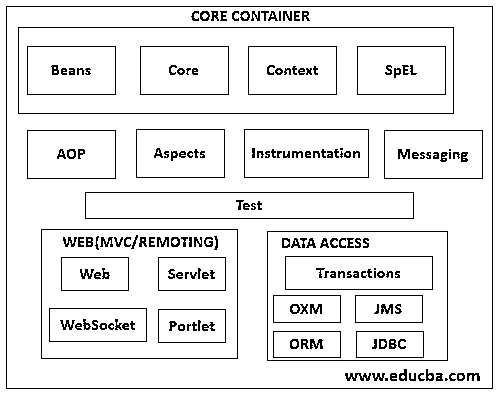

# 春天建筑

> 原文：<https://www.educba.com/spring-architecture/>

## Spring 架构介绍

Spring Architecture 只不过是一个支持 java 企业产品的简单访问工作区，用于设计、构建、编程和实现基于 Java 的应用程序。构建 Spring 架构的多层是核心模块、AOP 模块、DAO 模块、ORM 模块和 Web 模块。这些模块有分开的隔间。例如，核心模块由上下文、语言表达式容器、Beans 和 SpEI 组成，web 模块由 Web-MVC Web-Socket 和 Web-Portlet 组成。

### Spring 框架的体系结构

在跳到 spring 的架构之前，我们应该知道下面这个术语:

<small>网页开发、编程语言、软件测试&其他</small>

#### 1.国防情报部

不理解什么是依赖注入和控制反转，就很难理解什么是 Spring 框架。同样，依赖注入是控制反转(IoC)的一种。

#### 2.控制倒置

这是面向对象编程的标准，其中程序的对象不依赖于不同对象的实体执行；然而，他们可能知道他们的抽象(接口)用于以后的关联**。**

#### 3.依赖注入

它是一个基本的结构设计，其中对于应用程序的每个功能，都有一个严格自治的项目(管理),它可以通过接口利用它所知道的不同的项目(条件)。条件在创建时就被移动(实现)到管理中。这是我们将一个类的组件呈现给另一个类的地方。实际上，DI 是通过向构造函数传递参数或利用 setters 来实现的。执行这种方法的库又被称为 IoC 容器。

#### 4.面向切面编程

它是一个基本的结构设计，其中对于应用程序的每个功能，都有一个严格自治的项目(管理),该项目可以希望利用接口所知道的不同的其他对象(依赖关系)。依赖项在创建时就被转移(实现)到管理中。这是我们将一个类的组件呈现给另一个类的地方。

#### 5.架构模块

*   **核心模块:**提供了依赖注入(DI)包括 Spring 系统的基本思想。该模块包含 Bean Factory，这是 Factory 模式的一个执行，它根据 XML 记录中设计者的设置生成 Bean。
*   AOP 模块:面向方面的编程模块使工程师能够描述技术拦截器和点切片的特征，以保持担忧的分离。它是在运行时安排的，因此可以跳过累加步骤。它侧重于高管的解释性交流，这更容易跟上。
*   **DAO 模块:**这为建立关联、释放关联等底层任务提供了一个反射层。此外，它还保持了一个重要豁免的命令链，而不是从明确的数据库销售者那里丢弃混乱的错误代码。它[利用 AOP 来监督](https://www.educba.com/what-is-aop/)交换。交易所同样可以被自动监管。
*   ORM 模块: Spring 没有提供自己的 ORM 执行，但是提供了与主流对象关系映射设备的混合，比如 Hibernate、iBATIS SQL Maps、Oracle TopLink 和 JPA 等等。
*   web 模块: Spring 伴随着 MVC 结构，这有助于创建 Web 应用程序。同样，它也很好地结合了最主流的 MVC 结构，如 Struts、Tapestry、JSF。

现在让我们详细讨论下面的架构图:

### 弹簧芯容器

核心容器有以下几个方面:

*   **核心**
*   **豆子**
*   **语境**
*   **AOP**
*   **游戏**
*   **表情语言模块(方面)**

核心和 Beans 模块给出了该结构的基本部分，包括 IoC 和依赖注入特性。豆工厂是创造线结构的一种推进式应用。它清除了编程单线的必要性，并使你能够从你真正的程序推理方法中分离出结构和条件。上下文模块开发了核心和 Beans 模块的坚实基础:它是一种以类似于 JNDI 库的结构化方式访问对象的方法。

应用程序上下文接口是混合上下文模块的目的。表达式语言模块提供了一种令人惊叹的动词化语言，用于在运行时处理和控制文章大纲。它是 JSP 2.1 保证中决定的绑定在一起的解释语言(统一 EL)的发展。

该语言支持设置和获取属性估计、属性任务、方法调用、开始设置束、种类和索引器、合理的和数字洗牌管理器、命名变量，以及从 Spring 的 IoC 区间按名称恢复事物。

### 信息(数据)访问/组合(集成)

身份和访问管理(IAM)作为一个集中式门户，是任何企业数据安全的重要组成部分。下面讨论了一些组件:

*   **JDBC**
*   **蛇**
*   **OXM**
*   **JMS**

**JDBC:** 它提供了一个 JDBC 反射层，消除了单调的 JDBC 编码和解析数据库交易者明确的笨拙代码的需要。

ORM: 它为包含 JPA、JDO、Hibernate 和 iBatis 的标准项目公共绘图 API 提供了一个混合层。使用 ORM 组，您可以将这些 O/R-mapping 框架与 Spring 提供的各种功能混合使用，例如，到目前为止，委员会引用的清晰、权威的交易。

**OXM:** 它提供了一个支持 JAXB、Castor、XMLBeans、JiBX 和 XStream 的对象和 XML 绘图应用的转换层。

**JMS:** 它提供了传递和消费消息的特性。

### 网

网络有以下几层:

*   **网页**
*   **Web-MVC**
*   **网络插座**
*   **网络门户**

**弹簧网:**它给出基本的网排列的熔丝特征；例如，多部分存档使用 servlet 人群个人和网络组织的应用程序设置来移动便利性和 IoC 持有者的呈现。

**Web** **Servlet:** 它拥有 Spring 对 Web 应用的 MVC 执行。

Web Socket: 模块包含在 Spring 应用程序中组织模型 Struts web 级别的辅助类。

### 结论 Spring 架构

在本文中，我们介绍了 Spring 架构、它的工程和基本要点。我们已经弄清楚了 Spring 结构如何让我们利用依赖注入来开发松散耦合的应用程序，其中依赖对象是使用配置文件注入的。说白了，Spring 系统是一个直接的、基本的、轻量级的、强大的结构，用于组装当今基于 Java 的应用程序。

### 推荐文章

这是一个春天建筑指南。在这里，我们讨论 Spring 架构及其工程和基础亮点的介绍。您也可以浏览我们推荐的其他文章，了解更多信息——

1.  [什么是 Spring 框架？](https://www.educba.com/what-is-spring-framework/)
2.  [春云组件](https://www.educba.com/spring-cloud-components/)
3.  [春季框架面试试题](https://www.educba.com/spring-framework-interview-questions/)
4.  [Spring Boot 开发工具](https://www.educba.com/spring-boot-devtools/)

