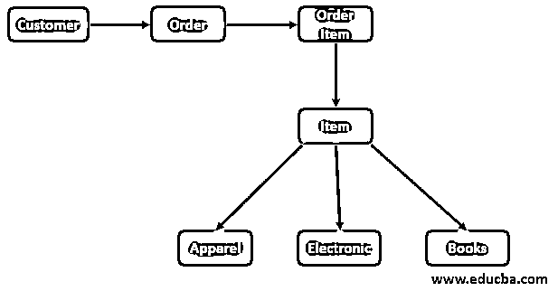
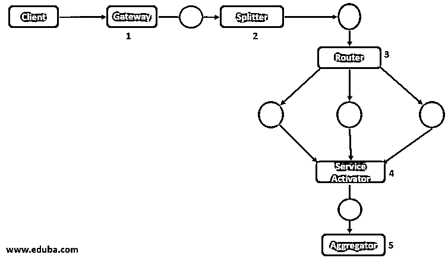

# 什么是 Spring Integration？

> 原文：<https://www.educba.com/what-is-spring-integration/>


## Spring 集成简介

Spring 编程最常用的扩展之一 Spring Integration 用于支持企业集成模式。企业集成模式是针对特定设计问题测试的解决方案，这些解决方案完全与技术无关，这意味着使用哪种编程语言并不重要。它使开发人员能够在基于 Spring 的应用程序中使用轻量级消息传递。Spring integration 开发背后的主要直觉是拥有一个简单的模型，可以用来构建一个企业集成解决方案，并维护对于生成可维护和可测试的代码至关重要的独立关注点。在本文中，我们将研究可用于简化 Spring 应用程序开发过程的工具。

### 什么是 Spring Integration？

如前所述，这是一种简化商业产品生产以解决特定业务单元问题的方法。根据所涉及步骤的复杂性和规模，所解决的问题是作为企业解决方案来衡量的，还是仅仅几行代码。这个企业应用程序的问题是，使用较旧的技术已经可以使用很少的代码部分，从头开始重新编写相同的东西并再次经历测试的痛苦变得不太划算。这就是集成发挥主要作用的地方，它通过交互操作使用旧技术构建的新组件或代码的遗留部分。

<small>网页开发、编程语言、软件测试&其他</small>

它考虑了无缝集成多个组件所需的所有技术方面，无论是新组件的遗留部分。Spring 为开发人员提供了一个环境来构建易于集成的代码。它通过以下方式实现这一壮举:

*   **松耦合:**由于构建企业级应用程序涉及多个部分，每个部分都有自己的关注点。不同组件之间的松散耦合将减少设计威胁，维护也更容易。
*   **事件驱动的 Spring 集成:**这里遵循的架构设计是，企业级应用程序中涉及的不同组件通过由其他组件生成的事件进行交互，这些事件被称为事件的发布者，并允许组件订阅它以接收事件细节，从而采取下一个适当的行动。

### 弹簧积分的应用

既然我们已经了解了在制作应用程序时使用 Spring Integration framework 的意图，让我们来看看如何使用 Spring Integration Framework 开发应用程序。此外，在我们进入示例应用程序之前，让我们先来看看构建框架的 3 个组件。

*   消息:这个组件帮助封装需要从一个地方传输到另一个地方的数据。
*   **通道:**该组件提供了一种机制，允许消息从一点传输到另一点。
*   **端点:**它们或者是消息的消费者，或者是消息的生产者。

### Spring 集成的主要依赖项

spring integration 的主要依赖项是在 pom.xml 中用相关的 spring integration jar 声明的。这通过以下方式实现:

**代码:**

```
<dependencies>
<dependency>
<groupid>org.springframework.integration</groupid>
<artifactid>spring-integration-stream</artifactid>
<version>5.2.2.RELEASE </version>
</dependency>
</dependencies>
```

然后我们将调用 maven exec 插件来清理、打包和运行应用程序。

现在我们已经声明了相关的 spring integration jar，我们将看一个在线商店的场景来更好地理解这个概念。




在上面的流程图中，客户可以在一个特定的订单 ID 下从不同的可用类型订购很多东西，每个块代表 Java 中的类。上述流程图可用于管道设计，如下所示:




现在，我们已经设计了管道，让我们了解编号为 1 到 5 的每个组件。首先，每个圆形对象是一个通道，每个矩形框是一个端点。在数字 1 中，网关组件标志着消息传递系统的入口。任何新订单 s =作为消息到达该组件，用于封装消息的进一步处理，并放入第一个通道。现在，在这个通道中，每个订单都被分解成各自的项目实例，然后使用 Splitter 对每个订单进行包装，并放入下一个通道中，以供后续步骤使用。

现在，使用路由器考虑每一个分解的项目，并将其传输到服装、电子产品或书籍的相应通道。一旦它被放置在相应的渠道中，服务激活器从所有 3 个渠道接收并激活任何所需的命令，例如折扣、优惠或任何促销礼品，并将其放置在下一个渠道中。在聚合器组件中，单个商品被聚合，然后最终按照订单 ID 重新构建整个订单。

不属于此图的一个组件是轮询器组件，它配置各个消息输入通道的询问频率。至此，我们完成了 Spring Integration 框架的整个流程，接下来我们将开始研究 Spring Integration 带来的不同优势。

### 优势

除了 Spring 本身带来的核心优势之外，它还有很多优势。以下是使用 Spring Integration 的一些优点:

*   控制反转(IoC):这个优势只适用于 Spring Integration。它基本上将任务的执行从实现中分离出来，这样每个模块都可以专注于模块的基本意图。
*   使用[面向方面编程(AOP)](https://www.educba.com/what-is-aop/) 来解决横切关注点。在这一点上，AOP 的编程范例分离了软件应用程序的关注点，从而提高了模块化。这样做可以更容易地将特性和行为分成可管理的部分。

### 结论

在本文中，我们研究了什么是 Spring Integration，以及整个 Spring Integration 框架所基于的不同组件。记住这一点，你就能更容易地清除在学习 Spring Integration 的过程中可能出现的一些相似性混淆。开发人员广泛使用这个框架来构建一些东西，不仅可以解决业务问题，还可以用一种更简单的方式来解决它！

### 推荐文章

这是一本关于什么是 Spring 集成的指南？.在这里，我们讨论不同的组件、应用程序、流程图以及 spring 集成的优势。您也可以浏览我们的其他相关文章，了解更多信息——

1.  [Spring Boot 开发工具](https://www.educba.com/spring-boot-devtools/)
2.  [Spring Boot 执行器](https://www.educba.com/spring-boot-actuator/)
3.  [Spring Boot 首发网](https://www.educba.com/spring-boot-starter-web/)
4.  [Spring Boot 注解](https://www.educba.com/spring-boot-annotations/)


