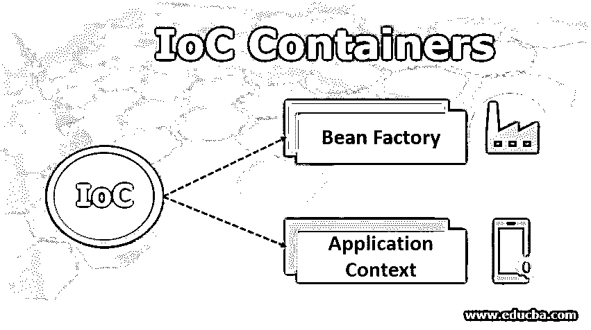
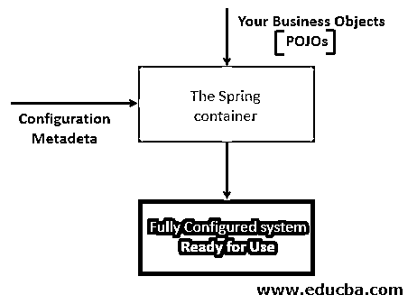
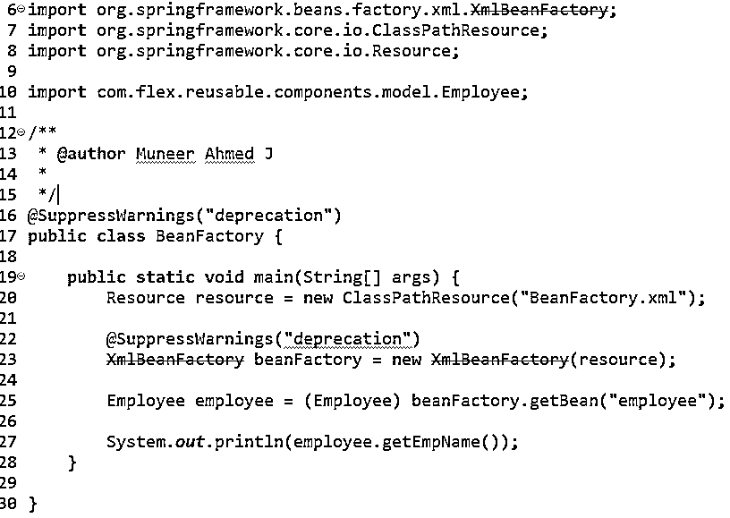
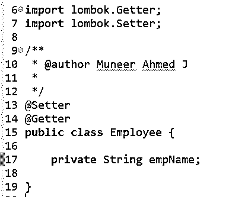
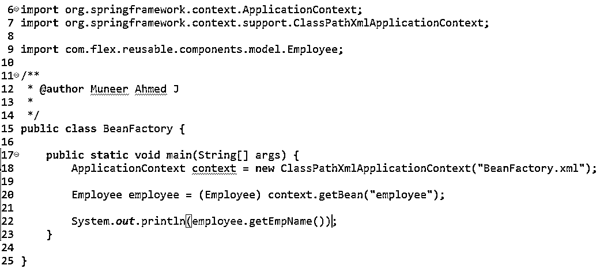

# 国际奥委会集装箱

> 原文：<https://www.educba.com/ioc-containers/>

## 国际奥委会容器介绍

Spring 核心框架最重要的部分之一是 Spring IoC 容器。Spring IoC 容器主要负责实现控制反转(IoC ),即通过创建对象并在运行时动态注入它们来实现类之间的松散耦合。

Spring IoC 容器有助于实例化类&创建对象、配置对象、组装和管理对象之间的依赖关系。创建、配置和组装对象所需的信息是通过读取 XML 配置文件或扫描项目中使用的 Spring Java 注释获得的。

<small>网页开发、编程语言、软件测试&其他</small>

### IoC 容器的体系结构

从上面的架构图中，我们可以看出 Spring 容器使用的配置元数据只不过是 XML 文件配置或 Java 注释。该配置元数据包含定义，

1.  要实例化的对象是什么？
2.  要配置的对象是什么&如何配置？
3.  如何组装物品？

这些对象将成为项目的业务对象或 DAO 对象的一部分。因此，IoC 容器在启动应用程序本身时实例化、配置和组装对象，并管理从创建到销毁的对象生命周期。

### 国际奥委会容器的类型

Spring 框架提供了两种类型的 IoC 容器。

*   豆制品厂
*   应用程序上下文

#### 豆制品厂

Bean Factory 是 IoC 容器的根接口，它为使用依赖注入实现类[之间的松散耦合提供了基本支持。](https://www.educba.com/dependency-injection-in-spring/)

在 org . spring framework . beans . factory . bean factory 接口下定义。顾名思义，Bean Factory 是制造 Bean 并将其注入到类中的地方。

你可能想知道，豆子是什么？Beans 什么都不是，而是由其中的 Spring 初始化的 Java 对象。因此，任何 POJO 类或 DAO 类都充当 Spring Bean，如果它被配置为由 IoC 容器根据 XML 配置文件中可用的元信息进行实例化，或者作为项目中基于 Java 的注释。

##### 豆子的范围

*   **Singleton:** 这是默认作用域。顾名思义，每个容器只创建一个 bean 实例。
*   **Prototype:** 对于每个请求，都会创建一个新的 bean。
*   **请求:**将在 [Web 应用](https://www.educba.com/what-is-web-application/)中使用。对于来自客户端的每个 HTTP 请求，都会创建一个新的 bean。
*   **会话:**对于每个 HTTP 会话，都会创建一个新的 bean。

##### 如何创建豆工厂？

让我们看一个使用基于 XML 的配置创建 Bean Factory 的实时示例。

员工 POJO 类别

使用 XmlBeanFactory 读取 XML 配置的 BeanFactory 类。

beanFactory.xml 文件，用于配置 Spring Bean Factory 创建 Bean 对象的元数据。

**输出:**

穆尼拉赫梅 j

##### 豆制品厂的方法

Bean 工厂有六种主要方法。它们如下:

*   **Boolean contains Bean(String):**该方法将可用 bean 实例的名称与作为参数传递的名称进行比较。如果匹配则返回 true，否则返回 false。
*   **Object getBean (String):** 该方法返回可用的 Bean 实例，其名称作为参数传递。如果找不到 bean 实例，它将抛出 NoSuchBeanDefinition 异常。
*   **Object getBean (String，Class):** 该方法返回可用的 Bean 实例，其名称作为参数传递&它将被转换为作为第二个参数传递的类。如果找不到 bean 实例，则抛出 NoSuchBeanDefinition 异常&如果 bean 无法转换为提供的类，则抛出 BeanNotOfRequiredType 异常。
*   **Class getType(String name):**这个方法将返回作为参数传递的 bean 的类。
*   **Boolean singleton(String):**该方法将检查作为参数传递的 bean 名称是否在 Singleton 范围内。如果 Singleton else 返回 false，则返回 true。
*   **String[]get aliases(String):**该方法返回传递的 bean 名称的单个别名或别名数组(如果可用)。

#### 应用程序上下文

应用程序上下文与 BeanFactory 相同，因为它只构建在 Bean Factory 接口上，但是它提供了一些额外的功能，例如

*   与 [Spring 框架的](https://www.educba.com/what-is-spring-framework/) AOP 简单集成，
*   国际化中的消息资源处理(i18N)，
*   事件传播和
*   最重要的是 Web 应用程序的 WebApplicationContext。

在 org . spring framework . context . application context 接口下定义。

如您所见，应用程序上下文是在 Bean Factory 上构建的，它还提供了一些额外的功能，它比 Bean Factory 更值得推荐。

##### 如何创建应用上下文？

让我们看一个使用基于 XML 的配置创建应用程序上下文的实时示例。

员工 POJO 类别

使用应用程序上下文读取 XML 配置的 BeanFactory 类。

beanFactory.xml 文件，用于配置 Spring Bean Factory 创建 Bean 对象的元数据。

**输出:**

穆尼拉赫梅 j

##### 应用程序上下文的类型

有三种不同类型的应用程序上下文。它们如下:

*   file systemxmlapplicationcontext
*   ClassPathXmlApplicationContext
*   WebXmlApplicationContext

### IoC 容器的优势

以下是解释的一些优点。

*   Spring IoC 容器有助于实例化、配置和组装 XML 配置文件或 Java 注释中提供的对象。
*   Spring IoC 容器有助于管理 Spring Bean 的生命周期，即从实例化到销毁。
*   Spring IoC 容器提供了对控制反转(IoC)的支持。
*   它提供了一个 beans 工厂，用于在应用程序启动时动态绑定它们。
*   它有助于实现松散耦合。
*   它为使用 Web Application 上下文创建 Web 应用程序提供了简单的支持。
*   它通过避免样板代码来最小化代码量。
*   它为服务的急切实例化和延迟加载提供支持。
*   它允许开发人员注入模拟对象，从而简化了单元测试。

### 结论

从这篇文章中，我们深入研究了 IoC 容器的架构、重要性和角色。我们还介绍了不同类型的 IoC 容器及其在基于 XML 的配置上的实时示例优势。

### 推荐文章

这是国际奥委会集装箱指南。这里我们讨论 IoC 容器的介绍、架构，以及类型和优点。您也可以浏览我们推荐的其他文章，了解更多信息——

1.  [网络应用安全](https://www.educba.com/web-application-security/)
2.  [虚拟主机的类型](https://www.educba.com/types-of-web-hosting/)
3.  什么是 ASP.Net 网络服务？
4.  [什么是 Selenium Web 驱动？](https://www.educba.com/what-is-selenium-web-driver/)

