# 弹簧模块

> 原文：<https://www.educba.com/spring-modules/>

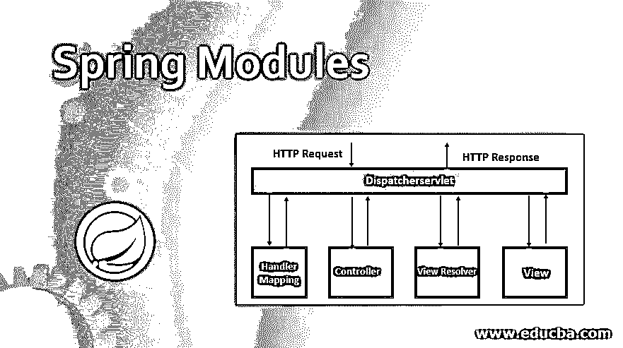

## Spring 模块简介

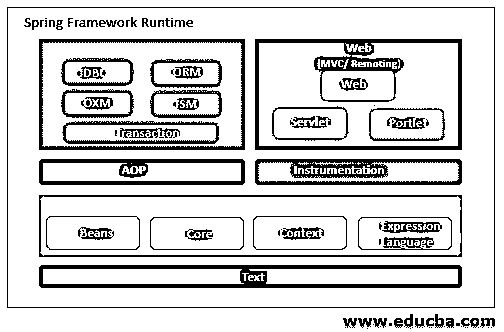

Spring 框架模块可以高度分类，核心容器充当 Spring 的主/基础模块，它包含以下子模块，如 Beans、核心、上下文和表达式语言。Web 层负责创建 Web 应用程序。子模块包括 Web、Servlet 和 Portlet。数据访问/集成层负责与数据库的交互以及与 ORM 框架的集成。子模块包括 JDBC、ORM、OXM、JMS 和 Transactions。测试层有自己的测试框架，它有很好的绑定&支持使用 Junit 或 Mockito 或 TestNG 测试应用程序。杂项层包括 AOP(面向方面编程)和工具。在这个主题中，我们将学习 Spring 模块。

<small>网页开发、编程语言、软件测试&其他</small>

### 弹簧模块说明

**核心容器——豆子&核心**

核心容器，Spring 模块的大脑，负责实现控制反转(IoC)或者依赖注入(DI)。这有助于实现类之间的松散耦合。

按照传统的方式，开发人员将在创建对象和注入依赖关系时控制代码。在这里，Spring 框架控制执行上述活动，这就是为什么这个术语被创造为“控制反转”——也就是说，控制是反转的！

依赖注入是一种坚持/实现控制反转以解决依赖的模式。

对象是应用程序的主干，由 IoC 容器管理(例如，实例化、配置和组装),称为 Beans。

在此之前，你应该清楚国际奥委会的概念。但是如何实例化 beans 呢？它是通过自动布线来处理的。Spring framework 利用自动连接的概念，在应用程序启动时将 beans 实例化到所需的类中。

**春天的语境**

Spring Context 是在 Spring Core & Beans 的基础上构建的核心容器的子模块。它主要负责通过扫描 Spring 注释或 XML 文件中的配置来实例化和配置 beans。

此外，它还支持国际化(i18N)、资源加载和事件传播。

**国际化(i18N)**

Spring 国际化有助于设计 Web 应用程序，使其能够被世界各地的各种语言访问/适应。这将有助于最终用户以他们自己的语言访问/浏览应用程序或网站。

i18N 可以通过配置 message-{language}中的消息/句子来实现。属性文件。

例如，对于英语，单词和句子可以在 message-en.properties 中维护，而对于匈牙利语，可以在 message-hgr.properties 文件中维护。

**Spring 表达式语言(SpEL)**

SpEL 是一种基于 Spring 的表达式语言，用于计算表达式，如数学运算、逻辑和关系运算、条件运算和正则表达式。

**实时示例:**

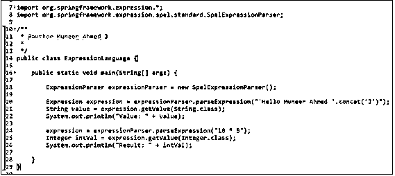

**输出**

你好，穆尼尔·艾哈迈德·J

结果:50

### 数据访问/集成层

这里是下面提到的层

#### JDBC 层

JDBC 层提供了传统 JDBC 的包装或抽象。

在 JDBC 连接中，开发人员需要为创建、打开和关闭数据库连接、执行查询等编写样板代码。，但是在 Spring JDBC 模板的帮助下，Spring 框架负责上述任务。

此外，JDBC 模板是线程安全的，也就是说，有了 JDBC 模板的单个实例，我们可以在不同的 DAO 类中使用它。

**建立 JDBC 连接的传统方式**

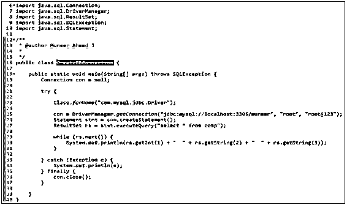

**使用弹簧 JDBC 模板**

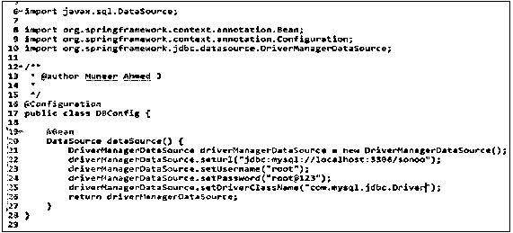

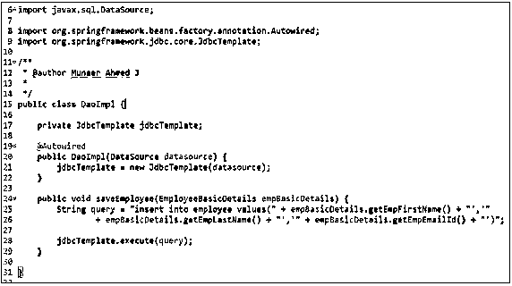

DaoImpl 类，它使用 JDBC 模板来执行查询。在这里，您可以注意到样板代码(即，显式注册驱动程序、打开/关闭数据库连接)尚未使用。

#### 蛇图层

Spring ORM(对象关系映射)层提供了与 Hibernate、JPA 等各种 ORM 框架集成的支持。，Spring 没有在 ORM 层提供任何改变，但是它提供了一些额外的特性来高效地处理 ORM 层。

把事情说清楚，JPA 只是一个规范。要使用它，您将需要它的一个实现。Spring Data JPA 就是这样一个实现。

Spring 数据 JPA 的一个实时例子

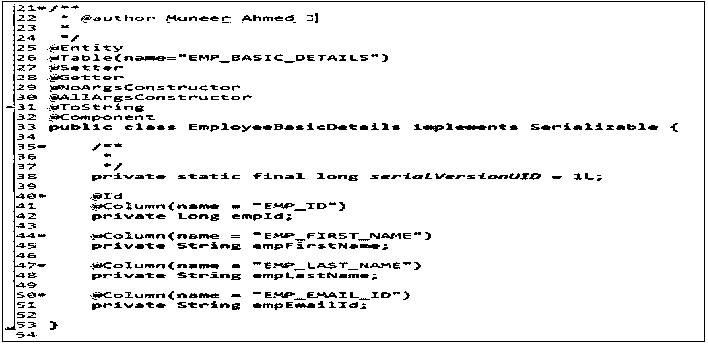

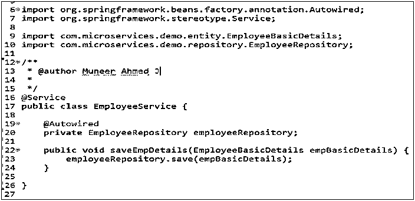

EmployeeRepository 类作为存储库层已经扩展到 JpaRepository。Spring Data JPA 层提供了现成的方法，如 save、findById、deletebyId 等。,

正如您在 EmployeeService 类中看到的，我们没有编写任何用于保存对象的查询，相反，我们使用内置的“save”方法将雇员基本详细信息对象保存到数据库中。

#### OXM 层

Spring OXM 层提供了一个包装器或抽象层，用于支持 Java 对象到 XML 文档的映射，反之亦然(即，XML 编组和解组)，具有各种实现框架，如 JAXB、XStream、Castor 等。,

**实时用例:**

在 SOAP Web 服务环境中，我们需要接受请求并将响应以 XML 格式返回给客户端。在这种情况下，开发人员需要将 XML 转换成 Java 对象进行处理(编组),处理之后，Java 对象需要转换回 XML 响应并将其发送回客户端。

**使用 JAXB 的实时示例**

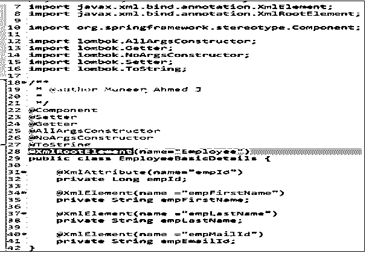

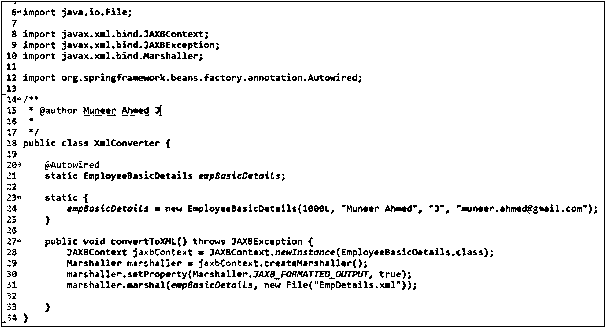

**输出响应**:

**T2】**

 **#### Spring Web/MVC 层

Spring MVC 指的是模型、视图和控制器。

**Spring MVC 的架构**

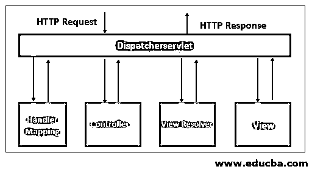

**Spring MVC 模型的步骤**

*   一旦客户机层发出 HTTP 请求，Dispatcher Servlet 将向处理程序映射提供请求端点，以将其路由到所需的控制器。
*   从控制器，它被路由到服务层以实现任何业务逻辑&然后路由到 DAO 层(在任何 DB 事务的情况下)。
*   一旦完成，数据将被设置到模型对象中&然后将被路由到视图层。
*   在这里，Dispatcher Servlet 将为视图解析器提供查找相应视图的详细信息。
*   一旦完成，HTTP 响应和模型数据对象将被路由到视图(HTML 文件),该视图将在浏览器中呈现。

为了帮助 Dispatcher Servlet 处理 HTTP 请求，将在 web.xml 文件中维护 URL 的映射(即部署描述符)。

### 弹簧测试模块

Spring 测试模块有一个测试框架，支持使用 Junit 或 TestNG 独立测试 spring 组件。

由于 Spring 框架使用依赖注入来实现松散耦合，它有助于开发人员在 Junit 框架的帮助下轻松执行单元测试。

在传统方式中，集成测试可以在应用程序部署后执行一次。但是 Spring 提供了一种简单的方法来模仿或存根对象&执行集成测试。

### 结论

从这篇文章中，我们已经用实时场景和代码片段深入研究了 Spring 模块。简而言之，Spring Modules 帮助开发人员用更少的工作和编码更有效地处理应用程序。

### 推荐文章

这是一个弹簧模块的指南。这里我们讨论 Spring 模块的解释以及实时场景和代码片段。您也可以看看以下文章，了解更多信息–

1.  [春季 AOP](https://www.educba.com/spring-aop/)
2.  [Spring Boot 版本](https://www.educba.com/spring-boot-versions/)
3.  [Spring Boot 专题](https://www.educba.com/spring-boot-feature/)
4.  [Spring Boot 申请](https://www.educba.com/spring-boot-application/)

**