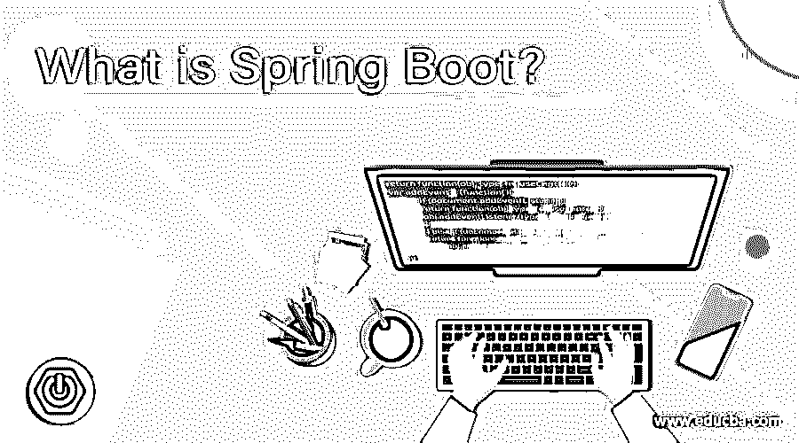

# 什么是 Spring Boot？

> 原文：<https://www.educba.com/what-is-spring-boot/>

## Spring Boot 简介

Spring Boot 是一个基于 Java 的框架，用于在微服务的帮助下创建 Spring 应用。它是一个开源框架，提供了灵活的 XML 配置、数据库事务、健壮的批处理、REST 服务和端点的宽松管理，以及比目前市场上的其他 java 框架更短的时间内的简单工作流。Spring Boot Java 框架中的各种角色是高级软件工程师、Spring Java 或应用程序开发人员，以及 Spring 中的技术领导或架构师，而头衔可以根据组织的不同而变化。

### 谅解

什么是春靴，已经说清楚了？然而，尽管我们已经提到了什么是 spring boot，但还有一个问题是，什么是微服务？

<small>网页开发、编程语言、软件测试&其他</small>

微服务可以被定义为一种架构，它使开发人员能够单独和独立地开发、组织和服务。每个正在运行的服务都有自己特定的功能和流程；因此，最终结果是输出一个支持业务应用程序的琐碎模型。

*   容易沉积
*   节省时间，因为它减少了生产时间
*   与容器兼容
*   最低配置
*   简单的可扩展性

微服务为任何开发者提供了上述优势。

Spring Boot 的主要目的是简化创建生产级 Spring 驱动的应用程序和服务的过程，尽量减少麻烦。简而言之，我们可以说这是一个由“Spring 团队”开发的框架，有助于简化任何新颖的 Spring 应用程序的引导和创建。它通常通过为代码和注释配置提供默认值来发挥作用，这将有助于实时快速启动任何新的 Spring 项目。此外，它还遵循“固执己见的默认配置”策略，以避免大量样板代码和其他旨在改进单元测试、开发和集成测试过程的配置。

### 特征

Spring Boot 计划旨在实现下述目标。

*   避免复杂的 XML 配置，
*   轻松开发现成的 Spring 应用程序。
*   It 部门希望减少开发和运行已开发的应用程序所需的时间。
*   它预计将提供一种更简单的方式来启动应用程序。虽然上述指标是弹簧靴的显著特征[，但好处并没有到此为止。](https://www.educba.com/spring-boot-feature/)
*   人们可以选择 Spring Boot，因为它在配置 XML 配置、Java Beans 和数据库事务方面非常灵活。
*   它提供了强大的批处理功能，甚至可以管理缩短时间的 REST 端点。此外，自动化让 Spring boot 占了上风，因为不需要手动配置。
*   它能够提供自动化的 spring 应用程序。
*   它可以减轻依赖性，并带有嵌入式 Servlet 容器。

### Spring Boot 的优势和劣势

下面给出了提到的优点和缺点:

#### 优势:

*   主要优势是 [spring boot 为](https://www.educba.com/spring-boot-versions/)提供了一种使用 [JAVA 或 Groovy](https://www.educba.com/groovy-vs-java/) 轻松创建基于 spring 的应用程序的方式。
*   最大的好处就是减少了时间。Spring Boot 最大限度地减少了开发和提高生产力的时间。
*   此外，它有助于减少编写注释、样板代码和 XML 配置的所有手工工作。
*   它使得 [Spring Boot 应用](https://www.educba.com/spring-boot-application/)与其 Spring 生态系统的集成变得容易，Spring 生态系统包括 Spring 安全、Spring 数据、Spring JDBC 和 Spring ORM。
*   通过遵循“自以为是的默认配置”，它还减少了开发人员的工作。
*   开发人员可以轻松访问 Jetty、Tomcat 等嵌入式 HTTP 服务器，也可以轻松测试 web 应用程序。
*   它提供了对命令行界面的简单访问，该界面已经开发并测试了用 Java 或 Groovy agile 开发的 Spring Boot 应用程序。
*   此外，它还提供了许多插件，有助于在 Gradle 和 Maven 等工具的帮助下轻松开发和测试 Spring Boot 应用程序。
*   最后，它提供了一个插件，使得处理嵌入式和内存数据库变得非常流畅和容易。

#### 缺点:

*   唯一的问题在于将遗留的或者已经存在的 [Spring Framework](https://www.educba.com/what-is-spring-framework/) 项目转换成 Spring Boot 应用程序的过程中所消耗的时间。

### 这项技术如何帮助你在职业生涯中成长？

现在，这是许多 JAVA 开发人员正在考虑职业选择的热门话题。拓宽了这个职业的视野后，有抱负的开发人员可以选择下面提到的任何职业。

**1。** **Spring Java 开发者:**挑选这个职业的人会有下面提到的职责。

*   开发和设计应用程序。
*   确保并提供最佳性能。
*   能够创建高效且结构良好的代码。
*   在 SDLC 的所有[阶段发挥自己的作用。](https://www.educba.com/what-is-sdlc/)

**2。Spring 应用开发者:**下面说的是一个 Spring 应用开发者的角色和职责。

*   非常了解客户的需求。
*   良好的沟通技巧，与开发团队合作，为需要开发的应用程序设定条件。
*   对代码有透彻的理解，能够编写高质量的可测试代码，并创建这些代码的文档。
*   执行单元和集成测试的能力。
*   对开发的应用程序进行调试和故障排除的细节和效率的关注。
*   必须知道如何创建原型。

**3。春季技术负责人:**主要职责是:

*   必须具备解决问题的技能，在开发任何技术问题的解决方案和方法时，敏捷应该是。
*   在开发解决方案的同时，他/她还必须设计和优化这些解决方案。
*   能够在团队中工作，并帮助团队成员建立一个无错误的系统。
*   必要时为团队成员提供指导和指引。

**4。高级软件工程师:**高级[软件工程师](https://www.educba.com/careers-as-a-software-engineer/)的主要职责包括:

*   团队工作技能，他们应该能够在一个团队中相处。
*   他们应该有商业头脑，因此应该总是寻找战略和计划来扩大业务及其未来的需求。
*   深入了解自动化和其他工作流程。

### 结论——什么是 Spring Boot？

到目前为止，很明显 Spring Boot 已经简化了用 JAVA 开发应用程序的任务。它的目标是成为这个不断发展和扩大的应用程序开发领域的领跑者。把更多的注意力放在开发令人兴奋的新配置上，这需要一种固执己见的方法。因此，它大大减轻了开发者的负担。

### 推荐文章

这是一本关于什么是 Spring Boot 的指南？这里我们讨论了基本概念、定义、特征和优缺点。您也可以浏览我们推荐的其他文章，了解更多信息——

1.  什么是 ASP.Net 网络服务？
2.  [什么是区块链技术？](https://www.educba.com/what-is-blockchain-technology/)
3.  [Spring Boot vs 春天 MVC](https://www.educba.com/spring-boot-vs-spring-mvc/)
4.  [Spring Boot 建筑](https://www.educba.com/spring-boot-architecture/)

