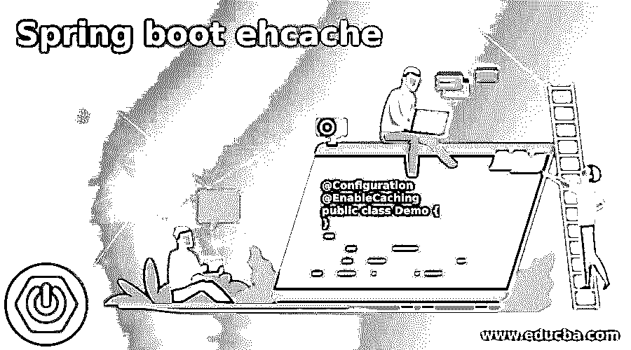

# 弹簧靴 ehcache

> 原文：<https://www.educba.com/spring-boot-ehcache/>

## 

## Spring boot ehcache 简介

在 spring boot 中，我们有 ehcache，这意味着我们可以在应用程序中实现缓存机制。这个外部或开源库帮助我们在 spring boot 中实现缓存；这个库是用 Java 写的；此外，这个开源库与 javax.cache 非常兼容，ehcache 的这种兼容性使得它很容易实现或与 spring boot、hibernate 等集成。此外，在应用程序中启用缓存可以提高其性能，因为它充当中间存储，确保数据快速可用。当我们一次又一次地请求相似的数据时，我们可以很容易地实现缓存，因此它将从缓存中收集和获取数据，而不是去数据库；在下一节中，我们将看到如何在 spring boot 中使用 ehcache 来实现它。

**语法**

众所周知，它是一个开源库，用于在我们的应用程序中实现缓存机制。还有，为了更好的理解和实现 spring boot 中的 ehcache，我们来看看下面的语法；

<small>网页开发、编程语言、软件测试&其他</small>

`@Configuration
@EnableCaching
public class Demo {
}`

正如您在上面的例子中看到的，我们使用@EnableCaching 注释来启用项目中的缓存；此外，我们需要进行更多的配置，以使缓存机制在我们的应用程序中工作。我们将在教程的下一部分看到的整个配置将更好地理解它。

### ehcache 在 Spring boot 中是如何工作的？

我们已经知道，要使 ehcache 在 spring boot 中工作，我们必须使用它的依赖性，因为它是一个开源库，可以帮助我们实现 chaching 机制。此外，我们还做了一些配置，以便在应用程序中启用它，但首先，我们将检查什么是组件以及 ehcache 内部是如何工作的，这也是一个实践示例，其中我们看到了对缓存机制的需求让我们开始吧，见下文；

**1) Ehchache tires:** 在 Ehcache 的情况下，我们有不同的内存区域，在那里我们可以轻松地为应用程序配置缓存。假设我们使用不止一个内存区域，那么 case 区域将按层次顺序排列。在这个等级秩序中，我们有最低和最高的秩序；为了更好地理解，让我们详细了解一下层，见下文；

这些是 ehcahce 支持实现缓存的内存区域；

**a)堆上存储:**这个内存存储使用堆内存区域来为我们实现缓存。通过为这个内存区域实现缓存，垃圾收集也将扫描它，因为我们知道它非常快，但非常有限。

**b)磁盘存储:**该内存区使用硬盘区实现缓存；这比内存慢得多。

c)堆外存储(Off-Heap store):这个内存区域使用 RAM 来车车条目，但是垃圾收集不会对此进行扫描；如果我们从性能的角度来看，它比堆上存储快，但稍慢一些，因为它多执行了一个步骤，比如在使用缓存条目之前移动它们。

下面的流程图展示了 spring boot 应用程序中 ehcache 的不同内存区域。

2)实践用法:我们可以使用缓存介质来逆转系统的性能，但是如何提高呢？它在内部创建数据的本地副本，并在每次用户请求时返回它。例如，假设我们有一个应用程序，用户一次又一次地请求相似类型的数据。因此，每当请求记录时，我们必须调用数据库并检索记录；这可能会降低应用程序的性能，并增加 db 调用的成本。因此，缓存为我们提供了将这类数据存储在本地内存中并在需要时使用它们的好处。此外，该记录通常被称为高速缓存条目。这就是它的工作原理和对应用程序的好处。

**3)演示:**我们来看看 ehcahce 部分；在这一部分中，我们将举一个简单的例子来说明如何在我们的应用程序中实现这一点，以及为应用程序逐步进行缓存需要哪些步骤；让我们开始吧；

1)首先，我们必须使用 spring 初始化器来创建项目。填写所有必要的细节并生成项目。然后，在编辑器中导入项目。

网址:

2)我们必须在 spring boot 构建文件中添加 ehchace 的依赖关系；以下是参考；将它添加到您的项目中。我们将需要所有这些依赖来完成这项工作。

例如:

`<dependency>
<groupId>org.springframework.boot</groupId>
<artifactId>spring-boot-starter-cache</artifactId>
<version>2.4.0</version></dependency>
<dependency>
<groupId>javax.cache</groupId>
<artifactId>cache-api</artifactId>
<version>1.1.1</version>
</dependency>
<dependency>
<groupId>org.ehcache</groupId>
<artifactId>ehcache</artifactId>
<version>3.8.1</version>
</dependency>`

为了在 Web 上运行，web 依赖也应该存在。

3)现在我们让控制器试着在服务上调用它的方法，见下面；

例如:

`@RestController
@RequestMapping("/demo")
public class DemoController {
@Autowired
private DemoService demoService;
@GetMapping(path = "/get/{num}")
public int getsum(@PathVariable int num) {
demoService.sum(num);
}
}`

4)现在，我们将创建一个服务，以便获得我们传递的数字的总和；作为参考，请参见下面的代码；

例如:

`@Service
public class DemoService {
@Cacheable(
value = "sumCahe",
key = "#num")
public int sum(int num) {
return num + 100;
}
}`

5)主类应该是一个它是；应该不需要任何更改。

6)我们必须为缓存配置创建一个类；供参考，见下文；

例如:

`@Configuration
@EnableCaching
public class demoConfig {
}`

7)现在，尝试点击我们拥有的 URL cerate 并运行应用程序，看看它是否运行正常；您将在下面看到它的输出。

**输出:**

### 结论

通过使用它，我们可以使应用程序的响应时间更快，这也有助于我们提高整个系统的性能。我们已经看到了实现这一点所需的配置；它易于实现、操作，并且易于开发人员理解。

### 推荐文章

这是一个关于 Spring boot ehcache 的指南。这里我们讨论一下 Spring boot ehcache 的工作原理。您也可以看看以下文章，了解更多信息–

1.  [Spring Boot 执行器](https://www.educba.com/spring-boot-actuator/)
2.  [Spring Boot 注解](https://www.educba.com/spring-boot-annotations/)
3.  [Spring Boot 开发工具](https://www.educba.com/spring-boot-devtools/)
4.  [Spring Boot 建筑](https://www.educba.com/spring-boot-architecture/)

