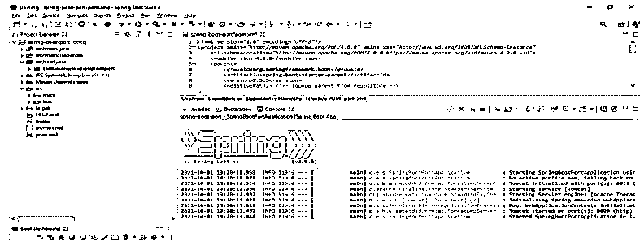
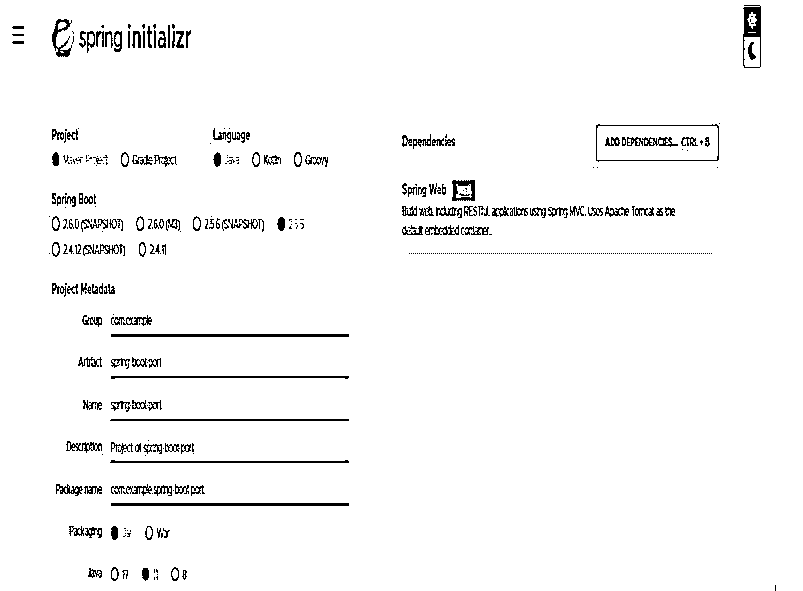
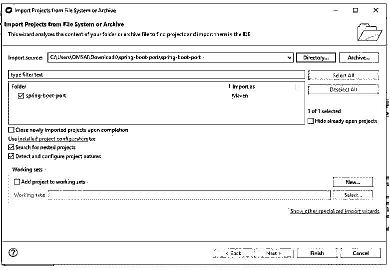
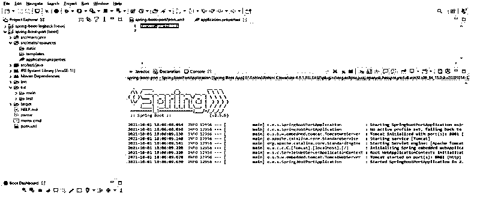

# Spring Boot 港

> 原文：<https://www.educba.com/spring-boot-port/>

## Spring Boot 港简介

Spring boot 端口无非是对不同的应用程序使用不同的端口，spring boot 对所有应用程序都使用默认端口 8080，如果我们想改变默认端口，有多种方法可以实现。Spring boot 提供了许多改变应用程序配置的方法，最重要的配置是改变 tomcat 的默认端口。如果假设我们在默认端口上运行一个应用程序，我们不能在这个端口上启动另一个应用程序，所以我们需要使用不同的端口运行一个应用程序。我们可以用不同的方法改变 spring boot 中的端口。

### 什么是 Spring Boot 港？

众所周知，spring boot 提供了默认的 tomcat 服务器来运行我们的引导应用程序。引导 tomcat 服务器在默认端口 8080 上运行。

<small>网页开发、编程语言、软件测试&其他</small>

下面的例子显示，默认情况下，spring boot 将使用端口号 8080 来运行应用程序。

我们还可以为我们的应用程序更改引导中的端口。我们可以通过在引导中使用不同的端口来运行多个应用程序。

有两种类型的端口可以通过使用引导应用程序进行更改，如下所示:

*   海关口岸
*   随机端口

使用应用程序属性文件，我们需要为 server.port 属性设置自定义端口号。

以下示例显示了如何在 application.properties 文件中为我们的应用程序设置自定义端口，如下所示:

**举例:**

Server.port = 8081

以下示例显示了如何使用 application.yml 文件设置自定义端口，如下所示:

**举例:**

服务器:
端口:8081

要设置任何随机端口到启动 tomcat 服务器，我们使用随机端口方法来设置端口。使用这种方法，我们可以为我们的服务器设置任何随机端口。

以下示例显示了如何在 application.properties 文件中为我们的应用程序设置随机端口，如下所示:

**举例:**

Server.port = 0

以下示例显示了如何使用 application.yml 文件设置随机端口，如下所示:

**举例:**

服务器:
端口:0

在上面的例子中，我们可以看到，我们使用的是服务器端口，0 表示在启动 tomcat 服务器时，它会将随机端口分配给 tomcat 服务器。我们还可以使用命令行来更改引导 tomcat 服务器的端口，要使用命令行来更改引导 tomcat 服务器的端口，我们需要将引导应用程序打包到一个 jar 文件中，并需要从命令行界面启动它。使用命令行界面，我们可以在项目部署时配置服务器的端口号。

### Spring Boot 换港

Boot 提供 tomcat 服务器的默认端口。我们可以通过使用属性文件和接口来改变这个端口。

下面是用于在启动时更改 tomcat 服务器的默认端口的属性文件和接口。

*   通过使用 application.yaml 文件
*   使用 application.properties 文件
*   通过使用命令行参数
*   通过使用 web 服务器工厂定制器(web server factory customizer)接口
*   通过使用 embeddedservercontainerscustomizer(嵌入式 servlet 容器定制器)接口

1.通过使用 application.yaml 文件。

*   我们可以使用 application.yml 文件来更改启动 tomcat 服务器的默认端口。
*   以下示例显示了如何使用 application.yml 文件更改端口。

**代码:**

`server:
port: 8081`

**输出:**

2.通过使用嵌入式 ServletContainerCustomizer 接口。

*   我们可以通过使用 EmbeddedServletContainerCustomizer 接口来更改 boot tomcat 服务器的默认端口。
*   以下示例显示了如何使用 EmbeddedServletContainerCustomizer 接口来更改端口。

**代码:**

`@Component
public class EmbeddedPort implements EmbeddedServletContainerCustomizer
{
public void customize(ConfigurableEmbeddedServletContainer container)
{
container.setPort (8099);
}
}`

**输出:**

3.通过使用 WebServerFactoryCustomizer 界面。

*   我们可以通过使用 WebServerFactoryCustomizer 接口来更改 boot tomcat 服务器的默认端口。
*   以下示例显示了如何使用 WebServerFactoryCustomizer 界面更改端口。

**代码:**

`@Component
public class WebFactory implements WebServerFactoryCustomizer
{
public void customize(ConfigurableWebServerFactory factory)
{
factory.setPort (9001);
}
}`

**输出:**

### 使用应用程序属性文件

当我们在 boot application.properties 文件中更改 tomcat 服务器的端口时，推荐使用这种方式。因为与其他选择相比，它非常简单。

下面是在引导中更改应用程序默认端口的步骤，如下所示:

1.使用初始值设定项创建一个项目模板，并为项目元数据指定以下名称。

*   在下面的步骤中，我们提供项目组名为 com.example，工件名为 spring-boot-port，项目名为 spring-boot-port，包为 jar 文件，并选择 java 版本为 11。

group–com . example
工件名称–spring-boot-port
名称–spring-boot-port
描述–spring-boot-port
包的项目名称–com . example . spring-boot-port
打包–Jar
Java–11
依赖项–spring web。

2.生成项目后，提取文件并使用工具套件打开该项目。

3.使用工具套件打开项目后，检查项目及其文件。

4.使用 application.properties 文件更改自定义端口。

*   在这一步中，我们将引导 tomcat 服务器的端口从默认端口更改为 8081。
*   我们使用以下代码编辑 application.properties 文件。

**代码:**

`server.port=8081`

**输出:**

5.运行应用程序。

*   在下图中，我们可以看到端口从 8080 更改为 8081。我们已经将自定义端口定义为 8081。

6.在 application.properties 文件中更改随机端口。

*   在这一步中，我们将引导 tomcat 服务器的端口从默认改为随机。
*   我们使用以下代码编辑 application.properties 文件。

**代码:**

`server.port=0`

**输出:**

7.运行应用程序。

*   在下图中，我们可以看到端口从 8080 更改为 53375。我们已经定义了一个随机端口，因此它将分配 53375 端口号来引导 tomcat 服务器。

### 结论

Boot 提供了许多改变应用程序配置的方法，最重要的配置是改变 tomcat 的默认端口。Application.properties 文件是在启动时更改端口的推荐方式，因为与其他选项相比，它非常简单。

### 推荐文章

这是 Spring Boot 港指南。这里我们讨论一下入门，spring boot 改变端口，以及使用应用程序属性文件。您也可以看看以下文章，了解更多信息–

1.  [Maven 资源库 Spring](https://www.educba.com/maven-repository-spring/)
2.  [Spring Boot 开发工具](https://www.educba.com/spring-boot-devtools/)
3.  [春季 AOP](https://www.educba.com/spring-aop/)
4.  [春云组件](https://www.educba.com/spring-cloud-components/)

