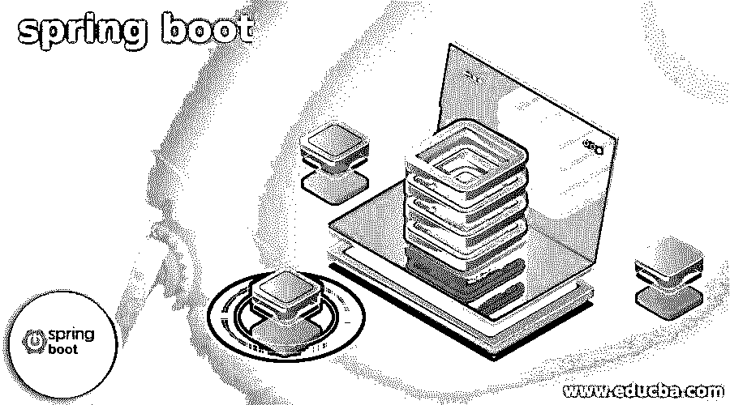
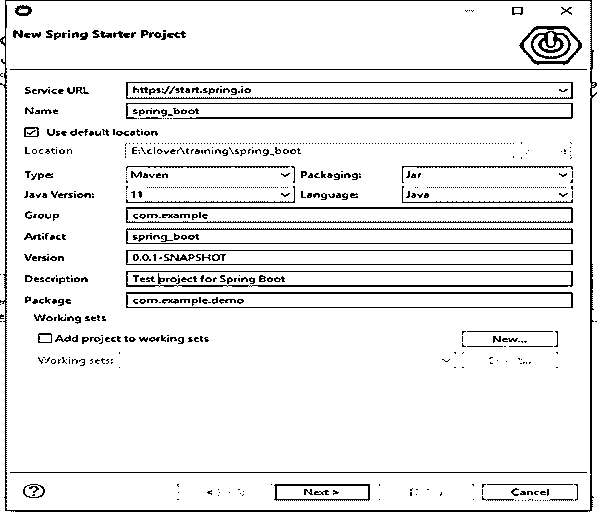
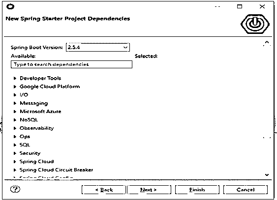
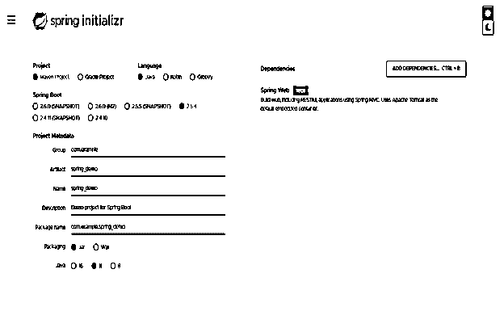
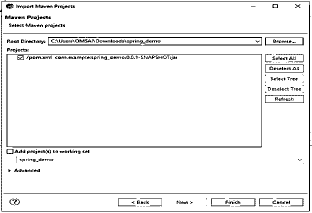
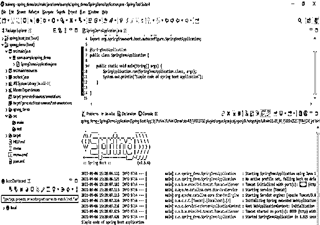
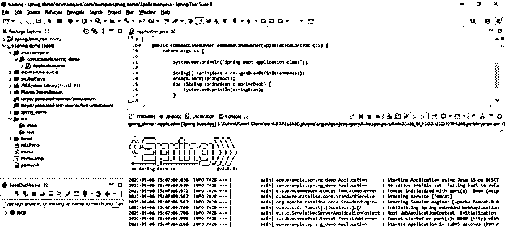

# 板簧罩

> 原文：<https://www.educba.com/spring-boot/>

## 弹簧靴简介

Spring boot 用于创建基于生产、基于 web 的独立应用程序，我们可以使用工具套件运行这些应用程序。基本上，boot 是在框架上运行的项目，boot 提供了一种更快更简单的方法来设置和配置基于 web 的应用程序。它也被称为 spring 的模块，提供了快速的应用程序开发，即框架的 RAD 特性。我们可以使用配置较少的引导来运行独立的基于 web 的应用程序。

### 什么是春靴？

*   基本上，我们可以说它是一个嵌入式服务器和 spring 框架的结合。
*   我们对 XML 及其配置没有任何要求。我们必须从嵌入式 HTTP 服务器中删除 XML 配置。

`Embedded HTTP
Spring  Framework      **+**          Server                          **-**           XML     **=**          Spring boot
(Jetty , tomcat)`

<small>网页开发、编程语言、软件测试&其他</small>

*   在上图中，我们可以看到 boot 是一个嵌入式服务器和框架的结合。
*   它将减少开发人员的开销，使用软件范例的配置。
*   为了在 boot 中开发应用程序，我们使用 spring tool suite (STS)或 java 中的 spring analyzer。
*   它为 java 开发人员开发基于 web 的或独立的应用程序提供了一个很好的平台。
*   它会根据应用程序中所需的依赖关系自动配置应用程序。使用批注名称作为 EnableAutoConfiguration 来添加自动依赖项。
*   如果我们使用 MySQL 数据库进行连接，并且在我们的类路径中使用 MySQL 数据库，但是我们还没有配置任何数据库连接，那么引导将自动在内存中配置数据库连接。
*   基本上，boot 的所有启动器都将遵循相同的名称模式，如 boot starter 或(spring-boot-starter -*)。其中*是我们正在使用的应用程序类型。

### 为什么要用弹簧靴？

*   我们已经使用 boot 开发了独立的基于 web 的应用程序。
*   它使用依赖注入的方法来自动解决依赖。
*   使用 boot，我们可以自动解决项目的依赖性。
*   它将包含数据库非常强大的事务管理能力。
*   使用启动事务管理非常容易。
*   我们可以很容易地将我们的应用程序集成到其他框架中，比如 java。它将很容易与另一个框架集成。
*   根据成本和时间管理，与 java 中的另一个框架相比，boot 非常有用。
*   使用 boot，我们可以提供简单而强大的 java 应用程序批处理。
*   使用 boot，我们可以轻松地从 SQL 以及 NoSQL 数据库中访问数据。
*   它还为我们的应用程序提供了非常强的安全性。使用 boot，我们可以轻松地为我们的应用程序提供强大的安全性。
*   我们可以轻松地将我们的应用程序集成到任何社交网站，如 LinkedIn。
*   无非是企业整合模式的实施。使用企业集成，我们可以轻松地将我们的应用程序集成到另一个 java 框架中。
*   它还包含执行验证和异常处理所需的应用程序的内置支持功能。
*   它将集成不同的企业版技术，如 AMPQ、RMI 等等。

### 应用程序弹簧启动

*   以下示例显示了如何创建引导应用程序，如下所示。

**使用 spring 工具套件创建一个应用程序—**

*   第一个开放的 spring 工具套件。进入文件->新建-> spring starter 项目。
*   给出以下配置细节–

`Service URL – https://start.spring.io
Name – spring_boot_test
Type – Maven
Java version – 11
Packaging – Jar
Language – Java
Group – com.example
Artifact – spring_boot_test
Version – 0.0.1-SNAPSHOT
Description – Test project for Spring Boot
Package - com.example.demo`

*   提供所有详细信息后，单击下一个选项卡。单击下一个选项卡后，将打开包含依赖项选择的新窗口。
*   选择依赖关系后，单击“完成”按钮。它将创建名为 spring_boot_test 的新引导应用程序。

`New spring starter project dependency -> Make default`

*   完成所有步骤后，检查创建的应用程序。

**使用 spring 初始化器创建应用程序—**

*   首先，我们需要打开 spring 初始化器。
*   打开 spring 初始化器后，输入下面的细节。

`Name – spring_demo
Type – Maven
Java version – 11
Packaging – Jar
Language – Java
Group – com.example
Artifact – spring_demo
Version – 0.0.1-SNAPSHOT
Description – Test project for Spring Boot
Package - com.example.spring_demo`

*   提供所有信息后，单击生成。生成应用程序后，提取文件。
*   提取导入后，项目如下。

`File -> import -> maven project -> select project -> finish`

### 弹簧靴的例子

下面是如下靴子的例子。

*   **弹簧靴的简单代码—**

以下代码显示了引导应用程序的简单程序，如下所示。

`public class SpringDemoApplication {
public static void main(String[] args) {
SpringApplication.run (SpringDemoApplication.class, args);
System.out.println ("Simple code of spring boot application");
} }`

*   **使用 spring boot 创建应用程序类—**

**代码—**

`public CommandLineRunner /* command line runner method */
commandLineRunner (ApplicationContext ctx) {
return args -> {
System.out.println ("Spring boot application class");
String[] springBoot = ctx.getBeanDefinitionNames ();
Arrays.sort (springBoot);
for (String springBean : springBoot) {
System.out.println (springBean);
} }`

### 特征

*   我们可以使用 boot 创建独立的和基于 web 的应用程序。
*   我们不需要使用引导来部署 war 文件。
*   它会自动配置第三方库。
*   不需要使用引导进行 XML 配置。
*   它将自动配置项目依赖项和另一个依赖项，如我们添加到项目中的 JAR。
*   应用入口点包含类，类包含 main 方法和 SpringbootApplication 注释。
*   我们不需要使用 boot 来扫描应用程序的组件，它会通过使用注释名 ComponentScan 来自动扫描所有组件。
*   在大型项目中，处理依赖关系是一项至关重要的任务，但是通过使用 boot，我们可以非常容易地处理大型项目的依赖关系。

### 推荐文章

这是一个弹簧靴的指南。在这里，我们讨论什么是 spring boot，为什么我们要使用它以及它的特性。您也可以看看以下文章，了解更多信息–

1.  [Spring Boot 批次](https://www.educba.com/spring-boot-batch/)
2.  [Spring Boot JPA](https://www.educba.com/spring-boot-jpa/)
3.  [Spring Boot 横幅](https://www.educba.com/spring-boot-banner/)
4.  [Spring Boot RestTemplate](https://www.educba.com/spring-boot-resttemplate/)

