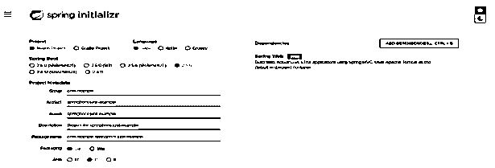
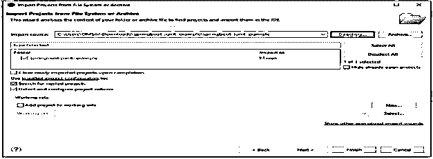
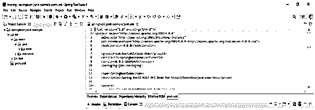
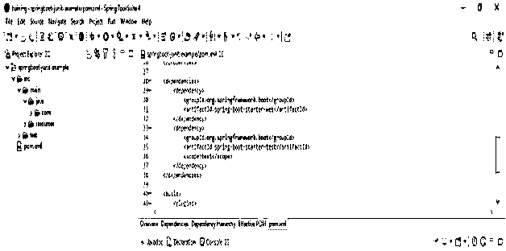
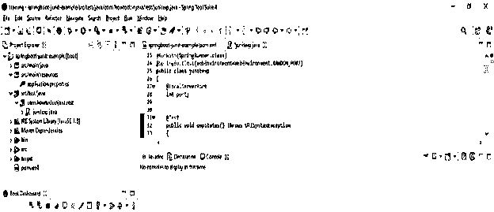
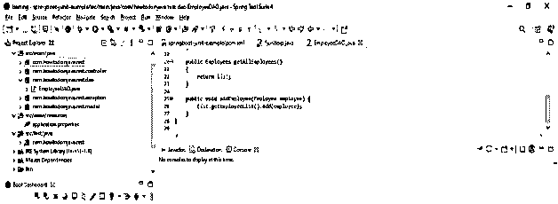
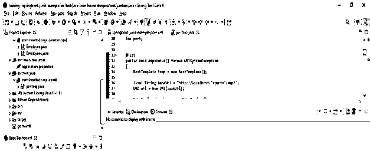
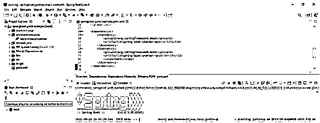
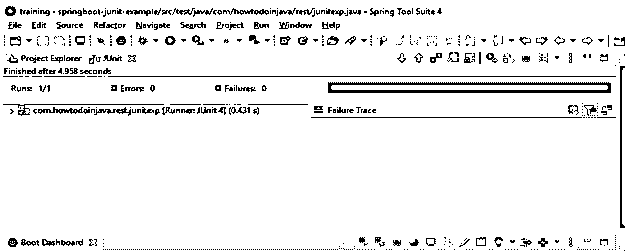

# Spring Boot·朱尼特

> 原文：<https://www.educba.com/spring-boot-junit/>


## Spring Boot·朱尼特的定义

Spring boot JUnit 用于测试我们的应用程序，我们正在使用 JUnit 进行 Spring boot 应用程序测试。使用 spring boot JUnit 测试我们正在进行整个应用程序测试，有多个 JUnit 版本可用于测试我们的应用程序。正如我们所知，如果不测试我们的应用程序，我们就无法部署它，spring boot JUnit 是测试我们的 spring boot 应用程序的一个非常重要的工具。在创建我们的测试用例时，使用新的全面的测试工具是非常重要的，JUnit 正在测试我们应用程序代码的所有方面。

### 如何使用 Spring Boot JUnit？

*   为了在我们的应用程序中使用 JUnit，我们需要在应用程序代码中使用 Rest API。
*   使用 2.4 版时，JUnit 5 引擎作为 spring boot starter 测试从依赖项名称中删除。如果我们需要使用 JUnit 4 编写测试，那么就不需要在代码中添加 JUnit vintage 依赖项。
*   假设我们使用的是版本 5，那么我们就不需要添加 JUnit vintage 依赖项。在使用 junit 5 时，我们在应用程序 pom.xml 文件中添加了 starter test 依赖项。

下面是我们在应用程序中用来测试应用程序代码的版本类型。

<small>网页开发、编程语言、软件测试&其他</small>

### JUnit 版本

1)Junit 5
2)Junit 5 . 7 . 1
3)Junit 5 . 7 . 0
4)Junit 5 . 6 . 2
5)Junit 5 . 6 . 1
6)Junit 5 . 6 . 0
7)Junit 4
8)Junit 3

我们可以使用如下两个模块来测试我们的应用程序。

1)使用核心项目进行 Spring boot JUnit 测试。

2)通过使用自动配置测试自动配置 JUnit 支持。

*   在我们的 JUnit 应用程序中添加了 spring boot starter 测试依赖项之后，它会将 JUnit 有用的库导入到我们的项目中。
*   JUnit 将测试应用程序中两个或更多类的交互。
*   JUnit 测试由开发人员完成，以确保应用程序的组件功能运行良好。
*   JUnit 测试覆盖了我们应用程序的每一个单元，它也将测试应用程序的每一个类。
*   JUnit 测试将覆盖多个层。这种测试是单元测试的专门化。

### 入门指南

*   我们可以构建应用程序，并使用 JUnit 对其进行测试。它涵盖了我们应用程序的多个单元。
*   为了使用 JUnit 测试我们的应用程序，我们需要在 pom.xml 文件中添加依赖包。

下面是我们在开发应用程序和使用 JUnit 测试应用程序时需要使用的应用程序列表。

### 应用程序列表

1)Junit 5
2)JDK 1.8
3)Maven 3.2
4)Spring 工具套件
5) Spring web 依赖包

要开发应用程序并使用 JUnit 测试它，我们需要遵循以下步骤。

a)在浏览器中打开 spring 初始化器。b)添加项目名称、语言和版本。
c)添加 web 依赖。
d)生成一个项目模板 jar 或 war 文件。
e)提取生成的项目模板。提取项目模板后，在 spring 工具套件中打开它。

开发完应用程序后，我们可以使用 JUnit 测试这个应用程序。

### 怎么用？

下面的步骤展示了如何在我们的 web 应用程序中使用 JUnit。

1)使用 spring 初始化器创建一个用于测试的 spring boot 应用程序。

2)创建应用程序后，我们需要使用 JUnit 创建 REST API 进行测试。

3)创建 REST API 后，下一步是运行我们的 HTTP REST API。

4)运行 HTTP REST API 之后，下一步是通过使用 OAuth 来保护我们的应用程序。

5)使用 OAuth 保护我们的应用程序之后，下一步是用 JUnit 测试我们的应用程序。

6)使用 JUnit 测试应用程序后，下一步是将集成测试添加到 spring-boot JUnit 应用程序中。

*   在使用初始化器创建应用程序时，我们在应用程序中添加了 JUnit 依赖。
*   通过添加 web 依赖，JUnit 依赖将包含在这个包中。

### Spring Boot JUnit 示例

以下是该项目的例子如下。

1)使用初始化器创建一个项目模板，并给项目命名。

在下面的步骤中，我们提供了项目组名称 com。例，工件名为 springboot-JUnit-example，项目名为 springboot-JUnit-example，打包为 jar 文件，选择 java 版本为 11。

```
Group – com.example
Artifact name – springboot-junit-example
Name – springboot-junit-example
Description - Project for springboot-junit-example
Spring boot – 2.5.5
Project – Maven project
Package name - com.example.springboot-junit-example
Packaging – Jar
Java – 11
Dependencies – spring web
```




**2)生成项目后，提取文件并使用工具套件打开该项目。**




使用工具套件打开项目后，检查项目及其文件。




4)添加依赖包。

**代码:**

```
<dependency> -- Start of dependency tag.
<groupId>org.springframework.boot</groupId> -- Start and end of groupId tag.
<artifactId>spring-boot-starter-test</artifactId> -- Start and end of artifactId tag.
</dependency> -- End of dependency tag.
```




5)创建一个 spring boot JUnit 应用程序类。

**代码:**

```
public class junitexp
{
@LocalServerPort
int port;
@Test
public void empstatus () throws URISyntaxException
{
}
}
```




**6)创建 REST API 代码文件。**

**代码:**

```
public Employees getAllEmployees ()
{
return list;
}
public void addEmployee (Employee employee) {
list.getEmployeeList ().add (employee);
}
}
```




7)用 rest 模板编写 JUnit 测试用例。

**代码:**

```
public void empstatus() throws URISyntaxException
{
RestTemplate temp = new RestTemplate ();
final String burl = "http://localhost:"+port+"/employees/";
URI url = new URI (burl);
Assert.assertEquals (200, ex.getRawStatusCode ());
Assert.assertEquals (true, ex.getResponseBodyAsString ().contains ("emp list"));
}
```




执行测试。







### 结论

JUnit 提供了许多注释和实用程序来测试我们的 spring boot 应用程序。JUnit 涵盖了我们应用程序的多个单元。它将测试应用程序中两个或更多类的交互。

### 推荐文章

这是 Spring Boot·朱尼特的指南。在这里我们讨论定义，不同的版本，什么是 spring boot JUnit，如何使用它的例子。您也可以看看以下文章，了解更多信息–

1.  [Spring Boot 测井](https://www.educba.com/spring-boot-logging/)
2.  [软件测试服务](https://www.educba.com/software-testing-services/)
3.  [Spring Boot 批次](https://www.educba.com/spring-boot-batch/)
4.  [软件项目评估](https://www.educba.com/software-projects-estimation/)


