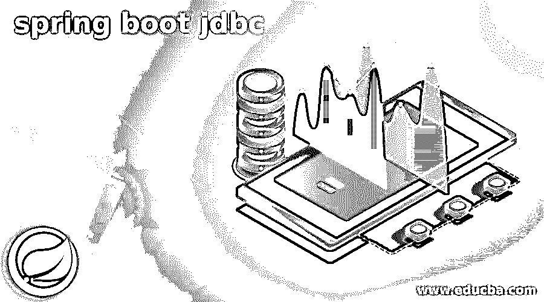
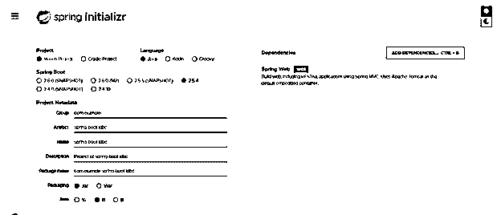
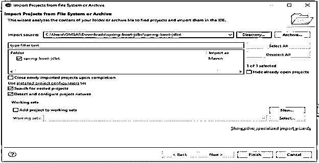
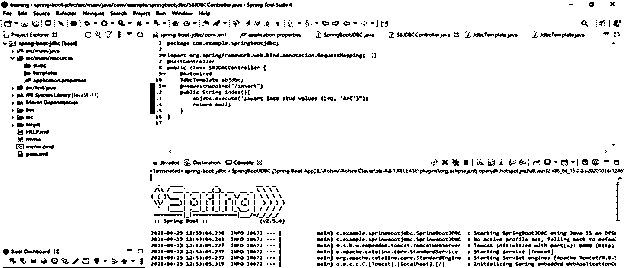

# 春季启动 jdbc

> 原文：<https://www.educba.com/spring-boot-jdbc/>

## spring boot jdbc 简介

Spring boot jdbc 提供了连接应用程序和 jdbc 的库和启动器，同时使用 JDBC 数据库相关的 beans，如 JDBC 模板、命名参数 JDBC 模板和数据源，这些都是在启动项目时自动配置和创建的。要使用自动配置的类，我们可以在 application.properties 文件中自动连接它们，我们正在配置连接池和数据源。如果我们没有为我们的项目选择任何选项，那么 JDBC 将选择 tomcat 池作为默认选项。JDBC 用于连接使用 JDBC 的应用程序。

### 什么是春靴 JDBC？

*   在使用 JDBC 的时候，我们只需要 spring boot starter jdbc 依赖。
*   基本上，JDBC 分为四个不同的包如下。
*   目标
*   数据源
*   核心
*   支持
*   JDBC 数据库访问采用面向对象的方式。它将允许我们通过使用一个对象来运行查询并返回结果。对象还用于映射查询结果和对象属性之间的列。
*   JDBC 数据源在实用程序类中用于访问数据源。JDBC 有许多数据源实现来测试 JDBC 代码。
*   JDBC 核心包包含 JDBC 核心功能。这个包中的许多类都很重要，它包含 jdbc 模板、简单的 jdbc 调用、简单的 JDBC 插入和命名参数 JDBC 模板。
*   JDBC 支持包包含支持对象和核心类下的类的支持类。这个包的一个例子是提供 SQLException 翻译的功能。
*   使用 JDBC，我们可以为简单的聚合实现数据库 CRUD 操作。JDBC 支持将注释名作为查询。它还将支持事件和 MyBatis 查询。
*   我们可以通过在 JDBC 使用启用 JDBC 存储库注释来配置基于 java 的存储库。
*   JDBC 是 spring boot 框架的一部分，该框架用于实现 JDBC 存储库。
*   JDBC 用于支持 JDBC 数据访问层。因此，构建使用连接池并从数据库服务器访问数据的应用程序变得更加容易。
*   JDBC 是使用这个 API 的主要 API；我们可以访问像创建和关闭数据库连接这样的功能。
*   我们可以执行所有的 SQL 查询，执行存储过程的语句和调用。
*   为了支持命名参数查询，我们使用了 JDBC 提供的 JDBC 模板。

### 为什么用 Spring Boot·JDBC？

*   在使用 JDBC 开发应用程序时，我们只需要 spring boot starter JDBC(spring-boot-starter-JDBC)依赖。
*   如果我们没有明确维护数据源的 bean，JDBC 会自动配置它。如果我们不需要 bean 或者想在我们的项目中使用 bean，我们需要将 spring.datasource.initialize 的属性设置为 false。默认情况下，spring.datasource.initialize 参数属性为 true。
*   使用 JDBC，我们不需要注册 bean，因为它会在启动项目时自动注册 bean。
*   使用 JDBC，任何包含扩展名 as 的数据库脚本。sql 将自动执行。
*   要使用 JDBC 开发应用程序，我们只需要 spring-boot starter 依赖项。
*   使用 JDBC，我们不需要在项目中添加多个依赖项。
*   如果我们没有注册任何 beans，如 jdbc 模板、平台事务管理器和命名参数 JDBC 模板，它将使用 JDBC 自动注册。
*   JDBC 正在提供 JdbcTemplate 类，它简化了 JDBC 的开发。
*   与 hibernate 相比，JDBC 更高效，也更容易用于开发应用程序。

### Spring Boot 和 JDBC 模板

下面举例说明如何设置 JDBC 项目模板如下。

<small>网页开发、编程语言、软件测试&其他</small>

*   **使用 spring 初始化器创建一个项目模板，并给项目元数据命名如下。**

`Group – com.example
Artifact name – spring-boot-jdbc
Name – spring-boot- jdbc
Description - Project of spring-boot- jdbc
Package name - com.example.spring-boot- jdbc
Packaging – Jar
Java – 11
Dependencies – spring web.`

*   **生成项目后，提取文件，使用 spring 工具套件打开该项目—**

*   **使用 spring 工具套件打开项目后，检查项目及其文件—**

*   我们需要以下软件来开发应用程序使用 JDBC 如下。

1.  Maven 3.2 +版本
2.  JDK 1.8 或更高版本
3.  Spring boot 2.4 或更高版本
4.  Spring 工具套件

*   为了使用 JDBC 开发应用程序，我们需要使用 spring 工具套件并使用 maven 开发一个项目。

**Spring Boot JDBC 的例子**

下面的例子显示 JDBC 如下。

*   **创建数据库和表格**

`# create database spring_boot_jdbc;
# \c spring_boot_jdbc
# create table stud (id int, name varchar(10));`

*   **编辑应用程序属性文件并添加数据库凭证**

**代码—**

`spring.datasource.url = jdbc:postgresql://localhost:5432/spring_boot_jdbc
spring.datasource.username = postgres
spring.datasource.password = postgres
spring.jpa.hibernate.ddl-auto = create-drop`

*   **创建 spring boot JDBC 应用文件**

**代码—**

`@SpringBootApplication
public class SpringBootJDBC {
public static void main /* main method of spring boot JDBC application */ (String[] args) {
SpringApplication.run (SpringBootJDBC.class, args);
}
}`

*   **为 JDBC 应用程序创建一个控制器**

**代码—**

`@RestController
public class SBJDBCController {
@Autowired
JdbcTemplate sbjdbc;
@RequestMapping("/insert")
public String index(){
sbjdbc.execute ("insert into stud values (101, 'ABC')");
}
}`

*   **运行应用程序**

*   **使用应用程序**检查数据库表格中插入的数据

**代码—**

`# select * from stud;`

### 结论

JDBC 数据库访问是以面向对象的方式完成的。它将允许我们通过使用对象来运行查询并返回结果。JDBC 正在提供库和启动器，将应用程序与 JDBC 连接起来。JDBC 被提供 JdbcTemplate 类来开发应用程序。

### 推荐文章

这是一个关于春季启动 jdbc 的指南。在这里，我们讨论什么是 spring boot JDBC，使用它的目的是什么，以及模板和示例。您也可以看看以下文章，了解更多信息–

1.  [Spring Boot RestTemplate](https://www.educba.com/spring-boot-resttemplate/)
2.  [Spring Boot 2](https://www.educba.com/spring-boot-oauth2/)
3.  [Spring Boot 简介](https://www.educba.com/spring-boot-profiles/)
4.  [Spring Boot 属地](https://www.educba.com/spring-boot-dependencies/)

