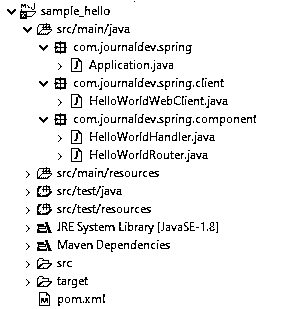

# Spring Boot 网络流量

> 原文：<https://www.educba.com/spring-boot-webflux/>

## Spring Boot 网络流量简介

Spring Boot WebFlux 是 Spring MVC 版本的一个并行版本，它支持完全非阻塞的反应式流。Spring Boot WebFlux 使用项目 reactor 作为反应库，其中 Reactor 是反应流库，因此所有操作者都支持与 Spring 密切合作开发的非阻塞背压。反应式系统需要在实现独特的编程架构方面受过专门训练的开发人员和工具。要开始使用 Spring Boot WebFlux，我们还需要了解一些概念。让我们先看看这些概念，然后再进入 WebFlux。

### Spring Boot WebFlux 入门

**反应系统:**

<small>网页开发、编程语言、软件测试&其他</small>

这里，术语“反应式”指的是围绕对变化做出反应而构建的编程模型。

*   它支持异步，是事件驱动的，并提供了一种非阻塞的数据处理方法。还将数据和事件组织为流。
*   在反应式系统中，当用户发出请求时，其他任务将被执行，等待结果。
*   当数据可用时，通知将通过回调函数随结果一起发送。
*   因此，反应式系统适用于数据驱动的应用。
*   反应式系统中的反应式架构模式优先使用松散耦合、可伸缩和灵活的组件。
*   在非阻塞代码中，需要控制背压，即事件的速率，以便快速生产者不会淹没目的地。
*   反应式编程适用于拥有流数据的应用程序、消费数据并将其传输给用户的客户端。
*   反应式系统通常关注反应性、弹性、弹性和消息驱动的通信。

### Spring Boot WebFlux 功能:

下面列出了 WebFlux 的一些特性，

*   **WebClient** :它是 WebFlux 的反应式 web 客户端，由一个众所周知的 Rest 模板构建而成。它是一个代表 web 请求主要入口点的接口，支持异步和同步操作。可以通过导入标准的 WebFlux 依赖项来构建和创建 WebClient。它主要用于反应式后端通信。

**Maven 依赖:**

`<dependency>
<groupId>org.springframework.boot</groupId>
<artifactId>spring-boot-starter-webflux</artifactId>
</dependency>`

**WebClient 实例:**

`WebClient client = WebClient.create();`

*   **路由器功能**:它是 Spring MVC 中使用的请求映射和控制器注释的功能替代。用户使用 route()来创建路由，而不是编写完整的路由器函数。这些路由器功能注册为 Spring beans，可以在任何配置类中创建。路由器功能还避免了由请求映射的多步骤过程引起的副作用，并简化了直接处理器/路由器链；这允许函数式编程。

**注解:**

`RequestMapping
Controller
RouterFunctions`

*   **服务器**:Jetty、Tomcat、Servlet 和 Netty、Undertow 等非 Servlet 容器支持 Spring Boot WebFlux。用户只需在 Gradle 或 Maven 构建软件中进行简单的更改，就可以轻松地在异步和非阻塞设计之间进行切换。
*   **Reactive Steam API** :它是一个导入函数的集合，允许智能流数据流，并内置了对异步处理和背压的支持，确保应用程序最有效地利用计算机和组件资源。Steam API 中的 4 个主要接口是:发布者、订阅者、订阅者和处理器
*   **并发模型** : Spring Boot WebFlux 使用了与 Spring 不同的并发编程模型，并假设线程将在阻塞的情况下通过使用大型线程池来阻塞。大型线程池使得 MVC 资源密集，因为硬件保持线程同时旋转。因此，WebFlux 使用一个小的线程池，因为它假设用户永远不需要传递工作避免阻塞，并被称为事件循环工作者。
*   **Spring WebFlux Security** :它使用 Spring Security 来实现认证和授权协议。它使用 Web 过滤器根据经过身份验证的用户列表来检查请求，或者可以被发送来自动拒绝符合来源或请求类型标准的请求。将所有设置设置为默认值是一个最小的实现。

### Spring Boot WebFlux 示例:

下面提到了不同的例子:

**步骤 1** :包含 Spring Boot WebFlux 应用所需的 Maven 依赖项。

`<project
xmlns:xsi="http://www.w3.org/2001/XMLSchema-instance"
xsi:schemaLocation="http://maven.apache.org/POM/4.0.0 http://maven.apache.org/xsd/maven-4.0.0.xsd">
<modelVersion>4.0.0</modelVersion>
<parent>
<groupId>org.springframework.boot</groupId>
<artifactId>spring-boot-starter-parent</artifactId>
<version>2.1.1.RELEASE</version>
<relativePath />
</parent>
<groupId>com.sample</groupId>
<artifactId>spring-webflux-demo</artifactId>
<version>0.0.1-SNAPSHOT</version>
<packaging>jar</packaging>
<name>spring-webflux-demo</name>
<url>http://maven.apache.org</url>
<properties>
<project.build.sourceEncoding>UTF-8</project.build.sourceEncoding>
<java.version>1.8</java.version>
</properties>
<dependencies>
<dependency>
<groupId>org.springframework.boot</groupId>
<artifactId>spring-boot-starter-webflux</artifactId>
</dependency>
<dependency>
<groupId>org.springframework.boot</groupId>
<artifactId>spring-boot-starter-data-mongodb-reactive</artifactId>
</dependency>
<dependency>
<groupId>org.springframework.boot</groupId>
<artifactId>spring-boot-starter-test</artifactId>
<scope>test</scope>
</dependency>
<dependency>
<groupId>io.projectreactor</groupId>
<artifactId>reactor-test</artifactId>
<scope>test</scope>
</dependency>
<dependency>
<groupId>javax.xml.bind</groupId>
<artifactId>jaxb-api</artifactId>
<version>2.3.0</version>
</dependency>
<dependency>
<groupId>javax.servlet</groupId>
<artifactId>javax.servlet-api</artifactId>
<version>3.1.0</version>
<scope>provided</scope>
</dependency>
</dependencies>
</project>`

需要添加的主要依赖项有 **spring-boot-starter-webflux、spring-boot-starter-data-MongoDB-reactive 以及 spring-boot-starter-test 和 reactor-test** 依赖项。

**第二步:**下面是项目结构，

创建上述文件以获得一个样本 WebFlux 示例。

第三步:在 Application.java

`package com.journaldev.spring;
import org.springframework.boot.SpringApplication;
import org.springframework.boot.autoconfigure.SpringBootApplication;
@SpringBootApplication
public class Application {
public static void main(String[] args) {
SpringApplication.run(Application.class, args);
}
}`

第四步:在 HelloWorldWebClient.java

`package com.journaldev.spring.client;
import org.springframework.http.MediaType;
import org.springframework.web.reactive.function.client.ClientResponse;
import org.springframework.web.reactive.function.client.WebClient;
import reactor.core.publisher.Mono;
public class HelloWorldWebClient {
public static void main(String args[]) {
WebClient client = WebClient.create("https://localhost:8080");
Mono<ClientResponse> result = client.get().uri("/helloWorld").accept(MediaType.TEXT_PLAIN).exchange();
System.out.println("Result = " + result.flatMap(res -> res.bodyToMono(String.class)).block());
}
}`

第五步:在 HelloWorldHandler.java

`package com.journaldev.spring.component;
import org.springframework.http.MediaType;
import org.springframework.stereotype.Component;
import org.springframework.web.reactive.function.BodyInserters;
import org.springframework.web.reactive.function.server.ServerRequest;
import org.springframework.web.reactive.function.server.ServerResponse;
import reactor.core.publisher.Mono;
@Component
public class HelloWorldHandler {
public Mono<ServerResponse> helloWorld(ServerRequest request) {
return ServerResponse.ok().contentType(MediaType.TEXT_PLAIN).body(BodyInserters.fromObject("Hello World!"));
}
}`

第六步:在 HelloWorldRouter.java

`package com.journaldev.spring.component;
import org.springframework.context.annotation.Bean;
import org.springframework.context.annotation.Configuration;
import org.springframework.http.MediaType;
import org.springframework.web.reactive.function.server.RequestPredicates;
import org.springframework.web.reactive.function.server.RouterFunction;
import org.springframework.web.reactive.function.server.RouterFunctions;
import org.springframework.web.reactive.function.server.ServerResponse;
@Configuration
public class HelloWorldRouter {
@Bean
public RouterFunction<ServerResponse> routeHelloWorld(HelloWorldHandler helloWorldHandler) {
return RouterFunctions.route(RequestPredicates.GET("/helloWorld")
.and(RequestPredicates.accept(MediaType.TEXT_PLAIN)), helloWorldHandler::helloWorld);
}
}`

在运行应用程序时，

**控制台输出:**

### 结论

至此，我们将结束“Spring Boot 网络流量”这个话题我们已经看到了什么是 Spring boot webflux，以及它在 Java Spring 中的含义。我们也看到了 WebFlux 如何与特性一起工作。对“反应式系统”有了清晰的概述，根据上面显示的例子，显示了一个小的文本消息，根据需求，可以添加功能。我希望这有所帮助。谢谢！快乐学习！!

### 推荐文章

这是一个 Spring Boot 网站流量指南。在这里，我们讨论什么是 webflux，它在 Java Spring 中意味着什么，并了解 WebFlux 如何与特性一起工作。您也可以看看以下文章，了解更多信息–

1.  [Spring Boot 的名字缩写](https://www.educba.com/spring-boot-initializr/)
2.  [Spring Boot 缓存](https://www.educba.com/spring-boot-cache/)
3.  [Spring Boot 码头工人](https://www.educba.com/spring-boot-docker/)
4.  Spring Boot·HTTPS

