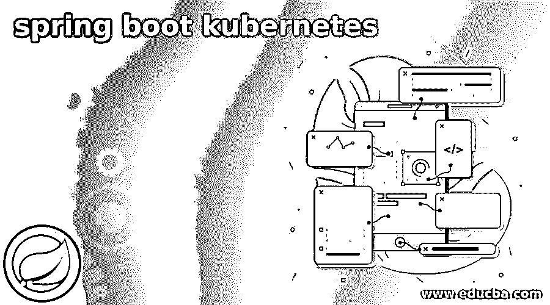
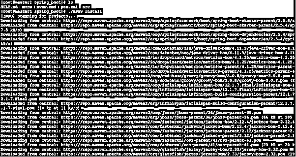

# 春船库比涅斯

> 原文：<https://www.educba.com/spring-boot-kubernetes/>

## 弹簧靴 Kubernetes 简介

在 Kubernetes 环境中，我们可以构建 spring boot 应用程序。我们可以创建任何 spring boot 应用程序。在 Kubernetes 中，没有依赖于操作系统、我们需要使用的库、依赖包、内核版本等的限制。我们需要使应用程序成为一个容器，并在 Kubernetes 环境中部署相同的映像或容器。然后库伯内特人会自己管理。它将负责应用程序单元的复制、单元的高可用性等。在某些情况下，pod 或应用程序可能会关闭。然后，根据我们在进行部署时必须定义的副本，Kubernetes 将启动在部署时定义的一组 pod。

### 创建春季启动 Kubernetes

在 Kubernetes 环境中，所有的事情都是按照 pod 运行的。pod 有自己的 IP 地址。当我们在 Kubernetes 环境上创建应用程序时。首先，我们需要确保图像在容器部分已经准备好了。这里，我们正在研究弹簧靴的例子。然后，我们可以考虑 docker 图像或构建代码(这将取决于项目或应用程序需求)。一旦它准备好了，我们需要根据 YAML 文件定义所有的文件。强烈建议我们需要根据部署来部署应用程序或任务。

<small>网页开发、编程语言、软件测试&其他</small>

### 理解弹簧靴 kubernetes 的例子

下面提到了不同的例子:

**Spring boot kubernetes:获取 Spring boot 代码**

根据需求，我们可以设计 spring boot 代码。但是如果我们需要使用 POC 环境，那么我们可以使用示例代码。

**命令:**

`./mvnw install`

**说明:**

当我们在进行 spring boot 代码构建时，我们需要获得基本的包或类。它将定义所有项目或应用程序级别的细节。一旦准备好了，我们需要安装、构建包，并需要创建 java jar 文件。注意:在做这件事的时候，请确保我们需要设置 java home。

**输出:**

**Spring boot kubernetes:列出 Docker 容器映像**

在 docker 环境中，我们拥有获取或列出 docker 图像数量的功能。此外，我们可以列出当前或工作中的 docker 环境中可用的 docker 映像。

**命令:**

`docker images`

**说明:**

一旦 jar 文件准备好了，我们需要构建 docker 映像。相同的 docker 图像将有助于创建 Kubernetes 豆荚。接下来，我们需要列出 docker 图像。这将有助于确定图像是否准备好。

**输出:**

**Spring boot kubernetes:列出 kubernetes 集群/节点的状态**

在 Kubernetes 环境中，我们可以获得或列出属于 Kubernetes 环境的节点数量。我们还可以列出集群信息。在我们开始使用 Kubernetes 环境之前，这种类型的信息非常重要。

**命令:**

`kubectl cluster-info
kubectl get nodes`

**说明:**

按照上面的命令，我们能够列出 Kubernetes 集群信息。按照第一个命令，我们能够列出 Kubernetes 集群信息。接下来，我们需要确保集群正常运行。在第二个命令中，我们能够获得节点数量的详细信息。我们来举个例子；我们在集群环境中有 3 个节点，其中有一个主节点(请参考下面的屏幕截图)。

**输出:**

**春装 kubernetes:列出 Kubernetes 豆荚的数量**

在 Kubernetes 环境中，我们能够列出运行当前应用程序或项目相关任务的 pod 的数量。我们可以很容易地在当前的 Kubernetes 环境中列出它们。

**命令:**

`kubectl get pods`

**说明:**

按照上面的命令，我们能够列出在 kubernetes 环境中运行的 pod 的数量。

**输出:**

获得 YAML 密码。

在 Kubernetes 生态系统中，我们能够列出 YAML 文件。它将包含任务或应用程序部署的详细步骤。

**命令:**

`sudo kubectl create deployment spring_boot --image=spring_boot_tomcat_mysql --dry-run -o=yaml
apiVersion: apps/v1
kind: Deployment
metadata:
creationTimestamp: null
labels:
app: spring_boot
name: spring_boot
spec:
replicas: 1
selector:
matchLabels:
app: spring_boot
strategy: {}
template:
metadata:
creationTimestamp: null
labels:
app: spring_boot
spec:
containers:
- image: spring_boot_tomcat_mysql
name: spring-boot-tomcat-mysql-g8fhw
resources: {}
status: {}`

**说明:**

按照上面的命令，我们能够得到 YAML 代码。

**输出:**

**Spring boot kubernetes:部署 Spring boot 应用程序或任务**

我们能够在 Kubernetes 环境中部署 spring boot 或任何任务。我们可以在 Kubernetes 命令中使用“-f”关键字。

**命令:**

`kubectl create –f spring_boot_tomcat_mysql.yaml`

**说明:**

按照上面的命令，我们正在 Kubernetes 环境上创建一个部署。在截图 1 (B)中，我们可以列出运行 Kubernetes 环境的 pod 的数量。

**输出:**

截图 1 (A)

截图 1 (B)

该项目的结构 spring boot Kubernetes

项目结构很简单。我们需要主要关注或流动 spring boot 部署的基本结构。我们需要主要关注图像或容器部分。一旦任务或应用程序容器准备就绪，我们需要处理 Kubernetes YAML 文件。一旦它准备好了，我们就需要在 Kubernetes 环境中部署它。根据应用程序或项目的需要，我们需要决定我们需要根据 pod 或部署方法来部署它。

### 结论

我们已经看到了“spring-boot Kubernetes”的完整概念，它有适当的示例、解释和带有不同输出的命令。当我们在 Kubernetes 环境上部署 spring boot 应用程序或任务时，它将更加健壮。它将是容错的。这将确保它的高可用性。

### 推荐文章

这是一个春季引导 kubernetes 指南。在这里，我们讨论了 spring-boot Kubernetes 的完整概念，并给出了适当的示例、解释和带有输出的命令。您也可以看看以下文章，了解更多信息–

1.  [立方注释](https://www.educba.com/kubernetes-annotations/)
2.  [立方入口](https://www.educba.com/kubernetes-ingress/)
3.  [立方结构](https://www.educba.com/kubernetes-architecture/)
4.  [Kubernetes 自动缩放](https://www.educba.com/kubernetes-autoscaling/)

