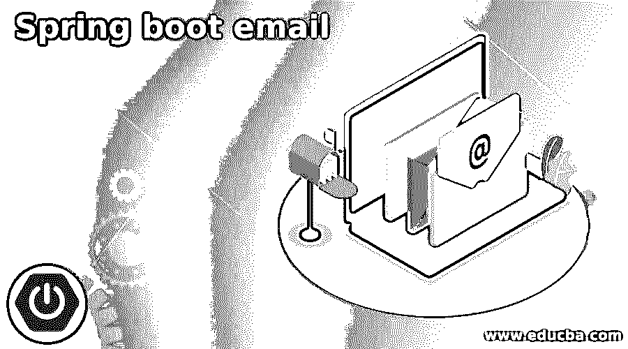

# 春季开机电子邮件

> 原文：<https://www.educba.com/spring-boot-email/>

## 春季开机电子邮件简介

在我们的应用程序中，我们可能会遇到这样的需求，我们必须根据某些条件发送电子邮件，因为这个 spring boot 为我们提供了一种简单的方法来发送电子邮件，而无需对现有代码进行任何更改，我们必须在我们的类路径中添加 spring boot 框架提供的依赖项。这为我们提供了许多接口和类，可以用来准备电子邮件，并在需要时发送给用户。我们可以使用 Gmail SMTP 服务器发送电子邮件，他们可以使用 Gmail 的传输层安全性发送电子邮件。我们必须进行更多的配置，而不仅仅是将依赖关系添加到构建文件中；在本教程的下一节，我们将看到如何在我们的应用程序和内部工作和实现中进行配置，以便更好地理解和清晰。

**语法**

<small>网页开发、编程语言、软件测试&其他</small>

正如我们已经讨论过的，这用于在需要的时候向用户发送电子邮件；为此，我们必须在应用程序属性文件中进行更改；为了更好地理解，让我们仔细看看语法；见下文；

spring.mail.host=主机名

spring.mail.port=端口号

spring . mail . username = SMTP 服务器用户

spring . mail . password = SMTP 服务器的密码

spring . mail . properties . mail . SMTP . auth = true 或 false

spring . mail . properties . mail . SMTP . starttls . enable = true 或 false

正如您在上面的语法行中看到的，我们必须在应用程序文件中进行这些配置，以便在向用户发送电子邮件时读取和使用它们。在本教程的下一节中，我们将更详细地了解每个配置，以便初学者更好地理解。

### Spring boot 电子邮件是如何工作的？

正如我们已经知道的，它使开发者能够发送电子邮件；这封电子邮件可以在任何要求发送。我们有一些基本的场景，当我们在应用程序中出现任何异常或错误时，每个应用程序都需要它。在这种情况下，我们可以向开发人员发送电子邮件，让他们知道错误，并提供指定的日志和错误消息。此外，还可以用作开发人员的通知程序。简而言之，它也可以用作通知服务，除了它的用法取决于需求，因为在应用程序中，我们可以有各种各样的需求，我们必须向用户发送电子邮件，如成功注册，密码重置等等。

让我们仔细看看可用于此的不同类型的类和接口；见下文；

1) MailSender 接口:这是一个顶级接口，帮助并为我们提供了基本的功能，通过它我们可以从我们的应用程序发送简单的电子邮件

2) JavaMailSender 接口:这个接口扩展了 MailSender 接口，因此是它的子接口。基本上是用 MimeMessageHelper 类的合取来准备 MIMEMessage 非常推荐多使用一个接口，命名为 MimeMessagePreparator。

**3) JavaMailSenderImpl 类:**是帮助我们实现 JavaMailSender 接口的类。基本上，它实现了这个接口；它支持 SimpleMailMessage 和 MimeMessage。

4) SimpleMailMessage 类:这也是一个用于为邮件创建简单消息的类，如文本字段、抄送、收件人、发件人广告主题。

**5) MimeMessagePreparator 接口:**这个接口为我们提供了一个回调接口，我们可以通过这个回调接口来准备 MIME 消息。

**6) MimeMessageHelper 类:**这个类是一个帮助我们创建 MIME 消息的 Helper 类；它还为我们提供了对 HTML 和邮件附件等图像文本内容的支持。

此外，我们添加了一个依赖项，以支持 ad 使用电子邮件库；供参考，请看下文；

例如:

`<dependency>
<groupId>org.springframework.boot</groupId>
<artifactId>spring-boot-starter-mail</artifactId>
</dependency>`

### 春季启动电子邮件示例

按照下面的步骤在 spring boot 应用程序中配置电子邮件，这是一个使用 JavaSender 发送电子邮件的简单应用程序，提供了它的实现。

a)使用 spring initializer 创建一个项目，并在其中提供所有细节，作为参考，请找到下面的 URL。

网址:https://start.spring.io/

b)现在，我们必须再添加一个依赖项，以便在 spring boot 中使用该库来创建电子邮件；供参考，见下文；

例如

`<dependency>
<groupId>org.springframework.boot</groupId>
<artifactId>spring-boot-starter-mail</artifactId>
</dependency>`

c)现在，在申请文件中，我们必须填写详细信息，以便在发送电子邮件时使用这些信息；作为参考，请参见以下代码；示意您的用户和密码的 SMTP 帐户，使这一工作。

例如:

`spring.mail.host=smtp.gmail.com
spring.mail.port=587
spring.mail.username=your SMTP user
spring.mail.password=your SMTP password
spring.mail.properties.mail.smtp.auth=true
spring.mail.properties.mail.smtp.starttls.enable=true`

d)将下面的代码粘贴到主类中；这将在创建时为 JavaSender 提供 bean 只是复制代码；不需要更多:

例如:

`@SpringBootApplication
public class TradersApplication {
public static void main(String[] args) {
SpringApplication.run(TradersApplication.class, args);
}
@Bean
public Javasender getJavasender() {
JavasenderImpl sender = new JavasenderImpl();
sender.setHost("smtp.gmail.com");
sender.setPort(587);
sender.setUsername("your gamil acc");
sender.setPassword("your pass");
Properties pop = sender.getJavaMailProperties();
pop.put("mail.transport.protocol", "smtp");
pop.put("mail.smtp.auth", "true");
pop.put("mail.smtp.starttls.enable", "true");
pop.put("mail.debug", "true");
return sender;
}
}`

e)创建一个简单的服务，使用 Javasender bean 发送电子邮件，我们需要在这里自动连接 bean，以便使用它，请参考下面的代码；

例如:

`@Component
public class EmailServiceDemoImpl implements EmailService {
@Autowired
private JavaMailSender sender;
public void sendEmail(String to, String subject, String text) {
SimpleMailMessage message = new SimpleMailMessage();
message.setFrom("user1@educba.com");
message.setTo(to);
message.setSubject(subject);
message.setText(text);
sender.send(message);
System.out.pritln("Message sent successfully");
}
}`

**输出:**

### 结论

正如我们已经看到的如何在 spring boot 应用程序中启用电子邮件，添加一个依赖项和几行配置是开发人员在应用程序本身中创建自定义电子邮件并使用 Gmail 传输层安全性发送它们的一种简单方法。我们只需在应用程序文件中指定 SMTP 用户的详细信息，以便发送。这很容易学习、阅读和维护。

### 推荐文章

这是一个 Spring Boot 电子邮件指南。在这里，我们讨论了 Spring Boot 电子邮件的工作方式，以及一个例子和它的实现，以便更好地理解和清楚。您也可以看看以下文章，了解更多信息–

1.  Spring Boot·HTTPS
2.  [Spring Boot 简介](https://www.educba.com/spring-boot-profiles/)
3.  [Spring Boot 属地](https://www.educba.com/spring-boot-dependencies/)
4.  [Spring Boot 版本](https://www.educba.com/spring-boot-versions/)

