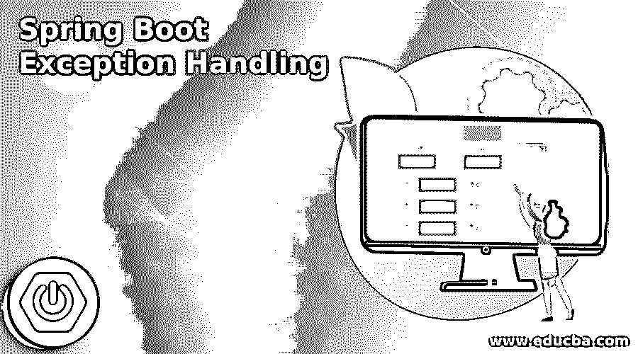

# Spring Boot 异常处理

> 原文：<https://www.educba.com/spring-boot-exception-handling/>

## Spring Boot 异常处理简介

以下文章概述了 Spring Boot 异常处理。在 spring boot 中，我们有一种机制，通过使用 spring boot 框架提供的控制器建议来全局处理异常。我们应该适当地处理 API 中的异常和错误(如果有的话),因为这样，当从服务器请求特定资源时，我们也可以向客户端返回有用的状态代码；在执行任何业务逻辑时，我们可能会遇到几个异常，所以我们应该正确地处理它们。

我们应该尝试给客户一些有用的信息，让他们能够理解，因为他们不理解技术问题。我们在 spring boot 中有基于类的注释和基于方法的注释，这两种注释处理我们应用程序中的异常。在本教程中，我们将看到如何在 spring boot 应用程序中实现这一点，以便在出现异常时获得有用的信息和状态代码。

<small>网页开发、编程语言、软件测试&其他</small>

**Spring Boot 异常处理的语法**

春天，我们可以在全球范围内处理它们；我们必须使用 spring boot 框架提供的标准注释。

`@ControllerAdvice
public class Name_of_class {
}`

如您所见，我们可以创建一个类，并在 spring boot 中使用@ControllerAdvice 对其进行注释。

**举例:**

`@ControllerAdvice
public class MyExceptionnHandler {
// logic will go here .. //
}`

正如您在上面的语法中看到的，我们现在可以为应用程序编写和处理自定义异常了。

### 异常处理在 Spring Boot 是如何工作的？

现在我们已经知道异常处理可以在 spring boot 中全局完成，这意味着我们可以有一个类在一个地方处理应用程序的所有异常。在 spring boot 中，我们有@ControllerAdvice，它负责在 spring boot 中全局处理异常。此外，我们还有一个注释，到目前为止我们还没有讨论过，它是@ExceptionHandler，这个注释负责处理特定的异常，我们用它来向客户端发送响应。

在这里，我们将看到如何使用这两者在 spring-boot 中创建自定义异常处理程序:

#### 1.@ exception handler-例外处理程式

该注释可用于在控制器级别处理异常。通过使用它，我们可以用它来注释一个方法，并且它将负责处理只发生在这个控制器上的异常。因此，通过使用它，我们必须在每个控制器上编写相同的方法；这对于我们的 while 应用程序不是全局的；这易于使用、实施和处理，但不可行。

**举例:**

`public class DemoController{
@ExceptionHandler({ yourexceptionclass1.class, yourexceptionclass2.class , ...soon})
public void handleexception() {
// logic will go here ..//
}
}`

正如你在上面的代码中看到的，我们已经定义了一个方法来处理我们的应用程序的异常。在处理程序注释中，我们可以传递我们已经创建的所有自定义类。这看起来很简单，但在应用程序中全局处理异常并不是好的做法。

#### 2.@ControllerAdvice

Spring boot 为我们提供了负责在全局级别处理异常的控制器建议。我们只需使用这个注释并创建一个类，它将只在一个级别上处理多个自定义创建异常。

下面是使用它来处理异常的一些优点:

*   通过使用它，我们可以很容易地通过使用 ResponseEntity 来设置响应消息和 Http 状态代码。
*   我们可以在这个类中定义任意数量的异常处理程序，它将是全局的，可以在任何地方使用。

我们已经看到了两种方法，但是接下来我们将看到实现第二种方法的步骤，因为它使用起来更加灵活，不需要重复相同的代码。

让我们看看第二种方法的实现。

形容词（adjective 的缩写）如果您没有 spring boot 应用程序，我们必须首先从头开始创建它。转到 spring initializer，根据你的需要填写细节。

b.生成 zip 文件，并将项目导入到您喜欢的编辑器中；现在，让我们开始实际的实现。

碳（carbon 的缩写）现在，我们必须创建一个控制器通知，它将包含我们的应用程序的单个级别的所有异常处理程序；为此，我们必须有适当的进口声明和包装到位。

下面是控制器建议类的语法:

**举例:**

`import org.springframework.web.bind.annotation.ControllerAdvice;
import org.springframework.web.bind.annotation.ExceptionHandler;
import org.springframework.http.HttpStatus;
import org.springframework.http.ResponseEntity;
@ControllerAdvice
public class EmployeeExceptionController {
@ExceptionHandler(value = EmployeeNotExixts.class)
public ResponseEntity<Object> exception(EmployeeNotExixts exception) {
return new ResponseEntity<>("Employee do notexists !!", HttpStatus.NOT_FOUND);
}
}`

d.现在，我们必须创建我们在控制器通知类中定义的自定义异常，即“EmployeeNotExixts”。

下面是自定义异常类的语法:

**举例:**

`public class EmployeeNotExixts extends RuntimeException {
private static final long serialVersionUID = 1L;
}`

这个类应该扩展 RuntimeException，以便从应用程序中抛出任何未检查的异常。

e.现在，我们需要一个控制器来测试我们在 spring boot 应用程序中的异常处理；为此，我们将编写一个方法，根据 URL 中传递的 id 从数据库中查找雇员。

**举例:**

`@RestController
@CrossOrigin
@RequestMapping("/operations/")
public class ActionController {
@RequestMapping(value = "get/employee/{id}", method = RequestMethod.GET)
public ResponseEntity<Object> getEmployee(@PathVariable("empid") Long empid) {
// db call to fetch the emp and check ..///
if(!empid)throw new EmployeeNotExixts();
// logic goes here if emp found ..//
return new ResponseEntity<>("Found", HttpStatus.OK);
}
}`

现在，我们试图根据 id 获取雇员；如果没有找到，我们将抛出 employee not found 异常，并返回给客户机 HTTP 状态代码和响应消息。

氟（fluorine 的缩写）spring boot 应用程序的主类将一如既往地简单明了。

**举例:**

`import org.springframework.boot.SpringApplication;
import org.springframework.boot.autoconfigure.SpringBootApplication;
import org.springframework.scheduling.annotation.EnableScheduling;
import java.util.*;
@SpringBootApplication
public class EmployeeApplication {
public static void main(String[] args)
{
SpringApplication.run(EmployeeApplication.class, args);
}
}`

**输出:**

### 结论

正如你所看到的，异常处理在 spring boot 框架中很容易实现，因为它为我们提供了很好的支持，让我们可以随时随地在任何控制器中使用它，而无需重复代码。

### 推荐文章

这是 Spring Boot 异常处理指南。这里我们讨论一下 spring boot 中的异常处理的介绍和工作原理。您也可以看看以下文章，了解更多信息–

1.  [Maven 资源库 Spring](https://www.educba.com/maven-repository-spring/)
2.  [Spring Boot 开发工具](https://www.educba.com/spring-boot-devtools/)
3.  [春季 AOP](https://www.educba.com/spring-aop/)
4.  [春云组件](https://www.educba.com/spring-cloud-components/)

