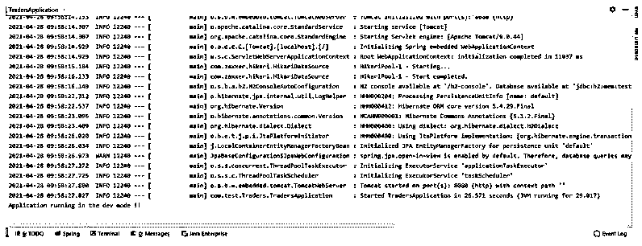

# Spring Boot 查询

> 原文：<https://www.educba.com/spring-boot-query/>

## Spring Boot 查询简介

在 Spring boot 中，我们有一个由 JPA 提供的查询，只在方法声明之上创建 sql 查询。与 JPA 中的命名查询不同，该注释可以在接口内部使用。我们在类本身中编写的命名查询，为了使用这两个注释来处理 SQL，我们必须在项目设置中有 JAP 依赖关系；否则，它会因为没有找到它而给出一个编译时错误。通过使用这个查询注释，我们也可以编写定制的 sql 查询；这个查询的 value 属性将包含 SQL 或 JPQL 来正确地执行它。这里我们将详细地看到这两个注释，因为它们都用来编写查询。

**Spring Boot 查询的语法**

<small>网页开发、编程语言、软件测试&其他</small>

正如我们所看到的，查询注释用于在 spring boot 应用程序中编写 sql 查询，以便从数据库中获得所需的结果。

使用此批注的语法:

`@Query("your query ")
public return_type method _name();`

正如您在上面的语法行中看到的，我们使用@Query 注释进行查询，这将从数据库中检索数据。

`@Query("SELECT e FROM EMP e WHERE e.city = 2")
List<EMP> getALl();`

正如您在上面的代码行中看到的，我们已经使用@Query 注释编写了一个查询，它也让您对如何在我们的应用程序中使用它有了正确的想法。但是我们必须在编写代码时对代码进行一些修改。

### Spring Boot 查询是如何工作的？

正如我们已经知道，查询用于在 spring boot 中编写 sql 查询，这有助于我们从数据库中检索数据。但是这个注释在 JPA 下，所以我们只能在 JPARepository 接口中使用它。我们有一些在应用中使用它的标准定义，为了使它工作，需要遵循这些定义。这个注释总是从数据库返回给我们指定的实体对象；在创建界面时，我们提到了所有这些必要的细节。要使用这个注释，我们应该在构建文件中有 JPA 依赖项，这将使我们能够进行数据库调用。

在这里，我们将看到如何在 spring-boot 中使用@Query 注释来定义它:

#### 1.@查询

我们可以在接口内部和接口方法之上使用这个注释。该方法将返回 sql 语句的预期结果。我们还可以将自己的参数传递给方法，以便将它们传递给 sql 查询本身。首先，我们将看看简单的语法，然后我们可以看看基于参数的查询。

#### 2.简单查询

`@Query("SELECT e FROM EMP e WHERE e.city = 2")
List<EMP> get();`

在这里，我们试图获取属于 city 2 参数的所有雇员的列表。但是如您所见，我们在这里对 city 参数的值进行了硬编码。get()是这里的方法名，它将雇员列表返回给调用服务，当我们试图调用存储库方法时，这个查询将总是自动执行。

#### 3.基于参数

如果我们想在里面传递任何参数，我们必须使用来自 jap 本身的@Param 注释；这个注释将帮助我们将值绑定到我们创建的查询。但是为了使用它，我们必须利用由 spring boot 框架定义的标准。

`@Query("SELECT e FROM EMP e WHERE e.id =:id ")
EMP getById(@Param("id") String id);`

正如您在上面的语法中看到的，我们在这里使用了 param 注释来从服务中获取参数，并将其绑定到我们的查询。这里我们已经使用@Param 注释在方法内部传递了参数，这需要在小括号中定义 Param 名称；如果我们忽略了这一点，就会产生编译时错误。同样，我们有一个语法来绑定它，' =:' this。这将把参数与查询值绑定起来，并将结果返回给我们。

#### 4.使用本机查询

我们还可以通过仅在@Query 语法中使用 native 关键字来编写 sql 原生查询。通过使用它，我们可以编写只基于 sql 语法的 sql，这将 jpa 转换成它的不可测试的形式。

`@Query(
value = "SELECT e FROM EMP e WHERE e.city = 2",
nativeQuery = true)
List<EMP> get();`

**执行此操作所需的必要步骤:**

1.我们必须从头开始创建 spring boot 项目；我们可以使用 spring 初始化器快速创建它。

请点击下面的链接并填写所需的详细信息。

**网址:**【https://start.spring.io/ T2】

2.现在，我们已经将所需的依赖项添加到构建文件中，以便在应用程序中使用给定的注释。

`<dependency>
<groupId>org.springframework.boot</groupId>
<artifactId>spring-boot-starter-data-jpa</artifactId>
</dependency>`

3.创建可以在其中包含查询的接口。

`import com.scania.coc.core.entity.Co2Contents;
import org.springframework.data.jpa.repository.JpaRepository;
import org.springframework.data.repository.query.Param;
public interface EMPRepo extends JpaRepository<EMP, Integer> {
@Query("SELECT e FROM EMP e WHERE e.id =:id ")
public EMP findByid(@Param("id") String id);
}`

根据需要，它可以包含多个方法。

4.我们的主应用程序文件应该如下所示。

`import org.springframework.boot.SpringApplication;
@SpringBootApplication
@EnableJpaRepositories("base path ")
public class CocCoreApplication {
public static void main(String[] args) throws IOException {
SpringApplication.run(CocCoreApplication.class, args);
}
}`

这里我们必须再使用一个注释，即@EnableJpaRepositories。这将在应用程序中启用 JPA，当我们运行我们的项目时，它将在应用程序中标识存储库。此外，我们必须提到括号内的应用程序的基础包名称；否则，应用程序将无法扫描包中的存储库，代码将会失败。

5.运行应用程序，您将在应用程序的控制台上看到下面的日志跟踪。

**输出:**

### 结论

正如我们已经看到的，查询易于使用和编写。然后，我们需要进行必要的更改，或者我们可以说配置，以便在编码时使用它。按照上面的步骤让它工作。

### 推荐文章

这是一个 Spring Boot 查询指南。这里我们讨论一下 spring boot 查询的介绍和工作原理。为了更好的理解。您也可以看看以下文章，了解更多信息–

1.  [Maven 资源库 Spring](https://www.educba.com/maven-repository-spring/)
2.  [Spring Boot 开发工具](https://www.educba.com/spring-boot-devtools/)
3.  [春季 AOP](https://www.educba.com/spring-aop/)
4.  [春云组件](https://www.educba.com/spring-cloud-components/)

