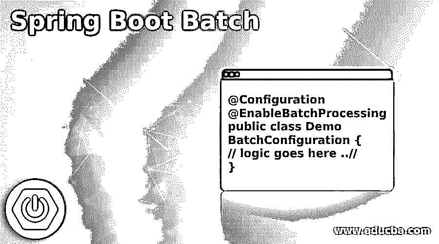
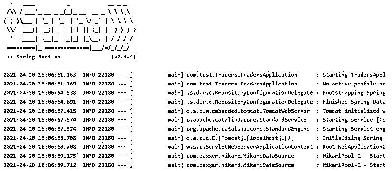

# Spring Boot 批次

> 原文：<https://www.educba.com/spring-boot-batch/>

## Spring Boot 批次简介

Spring boot 批处理用于执行作业；spring batch 是一个负责执行或处理作业的框架。这种工作可以由单个或多个步骤组成，并自己完成大部分繁重的任务。为此，我们可以在类上使用 spring boot 注释；此外，我们需要添加依赖关系，以便在开发时使用它。Spring batch 为我们提供了内置的函数，可以用来处理企业应用中的大量记录；此外，它还为我们提供了各种功能，如声明性 IO、事务管理等等。

**语法:**

<small>网页开发、编程语言、软件测试&其他</small>

我们知道，spring 批处理用于处理作业；为此，我们必须用一些需要就位的代码进行一些配置。

`@Configuration
@EnableBatchProcessing
public class DemoBatchConfiguration {
// logic goes here ..//
}`

正如您在上面的语法中看到的，我们已经使用@EnableBatchProcessing 将 spring 批处理启用到我们的应用程序中；我们使用@Configuration 来配置它。在这里，我们将讨论@EnableBatchProcessing 注释的内部细节，以及使用 spring batch 使作业处理在 spring boot 中工作所需的其他配置。

### 如何在 Spring Boot 批量工作？

正如我们已经知道的，spring batch 是一个轻量级框架，它负责并使我们能够开发对于执行任何企业应用程序的日常操作都非常重要的应用程序。使用 spring batch，我们可以在内置函数中使用它，这有助于处理大量数据和许多其他数据。

以下是 spring 批处理的一些功能，如下所示:

*   事务管理
*   基于 Web 的管理界面
*   说明性输入输出
*   启动/停止/重启
*   基于组块的处理
*   重试/跳过

下面给出了将 spring 批处理配置到应用程序中所需的步骤:

1.首先，我们必须从 spring initializer 下载 spring boot 项目 zip，在那里提到所需的文件，并将项目导入到我们想要的编辑器中。

2.其次，我们必须将依赖关系添加到 pom 或 gradle 文件中，这是我们正在使用的构建工具；如果我们不添加这个，那么在从 spring 包中访问注释时就会出现错误。

下面我们已经提到了所需的依赖关系，以供参考:

**举例:**

**代码:**

`<dependency>
<groupId>org.springframework.boot</groupId>
<artifactId>spring-boot-starter-batch</artifactId>
<version>2.4.0</version>
</dependency>`

3.在将所需的依赖项添加到 pom.xml 之后，现在我们必须在应用程序中添加关于批处理的配置。

下面我们提到了我们在使用时需要的类引用:

**举例:**

**代码:**

`@Configuration
@EnableBatchProcessing
public class DemoBatchConfiguration {
// logic goes here ..//
}`

在上面的类中，我们使用@EnableBatchProcessing 为我们的应用程序启用这个功能；现在，我们将看到这个@EnableBatchProcessing 注释为我们做了什么。

*   **@EnableBatchProcessing:** 首先，它在我们的应用程序中启用批处理；我们将与此@Configuration 批注一起使用。此外，通过使用此注释，我们在内部添加了如此多的 beans，它们负责为我们提供如此多的作业，这些作业可用于为作业提供支持，还可能需要大量的自定义代码，它只需关注业务逻辑。此外，该注释添加了工厂类，这是必需的。

4.在这里，我们有一个读取器、写入器和处理器()。所有这些 beans 都需要添加到 DemoBatchConfiguration 类中才能使用。

**举例:**

**代码:**

`@Bean
public FlatFileItemReader<Person> reader() {
// logic here .. //
}
@Bean
public PersonItemProcessor processor() {
// logic here .. //
}
@Bean
public JdbcBatchItemWriter<Person> writer(DataSource dataSource) {
// logic here .. //
}`

此代码需要添加到“DemoBatchConfiguration”中，以配置读取器、写入器和处理器。

5.我们试图将数据存储在 h3 数据库中，这意味着一旦服务器停止运行，数据将会丢失。我们没有使用 h2 数据库将数据保存到内存中；如果你想查看数据并将它们存储到一个特定的文件中，那么你可以点击下面的链接进行参考。

[https://www.baeldung.com/spring-boot-h2-database](https://www.baeldung.com/spring-boot-h2-database)

6.spring boot 的主类将是相同的；不会有太多变化或者配置。

**举例:**

**代码:**

`import com.test.Traders.entity.Student;
import org.springframework.boot.SpringApplication;
import org.springframework.boot.autoconfigure.SpringBootApplication;
import org.springframework.scheduling.annotation.EnableScheduling;
@SpringBootApplication
public class TradersApplication {
public static void main(String[] args)
{
SpringApplication.run(TradersApplication.class, args);
System.out.println("Application running in the dev mode !!");
}
}`

**输出:**

#### 使用 spring 批次进行处理时要记住的几点:

*   Spring batch 是一个轻量级框架，用于处理作业。
*   我们可以通过将所需的依赖项添加到 pom.xml 或 gradle 文件中来开始使用 spring 批处理。
*   实际使用时，我们可以将 CSV 格式的数据导入 excel 文件，这可能是一个繁重的过程，但是通过使用 spring batch，我们可以使用其内部函数来避免繁重的代码。
*   我们使用了@ EnableBatchProcessing 注释；这个注释将用在我们想要配置所有与 spring 批处理相关的东西的类中，比如读取器、写入器和处理器等等。

### 结论

有了它的使用，我们可以很容易地利用批处理；还有，我们可以轻松处理大量数据；我们不需要编写自定义代码；我们可以只关注业务逻辑。我们已经讨论过的一些特性也可以提高企业应用程序的整体性能。

### 推荐文章

这是 Spring Boot 批指南。在这里我们讨论一下 spring boot 中的批处理工作的介绍和方式。为了更好的理解。您也可以看看以下文章，了解更多信息–

1.  [Maven 资源库 Spring](https://www.educba.com/maven-repository-spring/)
2.  [Spring Boot 开发工具](https://www.educba.com/spring-boot-devtools/)
3.  [春季 AOP](https://www.educba.com/spring-aop/)
4.  [春云组件](https://www.educba.com/spring-cloud-components/)

