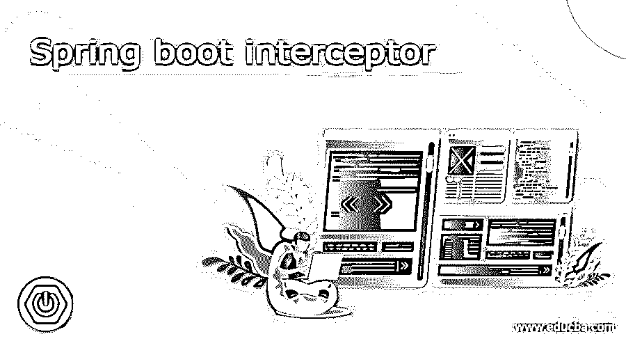
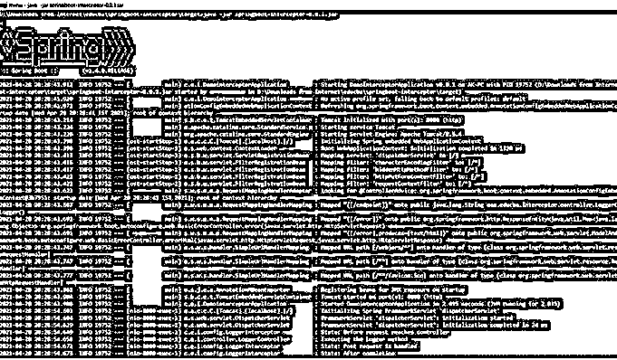
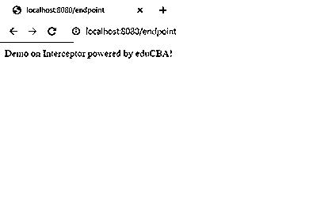

# 弹簧靴拦截器

> 原文：<https://www.educba.com/spring-boot-interceptor/>

## Spring boot 拦截器简介

Spring boot interceptor 被定义为一个概念，它在请求的预处理和后处理时被调用，并且只允许控制器处理过滤后的请求。我们可以假设这类似于一个访问者想要会见一个组织的 CEO 的情况。在这种情况下，访问者需要通过许多检查和协议才能有资格会见 CEO，例如，预约的可用性、通过安全检查等。拦截器的概念非常类似于 servlet 过滤器，适用于发送到控制器的请求。例如，添加/更新配置、写日志是拦截器在控制器处理请求之前执行的一些任务。

**语法**

<small>网页开发、编程语言、软件测试&其他</small>

如上所述，spring boot interceptor 是一种在请求传递给控制器进行操作之前对其进行检查的方法。在这一节中，我们将从语法的角度了解 spring boot 拦截器，这样当我们了解 spring boot 拦截器的工作原理及其特性时，映射回语法将使我们能够看到本文讨论的主题的全貌。

在 Spring Boot 应用程序中使用拦截器需要装饰器:

`@Component`

拦截器中的预处理方法:

`preHandle(HttpServletRequest request, HttpServletResponse response, Object handler)`

拦截器中的后处理方法:

`postHandle(HttpServletRequest request, HttpServletResponse response, Object handler, ModelAndView modelAndView)`

拦截器中的完成后方法:

`afterCompletion(HttpServletRequest request, HttpServletResponse response, Object handler, Exception ex)`

通过使用适配器向 InterceptorRegistry 注册拦截器:

`@Override
public void addInterceptors(InterceptorRegistry registry) {
}`

### Spring boot 中拦截器是如何工作的？

在我们开始理解 Spring Boot 拦截器的工作原理之前，我们需要理解拦截器的效用。现在，虽然我们在 Spring Boot 谈论拦截器，但是我们需要知道拦截器的概念并不特定于 Spring Boot，而是被认为是 J2EE 的一个标准。例如，web 应用程序中的请求可能会因为各种原因而被拦截，即日志记录、特定于国家的请求过滤等。因此，需要确保在请求被服务之前，记录请求的来源，然后修改头文件并将其附加到所需的内容中，这些都由拦截器负责。现在，有人可能会想，为什么要制作一个拦截器呢？在拦截器中，记录器和优化器可以完成大量的任务。这个问题的答案是，当编写记录器和优化器时，每个控制器都可能会出现异常，增加代码开销。因此，拦截器通过将代码与所需的尽可能多的接入点相关联来放置代码，并在请求到达路径控制器之前解密每个请求。

在 Spring boot 中，拦截器以两种方式实现，即，

1.  实现直接接口(接口称为 HandleInterceptor)
2.  通过扩展 HandleInterceptorAdapter 的实例。

为简单起见，本文将介绍扩展 HandleInterceptorAdapter 实例的方法。这 3 个功能需要被覆盖，即前置处理、后置处理、完成后。通过这三个功能，实现了拦截器的效用，从而成为理解拦截器工作的重要来源。

在请求被移交给控制器之前，请求首先遇到预处理功能。“真”值的返回对于允许请求继续对请求进行进一步的操作是非常重要的。返回 False 表示不需要进一步处理，因为 spring 拦截器已经自己处理了请求。response 对象用于在不调用 postHandle 和 afterCompletion 的情况下向客户端发送响应。到目前为止，还没有生成视图，以及处理请求的 handler 对象。现在，当控制器处理请求时，在请求到达客户机之前，会调用 postHandle。这样做是为了在请求发送回客户端之前执行操作。此方法通常用于向 ModelAndView 对象添加属性，这些属性在视图页面中使用。不仅如此，方法还用于确定处理程序方法处理客户端请求所用的时间。贴这个；视图已创建。现在，一旦执行了处理程序并呈现了视图，就调用 after completion 函数来完成循环。

在这种工作方式中，拦截器充当需要到达控制器的请求的代理，就像当访问者需要会见相关人员时为访问者进行的检查一样。

### 弹簧靴拦截器示例

下面给出了弹簧引导拦截器的例子:

**示例**–了解请求流程:

**语法**

pom.xml

`<?xml version="1.0" encoding="UTF-8"?>
<project xmlns:xsi="http://www.w3.org/2001/XMLSchema-instance"
xsi:schemaLocation="http://maven.apache.org/POM/4.0.0 http://maven.apache.org/xsd/maven-4.0.0.xsd">
<modelVersion>4.0.0</modelVersion>
<groupId>com.javainuse</groupId>
<artifactId>springboot-interceptor</artifactId>
<version>0.0.1</version>
<packaging>jar</packaging>
<parent>
<groupId>org.springframework.boot</groupId>
<artifactId>spring-boot-starter-parent</artifactId>
<version>1.4.0.RELEASE</version>
<relativePath/>
</parent>
<properties>
<project.build.sourceEncoding>UTF-8</project.build.sourceEncoding>
<project.reporting.outputEncoding>UTF-8</project.reporting.outputEncoding>
<java.version>1.7</java.version>
</properties>
<dependencies>
<dependency>
<groupId>org.springframework.boot</groupId>
<artifactId>spring-boot-starter-web</artifactId>
</dependency>
</dependencies>
<build>
<plugins>
<plugin>
<groupId>org.springframework.boot</groupId>
<artifactId>spring-boot-maven-plugin</artifactId>
</plugin>
</plugins>
</build>
</project>`

com.educba.interceptor 包中的 DemointerceptorApplication.java

`package com.educba.interceptor;
import org.springframework.boot.SpringApplication;
import org.springframework.boot.autoconfigure.SpringBootApplication;
@SpringBootApplication
public class DemointerceptorApplication {
public static void main(String[] args) {
SpringApplication.run(DemointerceptorApplication.class, args);
}
}
InterceptorConfig.java within com.educba.interceptor.config package
package com.educba.interceptor.config;
import org.springframework.beans.factory.annotation.Autowired;
import org.springframework.context.annotation.Configuration;
import org.springframework.web.servlet.config.annotation.InterceptorRegistry;
import org.springframework.web.servlet.config.annotation.WebMvcConfigurerAdapter;
@Configuration
public class InterceptorConfig extends WebMvcConfigurerAdapter {
@Autowired
LoggerInterceptor logInterceptor;
@Override
public void addInterceptors(InterceptorRegistry registry) {
registry.addInterceptor(logInterceptor);
}
}`

com.educba.interceptor.config 包中的 LoggerInterceptor.java

`package com.educba.interceptor.config;
import javax.servlet.http.HttpServletRequest;
import javax.servlet.http.HttpServletResponse;
import org.slf4j.Logger;
import org.springframework.stereotype.Component;
import org.springframework.web.servlet.HandlerInterceptor;
import org.springframework.web.servlet.ModelAndView;
@Component
public class LoggerInterceptor implements HandlerInterceptor {
Logger logIntercept = org.slf4j.LoggerFactory.getLogger(this.getClass());
@Override
public void afterCompletion(HttpServletRequest request,
HttpServletResponse response, Object object, Exception arg3)
throws Exception {
logIntercept.info("State: After completion");
}
@Override
public void postHandle(HttpServletRequest request,
HttpServletResponse response, Object object, ModelAndView model)
throws Exception {
logIntercept.info("State: Post request is handled");
}
@Override
public boolean preHandle(HttpServletRequest request,
HttpServletResponse response, Object object) throws Exception {
logIntercept.info("State: Before request reaches controller");
return true;
}
}`

com . educba . interceptor . controller 包中的 LoggerController.java

`package com.educba.interceptor.controller;
import org.slf4j.Logger;
import org.slf4j.LoggerFactory;
import org.springframework.web.bind.annotation.RequestMapping;
import org.springframework.web.bind.annotation.RestController;
@RestController
public class LoggerController {
Logger logIntercept = LoggerFactory.getLogger(this.getClass());
@RequestMapping("/endpoint")
public String executeLogger() {
logIntercept.info("Executing the Logger method");
return "Demo on Interceptor powered by eduCBA!";
}
}`

**输出:**

### 结论

总之，在本文中，我们已经了解了 spring boot interceptor 的工作方式，以及如何在 spring boot 为开发人员实现它的替代方法，在处理请求的过程中注意日志记录，这样就不需要额外的日志记录程序，一切都是一致的。因此，我们鼓励读者动手尝试这个例子以及任何“从经验中学习”的额外想法！

### 推荐文章

这是一个指南弹簧引导拦截器。在这里，我们将讨论 spring boot 拦截器的工作方式以及其他替代方式。您也可以看看以下文章，了解更多信息–

1.  [Spring Boot 执行器](https://www.educba.com/spring-boot-actuator/)
2.  [Spring Boot 注解](https://www.educba.com/spring-boot-annotations/)
3.  [Spring Boot 开发工具](https://www.educba.com/spring-boot-devtools/)
4.  [Spring Boot 建筑](https://www.educba.com/spring-boot-architecture/)

