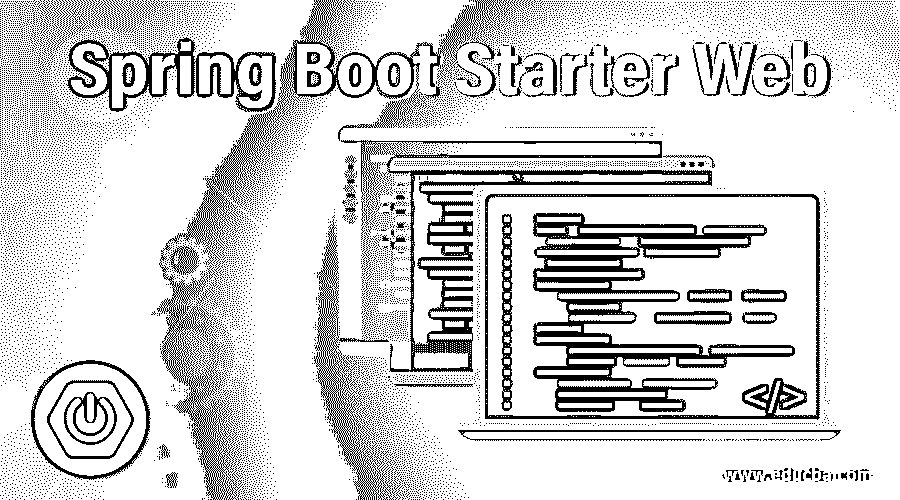

# Spring Boot 入门网站

> 原文：<https://www.educba.com/spring-boot-starter-web/>




## Spring Boot 入门网站简介

Spring Boot 启动器是 Spring Boot 风格的模块之一，它允许 Java 开发人员开发独立的生产级 Spring 应用程序，旨在“直接运行”。人们可以从最低配置开始，而不用考虑设置 Spring 配置。Spring Boot 的主要意图是避免在 Spring 中编写复杂的 XML 配置，从而减少开发时间。Spring 使用户能够运行独立开发的应用程序。现在，谈谈 Spring Boot 入门网站，这个特殊的模块是专门为编写 rest 端点而设计的。在接下来的几节中，我们将深入了解 Spring Boot 的 Spring starter Web 版本。

### 什么是 Spring Boot 网页？

对于任何 Spring 项目，pom.xml 文件都是必不可少的一部分。POM 或项目对象模块是 Maven 的基本单元。它基本上是一个 XML 文件，包含关于项目及其相关配置细节的信息。Spring Boot 网络的概念是实现三个主要目标:

<small>网页开发、编程语言、软件测试&其他</small>

*   减少手动添加的依赖项，并将所有必需的依赖项绑定为一个。
*   生产就绪型应用程序构建的快速标准化结构。
*   在 XML 本身中构造版本控制，使应用程序没有版本错误。

使用下面的 XML 结构，我们导入所需的依赖关系:

```
<dependency>
<groupId>org.springframework.boot</groupId>
<artifactId>spring-boot-starter-web</artifactId>
</dependency>
```

这里，当我们声明 spring-boot-starter-web 依赖时，这个 starter 包中需要的所有导入都是在内部导入的，然后添加到您的项目中。如果查看这个 starter pack 中的依赖项，您会看到一些依赖项是直接的，而其他依赖项则被引用到其他模板中，这些依赖项是通过下载的。虽然 pom.xml 中的版本控制是自动进行的，但是如果开发人员需要一个特定的版本，可以通过 xml 标签 <version>轻松获得。</version>

Spring Boot web 是 Spring Boot 提供的众多入门包之一。starter packs 有助于方便地收集应用程序运行所必需的依赖项描述符。

### Spring Boot 网站的特点

现在，我们对什么是 Spring Boot Starter Web 有了一个相当好的了解，让我们看看 Web starter 的两个主要特性，然后可能会深入到这个主题的一些基本讨论中。

其特点是:

1.  Spring Boot starter web 与 web 开发兼容，声明本身包含了常见的基本依赖项。
2.  Spring Boot 网站也有自动配置的功能。

上面讨论的特性有助于将 web 开发转换到一个更简单的水平，人们只需要关注应用程序的逻辑，甚至不用考虑设置基础设施，甚至不用担心丢失一些重要的导入。

此外，需要记住的是，我们确实在项目导入中嵌入了 tomcat 服务器，用户可以根据需要进行更改。spring web 使用 Spring MVC、REST、Tomcat 等工具作为默认的嵌入式服务器，帮助开发人员减少构建依赖计数。在下面的列表中，我们将浏览 web starter 临时依赖的一些初学者包:

*   **spring framework . boot:**spring-boot-starter-validation
*   **spring framework . boot:**spring-boot-启动器
*   **弹簧框架:**弹簧 webmvc
*   **spring framework . boot:**spring-boot-starter-Tomcat
*   **faster XML . Jackson . core:**Jackson-databind
*   **spring framework . boot:**spring-boot-starter-validation
*   **弹簧框架:**弹簧网页

### Spring Boot 入门网站示例

现在我们对 Spring Boot 网站提供的功能和它所迎合的各种类型有了一个大致的概念，让我们看一个例子来对 Spring Boot 网站的系统如何工作有一个总体的感觉。首先，我们需要添加 POM 要求，如下所示:

```
<dependency>
<groupId>org.springframework.boot</groupId>
<artifactId>spring-boot-starter-web</artifactId>
</dependency>
```

现在，假设我们不使用 tomcat 服务器，而是在应用程序中使用 Jetty 服务器。在这种情况下，我们需要添加以下内容:

```
<exclusions>
<exclusion>
<groupId>org.springframework.boot</groupId>
<artifactId>spring-boot-starter-tomcat</artifactId>
</exclusion>
</exclusions>
</dependency>
<dependency>
<groupId>org.springframework.boot</groupId>
<artifactId>spring-boot-starter-jetty</artifactId>
</dependency>
```

在这种情况下，exclusion 标记意味着 exclusions 中注明的细节将不包括在内，我们需要手动添加关于我们将使用的 jetty 服务器的<dependency>标记。一旦我们在 POM 中整合了所有的要素，我们就可以开始应用程序开发了。</dependency>

下面我们将为一个简单的 web 应用程序创建一个 web 控制器。

```
package com.example.project;
import org.springframework.web.bind.annotation.RestController;
import org.springframework.web.bind.annotation.RequestMapping;
@RestController
public class EduCBACtrl {
@RequestMapping("/home")
public String index() {
return "Welcome to the tutorial from EduCBA!";
}
}
```

在我们的项目中，应用程序位于 src/main/Java/com/example/project/educbactrl . Java 路径下。我们需要从各自库中的预定义类导入 RestController 和 RequestMapping。RestController 是一个方便的注释，对于使用 Spring MVC 创建 RESTful 服务非常有用。这里，RestController 负责将请求数据映射到已定义的处理程序方法。接下来，定义 RequestMapping，用于将传入的 HTTP 请求路由到相应的处理程序方法。人们可以在类级别甚至在方法级别使用 RequestMapping。在我们的例子中，/home 是它下面的方法被映射到的地方。

这是该应用程序运行结束时的样子:

### Spring Boot 网站的优势

现在我们已经对 Spring Boot web 的工作原理有了一个相当好的理解，让我们看看 Spring Boot 带来的优势，这样我们就可以放心地在 Spring Boot 上开发应用程序了。

*   Spring Boot web 应用程序可以用 Java 或 Groovy 轻松构建。
*   一旦开发人员使用 Spring Boot 构建他们的应用程序，就可以避免大量的样板代码。
*   由于减少了多余的工作，生产率提高了，节省了大量的开发时间。
*   即插即用的概念在 Spring Boot 提供的插件中非常明显。

### 结论

最后，总结一下，Spring Boot 确实提供了许多易于应用程序开发的特性。你可以把它想象成一个机器人，它会做一些重复性的工作，比如维护基础设施和它的内部依赖关系，这将使应用程序的开发和运行更加顺利。

### 推荐文章

这是 Spring Boot 入门网站的指南。在这里，我们讨论 spring boot starter web 的介绍和特性，以及优点和示例。您也可以看看以下文章，了解更多信息–

1.  [Spring Boot 版本](https://www.educba.com/spring-boot-versions/)
2.  [春云 vs Spring Boot](https://www.educba.com/spring-cloud-vs-spring-boot/)
3.  [什么是春云？](https://www.educba.com/what-is-spring-cloud/)
4.  [Spring Boot 开发工具](https://www.educba.com/spring-boot-devtools/)


