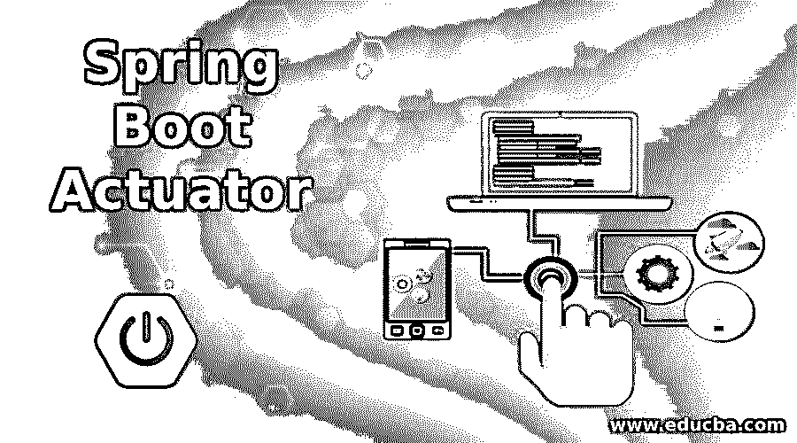

# Spring Boot 执行器

> 原文：<https://www.educba.com/spring-boot-actuator/>




## Spring Boot 执行器介绍

当我们将应用程序部署到生产环境中时，Spring Boot 执行器可以帮助我们管理和监控应用程序。它包含各种端点，通过这些端点我们可以看到资源在哪里启动，它有两种类型的端点，我们可以用来监控我们的 spring boot 应用程序，即 JMX 和 HTTP，它为我们提供了生产就绪的应用程序，我们可以通过它来监控我们的应用程序的运行状况。我们应该使用此功能。它还在应用程序中自动应用了一些东西，如指标、健康和审计。

### Spring Boot 执行器的特点

弹簧靴致动器模块提供了 Spring Boot 的所有生产就绪功能。启用这些功能的最简单的方法是向弹簧-启动-启动器-致动器“启动器”添加一个依赖项。

<small>网页开发、编程语言、软件测试&其他</small>

#### 1.提供生产就绪功能

我们有一个模块为我们提供所有生产就绪功能。为了在项目中启用此功能，我们需要添加一个依赖项，即弹簧-启动-启动器-致动器“启动器”。

#### 2.审计

我们的项目中都有 spring security 用于身份验证，所以这个执行器也有一个审计框架，它默认管理各种事件，比如拒绝访问、失败和身份验证成功。因此，这一功能非常重要，它根据身份验证失败的次数为用户实施锁定。现在，为了实现这一点，我们需要在 spring boot 应用程序中配置 AuditEventRepository 类型 bean。Spring boot 也提供了一个 InMemoryAuditEventRepository，但是它的功能非常有限，所以它只能推荐在开发阶段使用，如果我们想将我们的应用程序转移到生产中，那么我们应该使用 AuditEventRepository 配置。

#### 3.客户审计

我们还可以实现自定义安全事件，但为此我们需要提供以下接口的实现:

```
AbstractAuthenticationAuditListener
```

```
AbstractAuthorizationAuditListener
```

#### 4.端点

Spring boot actuator 为我们提供了各种内置的端点来管理和监控我们的应用程序，通过这些，我们还可以与我们的应用程序进行交互。它有如此多的内置端点，我们也可以创建自己的端点。我们还可以根据需要禁用和启用该端点。假设我们想要访问这些端点，那么为了访问它们，我们需要通过 HTTP 或 JMX 将它们暴露给网络。这里的应用程序更喜欢 HTTP 而不是 JMX，URL 以/ actuator 开头，在这个 ID 之后我们可以添加来访问它们。

#### 5.记录器

这个特性的一个主要原因是它允许我们在运行时在我们的应用程序中配置我们的记录器。我们还可以查看单个记录器或整个列表配置。这种配置是隐式和显式的。隐式的是 once，由登录框架提供，显式的是我们已经完成的。各种级别如下所述:

*   空
*   警告
*   找到；查出
*   信息
*   错误
*   离开
*   致命的
*   调试

#### 6.韵律学

如上所述，致动器为我们提供了测微计的自动配置和管理，它是为各种监控目的提供支持的门面，包括:

*   数据狗
*   普罗米修斯
*   弹性的
*   阿特拉斯
*   神经中枢
*   状态:状态
*   石墨
*   应用程序
*   潮湿的
*   流入
*   简单(内存中)
*   JMX
*   Dynatrace
*   KairosDB
*   新遗迹
*   信号 Fx
*   波阵面

#### 7.JMX

JMX 代表 Java 管理扩展，它允许我们管理和监控我们的 spring boot 应用。为了启用这个特性，我们需要在一个 out 项目中进行配置，比如设置配置属性 spring.jmx.enabled = true。如果我们想要禁用此属性，或者不想使用 JMX 公开我们的端点，那么我们需要进行如下配置:

```
management.endpoints.jmx.exposure.exclude
```

#### 8.超文本传送协议

此功能用于通过 HTTP 在网络上公开我们的端点。默认情况下，此功能处于启用状态。我们只需要在/actuator 前面加上端点的 ID。有时我们可能已经将/ actuator 用于其他目的，因此我们也可以通过设置某些属性来更改前缀，如下所示:

```
management.endpoints.web.base-path=/manage
```

#### 9.程序控制

Spring boot 为我们提供了两个对进程监控非常有用的类，如下所示:

*   WebServerPortFileWriter: 这个类用于创建一个文件，该文件包含关于应用程序启动和运行的服务器端口的信息。默认情况下，它创建的名称为 application.port
*   这个类创建一个包含应用程序 PDI 的文件。默认情况下，它创建的名称为 application.pid

#### 10.云铸造支持

当我们在云上部署应用程序时，Spring boot actuator 也为我们提供支持。它提供了我们/cloudfoundryapplication 路径，为我们提供了到所有端点的安全路径。

#### 11.HTTP 跟踪

这可以通过将 HttpTraceRepository 类型 bean 配置到我们的应用程序中来实现。Spring boot 为我们提供了 InMemoryHttpTraceRepository，但它对可用于开发的支持有限。对于生产就绪的应用程序，我们可以选择 HttpTraceRepository。

### Spring Boot 执行器端点

我们在弹簧靴致动器中有如此多的内置端点。

*   审计事件
*   豆子
*   隐藏所
*   情况
*   配置道具
*   包封/包围（动词 envelop 的简写）
*   候鸟迁徙所经的路径
*   健康
*   httptrace
*   信息
*   积分图
*   记录器
*   液态碱
*   韵律学
*   绘图
*   计划任务
*   会议
*   关机
*   线程转储

**Spring Boot 执行器属性:**

*   management . security . enabled = true
*   管理.安全.角色=用户
*   security.basic.enabled=true
*   security.user.name=user123
*   security.user.passowrd=user123

### Spring Boot 致动器示例

按照下面提到的步骤，使用执行器创建您的第一个 spring boot 项目。

*   首先，我们需要创建一个 spring boot 项目，你可以点击这个链接[https://start.spring.io/](https://start.spring.io/)
*   这里提到组名、工件 id 并添加必要的依赖项。致动器的依赖性如下所述。
*   将此添加到 pom.xml

```
<dependencies>
<dependency>
<groupId>org.springframework.boot</groupId>
<artifactId>spring-boot-starter-actuator</artifactId>
</dependency>
</dependencies>
```

*   Java 类:

```
package com.demo;
import org.springframework.web.bind.annotation.GetMapping;
import org.springframework.web.bind.annotation.RestController;
@RestController
public class DemoActuator
{
@GetMapping("/demo_act")
public String demoAc()
{
return "Demo actuator!!";
}
}
```

**输出:**


*   目前，我们正在禁用弹簧靴致动器的安全功能。为此，我们将设置下面提到的一个属性:

```
management.security.enabled=false
```

### 结论

因此，actuator 为我们提供了许多功能，使我们的 spring boot 应用程序可以投入生产，这有助于我们非常轻松地监控和管理我们的应用程序，同时也减少了我们的维护任务。我们还可以很容易地跟踪生产中的异常和错误。

### 推荐文章

这是一个 Spring Boot 执行器的指南。在这里，我们讨论 spring boot actuator 的介绍和特性，以及一个例子和它的代码实现。您也可以看看以下文章，了解更多信息–

1.  [Spring Boot 版本](https://www.educba.com/spring-boot-versions/)
2.  [春云 vs Spring Boot](https://www.educba.com/spring-cloud-vs-spring-boot/)
3.  [什么是春云？](https://www.educba.com/what-is-spring-cloud/)
4.  [Spring Boot 首发网](https://www.educba.com/spring-boot-starter-web/)


