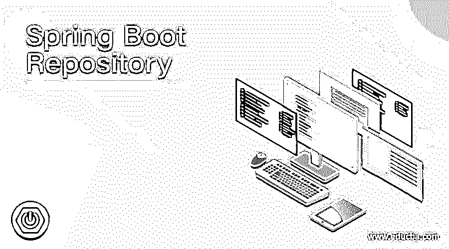

# Spring Boot 知识库

> 原文：<https://www.educba.com/spring-boot-repository/>

## Spring boot 存储库的定义

spring boot 是一个 java 框架，是 Spring 框架的扩展，通过使用它，我们可以摆脱许多手动配置，现在它们由 Spring boot 框架本身管理。Spring boot 框架提供了一个知识库，负责对对象执行各种操作。要在 spring boot 中创建任何类存储库，我们必须在那个类上使用存储库注释，这个注释是由 spring 框架本身提供的。spring boot 中的存储库注释是@Component 注释的专门化。在本教程的下一节，我们将看到内部工作，最重要的是我们如何在应用程序中使用这个注释来理解它的实现，对于初学者也是如此。

**语法:**

<small>网页开发、编程语言、软件测试&其他</small>

正如我们已经知道的，spring boot 中的 repository 是一个注释，用于在类上对对象执行任何操作。在这一节中，我们将了解如何将这个存储库导入到我们的应用程序中，以便更好地理解(见下文);

`@Repository
public interface Name extends any_repository<Type, Type> {
}`

正如您在上面使用 repository 的语法中看到的，我们已经使用@Repository 注释在 spring boot 中创建了任何 a 类存储库。此外，为了在我们的类中使用这个注释，我们必须导入所需的包，否则我们会得到一个编译时错误，说这个包不存在。让我们来看看 spring boot 中一个存储库的练习语法，看看下面；

**例如:**

`@Repository
public interface AddEmployee extends JPARepository<String, String> {
// your logic goes here.
}`

正如你所看到的，我们现在已经为初学者定义了一些可理解的代码来理解语法。在本教程的下一节中，我们将看到它的内部工作方式，以及在应用程序中使用它来正确运行它所需的依赖关系。

### Spring boot 存储库是如何工作的？

众所周知，spring boot 中的存储库用于对对象执行各种操作，这些操作包括删除、存储、检索、一次性存储列表，以及基于特定标准从数据库中进行搜索。@Repository 注释帮助我们将非基于 spring 的期望转换为 spring 未检查异常。这有助于我们确定问题发生在哪里。我们可以在 spring boot 中的 DAO 类上使用这个@repository 注释。基本上，我们将这个存储库实现为 Java 中的接口，并扩展不同的可用存储库。最常见的是，我们使用 JPARepository 对对象执行 crud 操作。这是一个非常重要的层，因为所有的交易都发生在这一层，所以如果发生任何异常，我们需要跟踪这一层。在这一节中，我们将看到如何在我们的应用程序中使用它，让我们从下面开始看；

**1)要添加的依赖:**

`<dependency>
<groupId>org.springframework</groupId>
<artifactId>spring-context</artifactId>
<version>5.0.6.RELEASE</version>
</dependency>
We need to add this dependency to use this inside our application, after that we can use any repository JpaRepository to perform any operations.
<dependency>
<groupId>org.springframework.boot</groupId>
<artifactId>spring-boot-starter-data-jpa</artifactId>
<version>2.4.2</version>
</dependency>`

2)我们应该从这两个方面入手。之后，我们可以创建一个接口，负责对对象执行任何操作，让我们看看它的语法，见下文；

**例如:**

`@Repository
public interface EmpRepository extends JpaRepository<String, String> {
// our methods if any
}`

3)一旦我们定义了存储库及其所需的方法，我们就可以轻松地在我们的服务类中自动连接它，以使用它并基于它执行操作。见下文，以便更好地理解；

**例如:**

`@Service
public class EmpService {
@Autowired
private EmpRepository empRepository;
}`

正如您在上面的示例代码中看到的，我们已经创建了一个员工服务，它将响应与存储库的交互，因此我们已经在服务类中自动连接了存储库的对象，以调用它们的方法。

4)我们应该已经有了实体和 dao 类来执行进一步的逻辑，你的实体类应该如下所示；

**例如:**

`@Entity
@Table(name = "EMPLOYEE")
public class Employee implements Serializable {
@Id
@GeneratedValue(strategy = GenerationType.IDENTITY)
@Column(name = "ID")
private Long id;
@Column(name = "NAME")
private String name;
@Column(name = "CITY")
private String city;
@Column(name = "ROLL_NO")
private String rollNumber;
}`

5)现在我们可以存钱了。在 spring boot 中删除、搜索、检索或执行使用存储库所需的任何操作。让我们来看看如何做到这一点，见下文；

`// to create new employee ..
public String saveEmployee(Employee emp) {
System.out.println("Employee created successfully !!");
return empRepository.save(emp);
}
// to delete an object
public String deleteEmployee(Employee emp) {
System.out.println("Employee deleted successfully !!");
return empRepository.delete(emp);
}
// delete all
public String deleteAllEmployee() {
System.out.println("All employee deleted successfully");
return empRepository.deleteAll();
}
// find employee by id
public String findEmpById(Long Id) {
System.out.println("search emp");
return empRepository.findById(Id);
}
// find all employee
public String findEmpById() {
System.out.println("search all employee");
return empRepository.findAll();
}`

要在 spring boot 应用程序中运行任何应用程序或任何示例，我们必须完成所有配置。这些示例不能通过使用任何在线编译器或工具来运行，我们必须在任何版本(如 Intellij 或 eclipse 等)中运行。所以设置好上面描述的所有必要的东西，并作为 spring boot 应用程序运行它们，然后它将开始工作。

**注:**

1)存储库是对对象执行操作所需的注释。我们可以使用 crud 库或 JPA 库来执行任何操作，如添加、删除、保存、查找等。
3)春装里@ componant 是个专精。

### 结论

正如我们已经看到的，它是 spring boot 中非常需要的注释，因为它负责与存储在数据库中的对象进行交互，还将异常转换为 spring 未检查的异常。为了运行它，我们要求服务、dao、实体和 spring boot man 类都就位，否则我们将会出错，应用程序将无法工作。

### 推荐文章

这是 Spring Boot 知识库的指南。这里我们讨论 Spring boot 仓库的定义、语法和工作原理。代码实现示例。您也可以看看以下文章，了解更多信息–

1.  [Spring Boot 开发工具](https://www.educba.com/spring-boot-devtools/)
2.  [Spring Boot 执行器](https://www.educba.com/spring-boot-actuator/)
3.  [Spring Boot 首发网](https://www.educba.com/spring-boot-starter-web/)
4.  [春天表情语](https://www.educba.com/spring-expression-language/)

