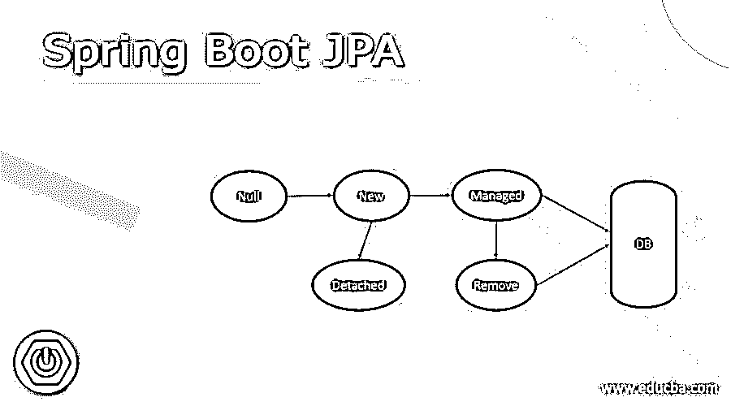
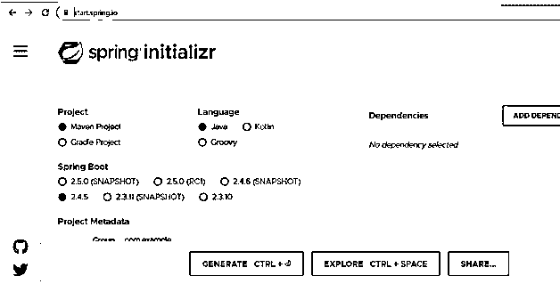

# Spring Boot JPA

> 原文：<https://www.educba.com/spring-boot-jpa/>

## Spring Boot JPA 的定义

在 Spring boot 中，我们有 JPA，它将 Java 对象映射到关系数据库。通过使用它，我们可以在数据库上执行许多操作，并得到我们想要的结果。Spring boot 框架为我们提供了 starter JPA 依赖，它包含了所有需要的东西，在它的帮助下，我们可以轻松地执行和连接到数据库。JPA 是一组遵循 ORM 方法的接口，ORM 方法代表对象-关系映射，借助 JPA，我们能够在应用程序和关系数据库之间持久化和访问数据或 java 对象。因为当涉及到数据存储和对这些数据执行事务时，数据库是一个非常重要的部分。在本教程的下一节中，我们将看到如何在 spring boot 应用程序中配置 JPA 来与关系数据库进行交互，并查看用法以便更好地理解。

**语法:**

<small>网页开发、编程语言、软件测试&其他</small>

正如我们所知，要访问 JPA，我们需要在我们的应用程序中进行一些配置，下面提到了 spring boot 中最常用的命令注释，这是我们需要的基本配置，让我们仔细看看语法，以便更好地理解下面的内容；

`@SpringBootApplication
@EnableJpaRepositories
public class name_Application{}`

正如您所看到的，我们已经使用了@EnableJpaRepositories 来支持 JPA 在项目中的使用。此外，我们将不得不看看使用 JPA 的练习语法，见下文；

**例如:**

`@SpringBootApplication
@EnableJpaRepositories
public class DemoApplication{}`

在本教程的下一节中，我们将介绍为了在 JPA 中轻松无误地运行 spring boot 应用程序还需要哪些配置。

### Spring boot JPA 如何工作？

正如我们已经知道的，为了使 JPA 工作，我们必须进行一些配置，我们还需要添加依赖关系。JPA 主要用于 java 类和数据库之间的交互。通过使用这一点，我们能够将值存储在数据库中，并在需要时获取它们。首先，让我们通过下面描述的步骤从 JPA 的生命周期开始；

**1) NULL:** 首先，对象处于 NULL 状态，这意味着它没有与 entityManager 关联，引用参见下面的代码:

**例如:**

`Demo demo = null;`

2) NEW:这是 JPA 对象的第二个阶段，我们使用 NEW 操作符创建对象，但是 entityManager 仍然不存在。

例如:

`Demo demo = new Demo();`

**3) Managed:** 在这个阶段，我们已经创建的对象将由 entityManager 管理，所以我们将做一些编码来在 entityManager 内部注册它，通过使用下面的代码；

**例如:**

`entityManager.getTransaction().begin();
Demo demo = new Demo();
entityManager.persist(demo);
entityManager.getTransaction().commit();`

这里我们已经将我们的对象配置到 entityManager，现在 entityManager 将为我们管理该对象。

**4)分离:**这个状态分离意味着从 entityManager 中删除对象。请参考下文；

**例如:**

`entityManager.detach(demo);`

5)移除:此阶段将帮助我们从数据库中移除对象。

**例如:**

`entityManager.removed(myObject);`

为了更好地理解，请参见下面的 JPA 生命周期阶段流程图；

### 例子

1.在这个例子中，我们将看到在数据库中保存一个简单的对象。为此，我们创建了实体、服务和存储库来存储对象，还在 pom.xml 中添加了依赖关系。

**举例:**

a)使用下面提到的 spring initializer 链接从头开始创建项目；

**网址:**【https://start.spring.io/ T2】

b)在创建 JPA 示例时也添加下面的依赖关系:没有 his，我们将无法在我们的应用程序中使用 JPA 功能，因此它是必需的。你可以直接在 spring 初始化器中输入这个名字，它会为你添加这个依赖项。

例如:

`<dependency>
<groupId>org.springframework.boot</groupId>
<artifactId>spring-boot-starter-data-jpa</artifactId>
</dependency>`

c)创建如下所示的实体类；这将是将要存储在数据库中的实体类。之后，我们还可以对其执行许多操作，如获取、删除、更新等。根据要求。

`@Entity
@Table(name = "STUDENT")
public class Student implements Serializable {
@Id
@GeneratedValue(strategy = GenerationType.IDENTITY)
@Column(name = "ID")
private Long id;
@Column(name = "name")
private String name;
@Column(name = "city")
private String city;
}`

d)现在创建 JPA 存储库，在其中保存学生对象，这是一个接口，非常重要，因为只有通过它所有的事务才会发生。这里需要@Repository 注释，所以我们可以稍后自动连接它以使用它。

**例如:**

`import org.springframework.data.jpa.repository.JpaRepository;
import org.springframework.data.jpa.repository.Modifying;
import org.springframework.data.jpa.repository.Query;
import org.springframework.data.repository.query.Param;
import org.springframework.stereotype.Repository;
import java. time.LocalDateTime;
import java.util.List;
@Repository
public interface StudentRepository extends JpaRepository<Student, String> {
}`

e)现在服务类中有一个方法，并自动连接其中的存储库来调用 JPA 方法来保存对象。

**例如:**

`import org.springframework.beans.factory.annotation.Autowired;
import org.springframework.stereotype.Service;
import java. time.LocalDateTime;
import java.util.List;
@Service
public class StudentService {
@Autowired
private StudentRepository studentRepository;
public void create(Student student){
studentRepository.save(student);
}
}`

f)现在是使配置工作的最后一步，在项目的主应用程序类中参见下文以供参考；

**例如:**

包 com。测试。交易员；

`import org.springframework.boot.SpringApplication;
import org.springframework.boot.autoconfigure.SpringBootApplication;
import org.springframework.context.ConfigurableApplicationContext;
import org.springframework.context.annotation.Bean;
import org.springframework.data.jpa.repository.config.EnableJpaRepositories;
import org.springframework.web.client.RestTemplate;
@SpringBootApplication
@EnableJpaRepositories
public class StudentApplication{
public static void main(String[] args){
}SpringApplication.run(StudentApplication.class, args);
}`

g)现在运行上面的代码，您将看到下面的输出；如果在应用程序中正确配置了 JPA，并尝试使用任何 rest 客户端保存对象，那么对于该 ad，控制器也是如此，并带有一个简单的端点。

**输出:**

### 结论

JPA 非常容易使用和处理，因为 spring boot 使我们的工作变得简单。我们只需要做一点点配置，然后就可以使用它，从数据库中存储和检索我们的实体对象，我们可以按照上面的步骤在 spring boot 应用程序中实现这一点。

### 推荐文章

这是 Spring Boot JPA 的指南。这里我们讨论定义，语法，Spring boot JPA 如何工作？代码实现示例。您也可以看看以下文章，了解更多信息–

1.  [Spring Boot 简介](https://www.educba.com/spring-boot-profiles/)
2.  [Spring Boot 路径变量](https://www.educba.com/spring-boot-path-variable/)
3.  [Spring Boot 属地](https://www.educba.com/spring-boot-dependencies/)
4.  [Spring Boot 知识库](https://www.educba.com/spring-boot-repository/)

