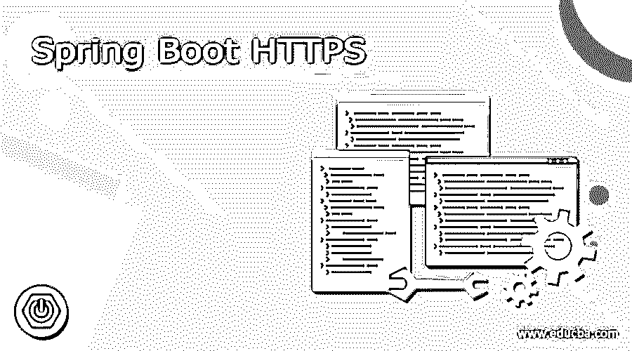
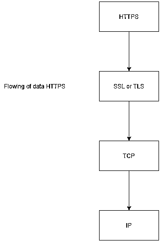
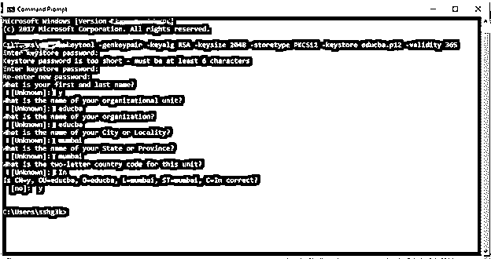
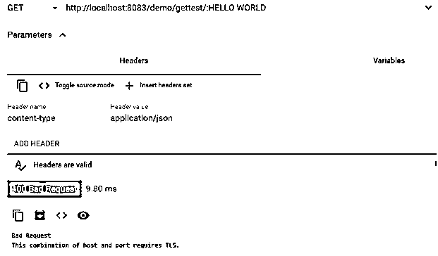

# Spring Boot·HTTPS

> 原文：<https://www.educba.com/spring-boot-https/>

## Spring Boot·HTTPS 的定义

HTTPS 代表超文本传输协议安全，这基本上是 HTTP 协议的扩展，我们使用该协议在网络浏览器和网站之间发送数据。它是 HTTP 的安全版本，使用加密机制来保护网络上的数据传输。我们经常使用它，例如当我们必须传输包含密码或其他机密凭证的敏感数据时，因此它有助于我们通过网络安全地传输这些数据。如果我们有一个需要来自用户的原始凭证的应用程序，那么这种类型的应用程序应该使用 HTTPS 协议来保护，我们可以通过使用该协议来使我们的 spring boot 应用程序变得安全。但是像往常一样，我们必须进行一些配置并安装一些证书，以使它在我们的应用程序中正常工作。在下一节中，我们将看到如何进行这些配置来保护我们的应用程序，一步一步地让初学者能够正确地理解它。

**语法:**

<small>网页开发、编程语言、软件测试&其他</small>

HTTPS 没有这样的语法，因为它是一种通过网络保护我们数据的机制。让我们仔细看看配置 HTTPS 的语法，见下文；

`server. ssl.key-store= path to certificate
server.ssl.key-store-password= password
server.ssl.keyStoreType= type of keyStoreType`

正如您在上面的代码行中看到的，我们对应用程序文件做了一些更改，在我们的项目中使用了与 SSL 相关的属性。我们将在本教程的下一节详细讨论这一点。让我们仔细看看这个练习的语法，见下文；

**例如:**

`server. ssl.key-store=classpath:path
server.ssl.key-store-password=abcd
server.ssl.keyStoreType=Type`

### 弹簧靴 HTTPS 是如何工作的？

在这一节中，我们将看到它是如何在内部工作的，以保护我们的应用程序，因为我们已经知道，它是用来通过使用加密机制在双方之间进行安全通信的。在 SSL 的情况下，它生成和 HTTPS 它生成包含公钥和私钥的 SSL 证书，以及使其安全所需的其他信息，如所有者详细信息等。现在让我们详细了解一下 HTTPS 的内部工作原理，也看看下面的弹簧靴。

现在，我们将了解 HTTPs 如何在内部保护网络上的数据传输，让我们更深入地了解一下。

HTTPS 使用我们所说的加密机制或协议来保护通信，该协议被称为 TLS，代表传输层安全性。该协议使用密钥在双方之间传输数据，从而对双方之间的通信进行加密。下面我们有以下类型的键，描述如下:

**1)公钥:**这种类型的密钥是公开的，任何想要以安全的方式与服务器交互的人都可以使用。我们用公钥加密一些信息，而这些信息只能在另一端用私钥解密。

**2)私钥:**这种类型的密钥根本不是对所有人公开的，因为它是由所有者自己控制的。我们保存在服务器上的这个密钥用于解密公钥信息。

现在我们将看到 HTTP 和 HTTPS 的一个基本流程，并逐步低估它。让我们开始吧，

1) HTTPS 是 HTTP 和 TCP 之间的安全层，这一层就是 TLS，代表传输层套接字，HTTPS 运行在端口 443 上。

2)如果我们谈论 HTTP，那么它并不真正使用安全通信进行数据传输。中间没有 TLS 这样的层。

为了更好地理解，请遵循以下流程图；

在 spring boot 应用程序中，我们现在将使用我们将生成的证书创建到 HTTPS 的 HTTP URL，让我们使用下面的步骤一个一个地理解它们；

1)第一步是创建 spring boot 项目，转到 spring unitizer 来创建它，我们还必须填写所需的详细信息来正确地生成项目。单击 generate 并将其导入到您拥有的编辑器中。网址:https://start.spring.io/

2)添加 web 依赖项，不要忘记在创建项目时添加它，作为参考，请参见下面的代码，并将它添加到您的项目的构建文件中，如下所示；

**例如:**

`<dependency>
<groupId>org.springframework.boot</groupId>
<artifactId>spring-boot-starter-web</artifactId>
</dependency>`

3)现在，在这一步中，我们将为我们的项目创建证书，只需打开命令提示符并键入以下命令即可为您的项目获取证书。已经使用了文件名“educba ”,您可以在这里将其更改为您的组织名称，作为参考，请参见下面的输出和命令以开始使用它。

**例如:**
keytool-genkey pair-keyalg RSA-keysize 2048-storetype PKCS12-keystore educba . p12-validity 365

**输出:**

您必须在此处输入密码，以及它将要求您输入的所有其他必要的详细信息。

4)现在转到生成证书的路径，并将其复制粘贴到项目的类路径中。请参考下面附上的截图；

**输出:**

5)完成所有这些更改后，现在我们必须告诉 spring 我们为您的应用程序生成的 HTTPS 证书，我们将通过提及 application.properties 文件中的详细信息来做到这一点，让我们从配置部分开始，见下文；

**例如:**

`server.port=8083
server.ssl.key-store=classpath:filananem.p12
server. ssl.key-store-password= your_password
server.ssl.keyStoreType=PKCS12`

**输出:**

6)现在所有的事情都完成了，我们不需要在主类中做任何配置更改，它将像往常一样。

7)运行应用程序，现在你会看到一些日志，这将告诉它是 HTTPS 现在安全；

**输出:**

### 结论

这是非常容易使用和配置独立我们的项目，我们可以从头开始创建或我们可以在现有的项目，更少的配置，易于理解和处理。

### 推荐文章

这是 Spring Boot·HTTPS 的指南。在这里，我们讨论定义，语法，HTTPS 如何工作？代码实现示例。您也可以看看以下文章，了解更多信息–

1.  [Spring Boot 应用程序.属性](https://www.educba.com/spring-boot-application-properties/)
2.  [Spring Boot 运行命令](https://www.educba.com/spring-boot-run-command/)
3.  [春云流](https://www.educba.com/spring-cloud-stream/)
4.  [Spring Boot 简介](https://www.educba.com/spring-boot-profiles/)

