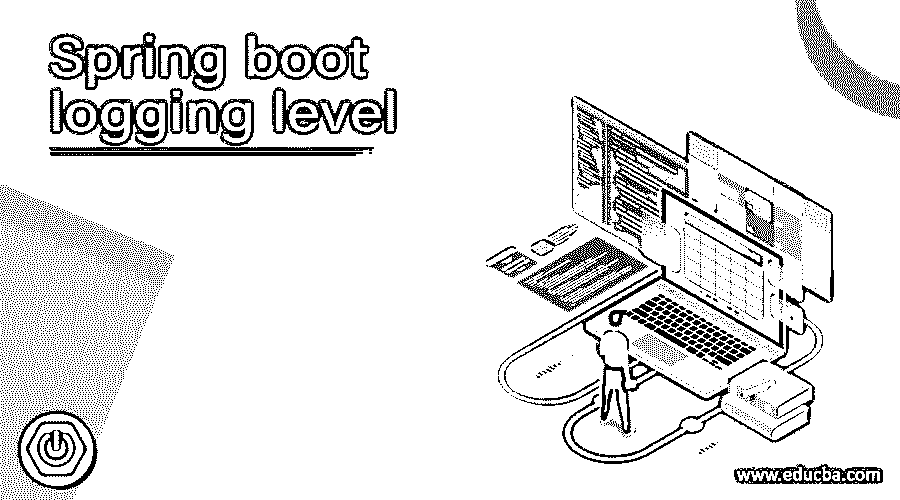

# 弹簧引导日志记录级别

> 原文：<https://www.educba.com/spring-boot-logging-level/>

## Spring boot 日志记录级别简介

在 spring boot 中，在不同的级别登录是非常容易的；此外，spring boot 为我们提供了默认日志记录。使用它时，我们不需要外部依赖，因为它已经包含在内了。日志记录用于跟踪我们应用程序的所有活动；通过使用这一点，我们可以在运行时识别应用程序中出现的错误。此外，我们可以检查和跟踪应用程序是否工作正常。这些都很容易使用和处理，因为我们不需要太多的配置，因为 spring boot 框架管理它。在本教程的下一节中，我们将看到 spring boot 应用程序中不同的日志记录级别，以及我们如何在应用程序中设置它们以更好地跟踪错误。

**语法**

<small>网页开发、编程语言、软件测试&其他</small>

正如我们已经看到的，我们可以在 spring boot 中设置不同的日志记录级别，让我们看看在我们的应用程序中实现这一点所需的语法和所需的东西，以便更好地理解，见下文；

`logging.level.root= your logging level`

正如您在上面的语法行中看到的，我们正在尝试配置日志级别。为此，我们必须对 applications.properties 文件进行上述更改，并且我们可以根据需要设置日志级别。让我们来看看练习语法，以便更好地理解(见下文);

**举例:**

`logging.level.root=DEBUG`

正如您所提到的，这种类型的配置在调试级别启用日志记录级别。在下一节中，我们将看到 spring boot 中的所有日志记录级别及其各自的工作细节，以及如何使用这些日志级别详细打印语句，以便初学者更好地理解。

### 春开机如何设置日志级别？

在 spring boot 中，我们可以设置不同的日志记录级别，并且只需要很少的配置。当我们在开发和生产环境中部署应用程序以跟踪任何错误或所有活动时，这个日志级别是很重要的。我们在 spring boot 中提供了不同类型的日志级别，以确保不会在生产环境中打印任何不必要的日志，这可能会将任何类型的信息丢失给任何未经授权的人。在本节中，我们将首先详细了解不同类型的日志记录级别，它们是如何工作的，以及我们如何在 spring boot 中使用它们；见下文，内容如下:

#### 1.信息

这种信息或日志不应该包含错误或细节。它们只是用来通知开发人员一切正常。我们可以在服务启动、服务停止、任何数据库操作时添加日志；我们可以跟踪这一信息级别下的所有这些类型的日志，这些日志是通用日志，用于记录应用程序的活动。

**举例:**

`import org.slf4j.Logger;
import org.slf4j.LoggerFactory;
@Service
public class MyClass {
private static final Logger logger = LoggerFactory.getLogger(MyClass.class);
private void test(){
logger.info("I am info level log !!");
}
}
application.properties
logging.level.root=INFO`

正如你在上面的代码中看到的，我们已经实现了信息级日志；为此，我们必须首先在内部初始化 LoggerFactory，我们传递我们的类名，现在我们可以使用它。通过调用它的 info()方法。

#### 2.调试

在这种模式下，我们希望监控与应用程序相关的信息，比如用户是否被创建，是否试图打印他们的 id 等等。当我们想要近距离捕捉生产活动时，这将成为我们关注的焦点。下面是使用它的语法；

**举例:**

`import org.slf4j.Logger;
import org.slf4j.LoggerFactory;
@Service
public class MyClass {
private static final Logger logger = LoggerFactory.getLogger(MyClass.class);
private void test(){
logger.debug("I am info debug log !!");
}
}
application.properties
logging.level.root=DEBUG`

正如你在上面的代码中看到的，我们已经实现了调试级日志；为此，我们必须首先初始化 LoggerFactory，在里面传递我们的类名，现在我们可以对它使用 debug()方法。

#### 3.错误

当我们希望捕获应用程序中的错误时，会使用这种类型的日志记录级别，这种错误会导致应用程序关闭，并破坏正常工作的功能。我们可以跟踪数据库连接、任何文件丢失或导致应用程序停止的严重问题。下面是在 spring boot 应用程序中使用它的语法。

**举例:**

`import org.slf4j.Logger;
import org.slf4j.LoggerFactory;
@Service
public class MyClass {
private static final Logger logger = LoggerFactory.getLogger(MyClass.class);
private void test(){
logger.error("I am error level log !!");
}
}
application.properties
logging.level.root=ERROR`

正如您在上面的代码中看到的，我们已经实现了错误级别日志；为此，我们必须首先初始化 LoggerFactory，在里面传递我们的类名；现在，我们可以用这个。通过对它调用 error()方法。

#### 4.警告

在这种类型的日志中，我们跟踪可能导致应用程序停止的警告；假设我们试图建立一个连接，但不知何故它正在下降，无法连接，所以在这种淤积，我们可以使用警告级别，它可以预测我们的应用程序的任何未来原因。下面是在 spring boot 应用程序中使用它的语法。

**举例:**

`import org.slf4j.Logger;
import org.slf4j.LoggerFactory;
@Service
public class MyClass {
private static final Logger logger = LoggerFactory.getLogger(MyClass.class);
private void test(){
logger.warn("I am warn level log !!");
}
}
application.properties
logging.level.root=WARN`

正如您在上面的代码中看到的，我们已经实现了警告级别的日志；为此，我们必须首先在内部初始化 LoggerFactory，我们传递我们的类名，现在我们可以使用它。通过对它调用 warn()方法。

### 结论

通过使用日志级别，我们可以很容易地将我们的信息日志划分为不在不同的环境中打印。我们必须对各自环境的应用程序属性进行正常的更改。

### 推荐文章

这是关于 Spring boot 日志记录级别的指南。在这里，我们将讨论如何在 Spring boot 中设置日志级别，并给出示例。您也可以看看以下文章，了解更多信息–

1.  [Spring Boot 开发工具](https://www.educba.com/spring-boot-devtools/)
2.  [Spring Boot 首发网](https://www.educba.com/spring-boot-starter-web/)
3.  [Dompdf Laravel](https://www.educba.com/dompdf-laravel/)
4.  [春季 AOP](https://www.educba.com/spring-aop/)

